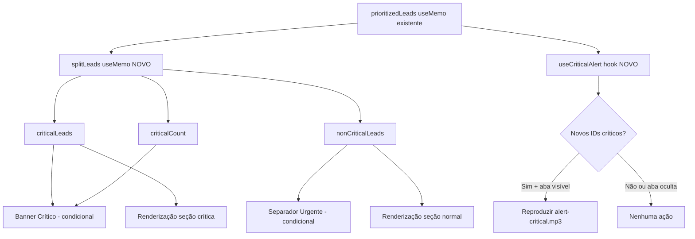

# Design — Behavioral Pressure Layer

## Visão Geral

A Behavioral Pressure Layer adiciona 3 mecanismos de pressão comportamental à sidebar de conversas (`ConversasSidebar.tsx`) da tela1, forçando o operador a priorizar leads críticos. A implementação é **puramente aditiva** — zero alterações em lógica existente de socket handlers, filtros, ordenação ou renderização de cards.

### Mecanismos

1. **Banner Crítico** — banner vermelho sticky no topo da lista, exibindo contagem de leads críticos
2. **Separador Urgente** — divisor visual entre leads críticos e não-críticos na lista
3. **Alerta Sonoro** — som curto (~0.5s) quando um lead transiciona para estado crítico

### Decisões de Design

| Decisão | Escolha | Justificativa |
|---------|---------|---------------|
| Cálculo de criticidade | `useMemo` derivado de `prioritizedLeads` | Reativo, sem efeitos colaterais, recalcula automaticamente |
| Separação de listas | Único `useMemo` retornando `{criticalLeads, nonCriticalLeads}` | Evita iteração dupla, mantém consistência |
| Detecção de transição sonora | `useRef` com snapshot de IDs críticos anteriores | Compara conjuntos para detectar novos IDs sem falsos positivos |
| Supressão em aba inativa | `document.hidden` check | API nativa, sem dependências extras |
| Localização do hook | `web/hooks/useCriticalAlert.ts` | Segue padrão existente (`useOperadorRole.ts`, `usePainelContext.ts`) |
| Arquivo de áudio | `web/public/sounds/alert-critical.mp3` | Convenção Next.js para assets estáticos |

## Arquitetura

### Fluxo de Dados



### Princípio de Não-Interferência

A camada de pressão opera como uma **projeção read-only** sobre dados existentes:

- **Entrada**: `prioritizedLeads` (já calculado e ordenado pelo `useMemo` existente)
- **Processamento**: `useMemo` adicional que particiona a lista em duas sublistas
- **Saída**: Elementos visuais condicionais + alerta sonoro
- **Efeito colateral**: Nenhum — não modifica estado, não persiste dados, não altera queries

## Componentes e Interfaces

### 1. `splitLeads` — useMemo no ConversasSidebar

```typescript
// Novo useMemo derivado de prioritizedLeads
const { criticalLeads, nonCriticalLeads, criticalCount } = useMemo(() => {
  const critical: LeadWithMeta[] = []
  const nonCritical: LeadWithMeta[] = []
  
  for (const lead of prioritizedLeads) {
    const urgency = getUrgencyStyle(
      lead.ultima_msg_em || null,
      lead.ultima_msg_de || null,
      lead.prazo_proxima_acao ?? undefined
    )
    if (urgency.level === 'critical') {
      critical.push(lead)
    } else {
      nonCritical.push(lead)
    }
  }
  
  return { criticalLeads: critical, nonCriticalLeads: nonCritical, criticalCount: critical.length }
}, [prioritizedLeads])
```

**Decisão**: Um único `useMemo` faz a partição e contagem em uma passada. Evita múltiplos `useMemo` que iterariam a mesma lista.

### 2. Banner Crítico — JSX condicional

```typescript
// Renderizado acima da área de scroll, dentro do container da lista
{criticalCount > 0 && (
  <div className="sticky top-0 z-10 mx-2 mb-2 px-3 py-2 bg-red-50 border border-red-300 rounded-lg">
    <p className="text-xs font-bold text-red-700">
      🔴 {criticalCount} lead{criticalCount > 1 ? 's' : ''} aguardando há mais de 30min
    </p>
  </div>
)}
```

**Comportamento**:
- Visível apenas quando `criticalCount > 0`
- `sticky top-0` mantém fixo no topo durante scroll
- Quando `criticalCount === 0`, não renderiza nada (sem espaço residual)

### 3. Separador Urgente — JSX condicional

```typescript
// Renderizado entre as duas seções de leads
{criticalLeads.length > 0 && nonCriticalLeads.length > 0 && (
  <div className="px-3 pt-2 pb-1">
    <span className="text-[10px] font-bold uppercase text-red-500">🔴 URGENTE</span>
    <div className="border-t border-gray-200 mt-1" />
  </div>
)}
```

**Comportamento**:
- Visível apenas quando existem leads em **ambas** as seções
- Se todos são críticos ou nenhum é, o separador fica oculto

### 4. Renderização em Duas Seções

Substituição do `.map` único por renderização particionada:

```typescript
// Antes (existente):
{!isSearching && prioritizedLeads.map(renderLeadItem)}

// Depois (novo):
{!isSearching && (
  <>
    {criticalLeads.map(renderLeadItem)}
    {criticalLeads.length > 0 && nonCriticalLeads.length > 0 && (
      <div className="px-3 pt-2 pb-1">
        <span className="text-[10px] font-bold uppercase text-red-500">🔴 URGENTE</span>
        <div className="border-t border-gray-200 mt-1" />
      </div>
    )}
    {nonCriticalLeads.map(renderLeadItem)}
  </>
)}
```

**Nota**: `renderLeadItem` permanece **inalterada**. Cada card individual continua idêntico.

### 5. `useCriticalAlert` — Hook Independente

```typescript
// web/hooks/useCriticalAlert.ts
import { useRef, useEffect } from 'react'
import { getUrgencyStyle } from '@/utils/urgencyColors'

interface LeadForAlert {
  id: string
  ultima_msg_em?: string | null
  ultima_msg_de?: string | null
  prazo_proxima_acao?: string | null
}

export function useCriticalAlert(leads: LeadForAlert[]): void {
  const prevCriticalIdsRef = useRef<Set<string>>(new Set())
  const audioRef = useRef<HTMLAudioElement | null>(null)

  // Inicializar Audio uma vez
  useEffect(() => {
    audioRef.current = new Audio('/sounds/alert-critical.mp3')
    return () => { audioRef.current = null }
  }, [])

  useEffect(() => {
    const currentCriticalIds = new Set<string>()
    
    for (const lead of leads) {
      const urgency = getUrgencyStyle(
        lead.ultima_msg_em || null,
        lead.ultima_msg_de || null,
        lead.prazo_proxima_acao ?? undefined
      )
      if (urgency.level === 'critical') {
        currentCriticalIds.add(lead.id)
      }
    }

    // Detectar novos IDs críticos (transição)
    const prevIds = prevCriticalIdsRef.current
    let hasNewCritical = false
    for (const id of currentCriticalIds) {
      if (!prevIds.has(id)) {
        hasNewCritical = true
        break
      }
    }

    // Reproduzir som se há transição E aba está visível
    if (hasNewCritical && !document.hidden && audioRef.current) {
      audioRef.current.play().catch(() => {})
    }

    // Atualizar snapshot
    prevCriticalIdsRef.current = currentCriticalIds
  }, [leads])
}
```

**Interface do hook**:
- **Entrada**: `leads: LeadForAlert[]` — lista de leads com campos necessários para `getUrgencyStyle`
- **Saída**: `void` — efeito colateral puro (reprodução de áudio)
- **Dependências**: `getUrgencyStyle` de `@/utils/urgencyColors` (fonte única de verdade)

### Integração no ConversasSidebar

```typescript
// No topo do componente, após os useMemo existentes:
import { useCriticalAlert } from '@/hooks/useCriticalAlert'

// Dentro do componente:
useCriticalAlert(prioritizedLeads)
```

## Modelos de Dados

### Tipos Existentes (sem alteração)

```typescript
// Lead (de tela1/page.tsx) — campos relevantes
interface Lead {
  id: string
  ultima_msg_em?: string | null
  ultima_msg_de?: string | null
  // ... demais campos
}

// LeadWithMeta (de ConversasSidebar.tsx) — campos relevantes
interface LeadWithMeta extends Lead {
  prazo_proxima_acao?: string  // via join ou campo direto
  // ... demais campos
}

// UrgencyStyle (de urgencyColors.ts)
interface UrgencyStyle {
  level: 'critical' | 'alert' | 'normal'
  bg: string
  border: string
  textColor: string
  label: string
}
```

### Tipos Novos

```typescript
// Interface mínima para o hook useCriticalAlert
interface LeadForAlert {
  id: string
  ultima_msg_em?: string | null
  ultima_msg_de?: string | null
  prazo_proxima_acao?: string | null
}
```

### Dados Derivados (não persistidos)

| Dado | Tipo | Fonte | Persistência |
|------|------|-------|-------------|
| `criticalLeads` | `LeadWithMeta[]` | `useMemo(prioritizedLeads)` | Memória apenas |
| `nonCriticalLeads` | `LeadWithMeta[]` | `useMemo(prioritizedLeads)` | Memória apenas |
| `criticalCount` | `number` | `criticalLeads.length` | Memória apenas |
| `prevCriticalIds` | `Set<string>` | `useRef` no hook | Memória apenas |

**Nenhum dado novo é persistido no banco de dados.** Toda a camada de pressão é derivada em tempo de execução a partir de dados já existentes.


## Propriedades de Corretude

*Uma propriedade é uma característica ou comportamento que deve ser verdadeiro em todas as execuções válidas de um sistema — essencialmente, uma declaração formal sobre o que o sistema deve fazer. Propriedades servem como ponte entre especificações legíveis por humanos e garantias de corretude verificáveis por máquina.*

### Property 1: Corretude da Partição — getUrgencyStyle como Fonte Única

*Para qualquer* lista de leads com campos `ultima_msg_em`, `ultima_msg_de` e `prazo_proxima_acao` arbitrários, todo lead em `criticalLeads` DEVE ter `getUrgencyStyle()` retornando `level === 'critical'`, e todo lead em `nonCriticalLeads` DEVE ter `getUrgencyStyle()` retornando `level !== 'critical'`.

**Validates: Requirements 1.1, 4.6, 5.6**

### Property 2: Completude da Partição — Nenhum Lead Perdido

*Para qualquer* lista de leads, a concatenação de `criticalLeads` e `nonCriticalLeads` DEVE conter exatamente os mesmos leads que a lista original `prioritizedLeads`, sem duplicatas e sem omissões (ou seja, `criticalLeads.length + nonCriticalLeads.length === prioritizedLeads.length`).

**Validates: Requirements 1.3**

### Property 3: Preservação de Ordem na Partição

*Para qualquer* lista de leads já ordenada, a ordem relativa dos leads dentro de `criticalLeads` DEVE ser a mesma ordem em que aparecem na lista original, e o mesmo para `nonCriticalLeads`. A partição não deve reordenar leads dentro de cada grupo.

**Validates: Requirements 3.5**

### Property 4: Visibilidade do Separador

*Para qualquer* par de listas `(criticalLeads, nonCriticalLeads)`, o separador urgente DEVE ser visível se e somente se ambas as listas forem não-vazias. Se qualquer uma das listas for vazia, o separador DEVE estar oculto.

**Validates: Requirements 3.1, 3.2**

### Property 5: Detecção de Transição para Estado Crítico

*Para quaisquer* dois conjuntos de IDs `previousCriticalIds` e `currentCriticalIds`, o alerta sonoro DEVE ser disparado se e somente se existir pelo menos um ID em `currentCriticalIds` que não estava em `previousCriticalIds` (ou seja, `currentCriticalIds \ previousCriticalIds ≠ ∅`).

**Validates: Requirements 4.1, 4.2**

### Property 6: Idempotência da Detecção — Mesmo Conjunto Não Dispara

*Para qualquer* conjunto de IDs críticos `S`, comparar `S` consigo mesmo DEVE resultar em zero transições detectadas. Re-renders ou refreshes que mantêm o mesmo conjunto de leads críticos NÃO devem disparar o alerta sonoro.

**Validates: Requirements 4.3**

## Tratamento de Erros

### Erros de Áudio

| Cenário | Tratamento | Justificativa |
|---------|-----------|---------------|
| Navegador bloqueia autoplay | `.catch(() => {})` silencioso | Não interromper fluxo do operador |
| Arquivo MP3 não encontrado | `.catch(() => {})` silencioso | Degradação graciosa — funcionalidade visual continua |
| `new Audio()` falha (SSR) | Guard `typeof window !== 'undefined'` | Next.js pode executar em servidor |

### Erros de Dados

| Cenário | Tratamento | Justificativa |
|---------|-----------|---------------|
| `prioritizedLeads` vazio | `criticalLeads = []`, `nonCriticalLeads = []` | Comportamento natural do loop |
| Lead sem `ultima_msg_em` | `getUrgencyStyle(null, ...)` retorna `level: 'normal'` | Já tratado pela função existente |
| Lead sem `prazo_proxima_acao` | `getUrgencyStyle(..., undefined)` ignora prazo | Já tratado pela função existente |

### Princípio: Degradação Graciosa

Se qualquer mecanismo de pressão falhar, o sistema deve continuar funcionando normalmente:
- Banner não renderiza → lista de leads continua visível
- Separador não renderiza → leads continuam na ordem correta
- Som não toca → indicadores visuais continuam funcionando

## Estratégia de Testes

### Abordagem Dual

A estratégia combina **testes de propriedade** (property-based testing) para lógica pura e **testes de exemplo** (unit tests) para comportamento de UI e edge cases.

### Testes de Propriedade (PBT)

**Biblioteca**: `fast-check` (já instalada em `devDependencies`)
**Runner**: `vitest` (já instalado em `devDependencies`)
**Iterações mínimas**: 100 por propriedade

| Propriedade | Função Testada | Gerador |
|-------------|---------------|---------|
| Property 1: Corretude da Partição | `splitLeads()` | Listas de leads com timestamps aleatórios |
| Property 2: Completude da Partição | `splitLeads()` | Listas de leads de tamanho variável |
| Property 3: Preservação de Ordem | `splitLeads()` | Listas de leads pré-ordenadas |
| Property 4: Visibilidade do Separador | `shouldShowSeparator()` | Pares de listas (critical, nonCritical) |
| Property 5: Detecção de Transição | `detectNewCriticalIds()` | Pares de conjuntos de IDs |
| Property 6: Idempotência | `detectNewCriticalIds()` | Conjuntos únicos de IDs |

**Configuração de cada teste PBT**:
```typescript
// Tag format:
// Feature: behavioral-pressure-layer, Property N: <property_text>
```

### Funções Puras Extraíveis para Teste

Para viabilizar PBT, a lógica será extraída em funções puras testáveis:

```typescript
// Extrair de useMemo para função pura
export function splitLeads(
  leads: LeadForAlert[],
  getUrgency: (lead: LeadForAlert) => { level: string }
): { criticalLeads: LeadForAlert[]; nonCriticalLeads: LeadForAlert[] }

// Extrair lógica de detecção de transição
export function detectNewCriticalIds(
  currentIds: Set<string>,
  previousIds: Set<string>
): Set<string>

// Extrair lógica de visibilidade do separador
export function shouldShowSeparator(
  criticalCount: number,
  nonCriticalCount: number
): boolean
```

### Testes de Exemplo (Unit Tests)

| Cenário | Tipo | O que verifica |
|---------|------|---------------|
| Banner visível com criticalCount=3 | EXAMPLE | Renderização condicional e texto correto |
| Banner oculto com criticalCount=0 | EXAMPLE | Não renderiza quando desnecessário |
| Banner com classes CSS corretas | EXAMPLE | bg-red-50, border-red-300, text-red-700, font-bold |
| Separador com classes CSS corretas | EXAMPLE | text-[10px], font-bold, uppercase, text-red-500 |
| Som suprimido com document.hidden=true | EXAMPLE | Não chama audio.play() |
| Erro de autoplay capturado silenciosamente | EDGE_CASE | .catch() previne exceção |
| Lista vazia não causa erro | EDGE_CASE | Partição retorna arrays vazios |

### Testes de Integração

| Cenário | O que verifica |
|---------|---------------|
| Socket `nova_mensagem_salva` continua funcionando | Handlers existentes não foram alterados |
| Filtros por pills continuam funcionando | Lógica de filtro inalterada |
| Auto-seleção do primeiro lead continua | Comportamento existente preservado |
