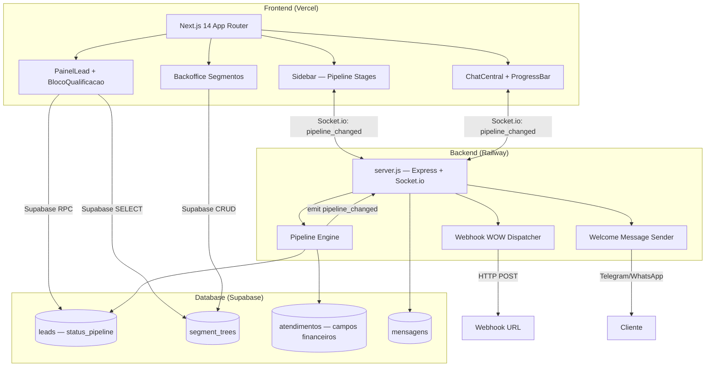
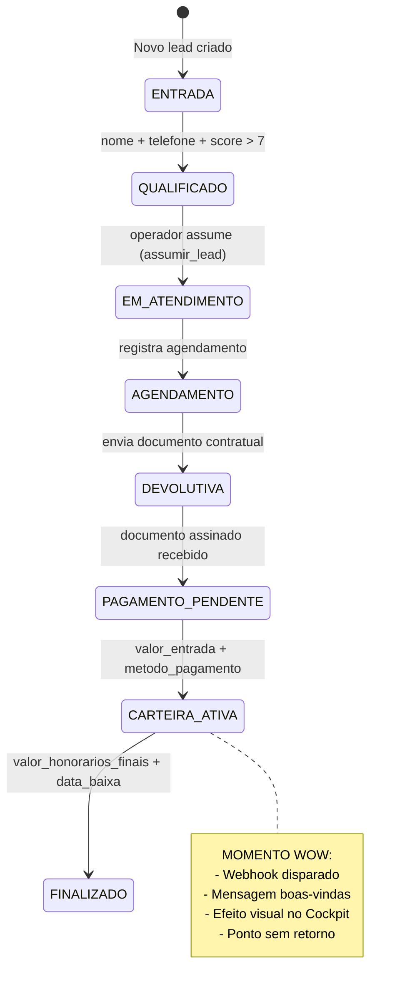
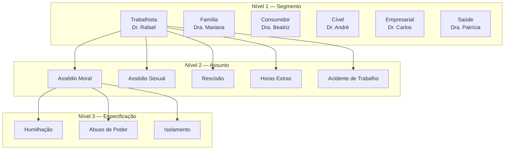
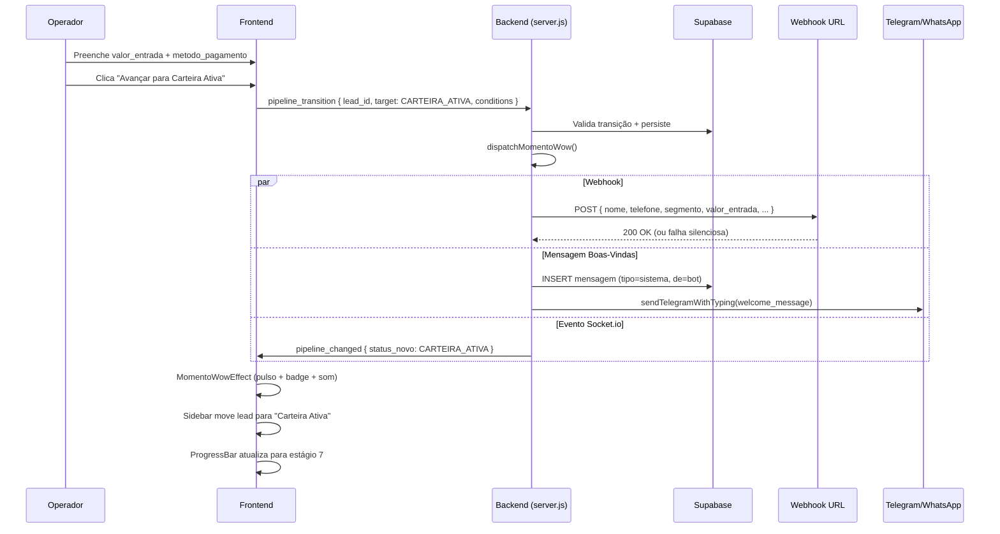

# Documento de Design — BRO Resolve v1.1

## Visão Geral

O BRO Resolve v1.1 transforma o cockpit operacional existente em um ERP jurídico SaaS profissional. O design abrange quatro blocos interdependentes:

1. **Árvore de 3 Níveis** — Tabela `segment_trees` com hierarquia auto-referenciada (Segmento → Assunto → Especificação), persona vinculada ao nível 1, dropdowns cascata no BlocoQualificacao e backoffice CRUD para owners.
2. **Pipeline de 8 Estados** — Coluna `status_pipeline` com cadeia linear ENTRADA → QUALIFICADO → EM_ATENDIMENTO → AGENDAMENTO → DEVOLUTIVA → PAGAMENTO_PENDENTE → CARTEIRA_ATIVA → FINALIZADO, campos financeiros, sidebar reorganizada por estágios, barra de progresso no chat e atualizações em tempo real via Socket.io.
3. **Copy Profissional** — Remoção de todos os emojis, adoção de terminologia B2B/jurídica e estilo visual SaaS mantendo o Tema_Light existente.
4. **Momento WOW** — Webhook para URL configurável, mensagem de boas-vindas profissional via bot e efeito visual de conversão no Cockpit.

### Decisões de Design

| Decisão | Rationale |
|---------|-----------|
| Tabela única `segment_trees` com self-join | Evita 3 tabelas separadas; `parent_id` + `nivel` + constraint CHECK garante integridade hierárquica. Extensível para N níveis no futuro. |
| `status_pipeline` na tabela `leads` (não em `atendimentos`) | O pipeline começa em ENTRADA (antes de existir atendimento). Manter na tabela `leads` simplifica queries da sidebar e evita JOINs desnecessários. |
| Transições validadas no backend (server.js) | Evita race conditions e garante consistência. Frontend apenas solicita transição; backend valida e emite evento. |
| Persona resolvida via `segment_trees.persona` | Substitui o mapeamento hardcoded `BOT_PERSONAS` em server.js por lookup dinâmico no banco. Permite owners alterarem personas sem deploy. |
| Copy mapping como constantes TypeScript | Centraliza todas as strings em um arquivo `web/utils/copy.ts` para facilitar manutenção e eventual i18n. |
| JetBrains Mono para "Dossiê Estratégico" | Conforme solicitação do usuário — tipografia monospace evoca "case file" jurídico. |

---

## Arquitetura

### Diagrama de Arquitetura Geral



### Diagrama de Pipeline de Estados



### Diagrama da Árvore de Segmentos



---

## Componentes e Interfaces

### 1. Migração SQL — `012_bro_resolve_v1_1.sql`

```sql
-- 012_bro_resolve_v1_1.sql
-- BRO Resolve v1.1: Árvore de Segmentos, Pipeline 8 Estados, Campos Financeiros
-- Idempotente: todas as operações usam IF NOT EXISTS / ADD COLUMN IF NOT EXISTS

-- ═══════════════════════════════════════════════════════════════
-- BLOCO 1: Árvore de Segmentos (segment_trees)
-- ═══════════════════════════════════════════════════════════════

CREATE TABLE IF NOT EXISTS segment_trees (
  id UUID PRIMARY KEY DEFAULT gen_random_uuid(),
  parent_id UUID REFERENCES segment_trees(id),
  nivel INTEGER NOT NULL CHECK (nivel IN (1, 2, 3)),
  nome TEXT NOT NULL,
  persona TEXT,
  ativo BOOLEAN DEFAULT true,
  created_at TIMESTAMPTZ DEFAULT now(),
  UNIQUE(parent_id, nome)
);

-- Nota: UNIQUE(parent_id, nome) garante unicidade de irmãos.
-- Para nível 1 (parent_id = NULL), PostgreSQL trata NULLs como distintos em UNIQUE,
-- então adicionamos um índice parcial para cobrir esse caso:
CREATE UNIQUE INDEX IF NOT EXISTS idx_segment_trees_root_nome
  ON segment_trees(nome) WHERE parent_id IS NULL;

CREATE INDEX IF NOT EXISTS idx_segment_trees_parent
  ON segment_trees(parent_id);

CREATE INDEX IF NOT EXISTS idx_segment_trees_nivel
  ON segment_trees(nivel);

-- RLS
ALTER TABLE segment_trees ENABLE ROW LEVEL SECURITY;
DROP POLICY IF EXISTS "authenticated_read_segments" ON segment_trees;
CREATE POLICY "authenticated_read_segments" ON segment_trees
  FOR SELECT TO authenticated USING (true);
DROP POLICY IF EXISTS "service_role_full_segments" ON segment_trees;
CREATE POLICY "service_role_full_segments" ON segment_trees
  FOR ALL TO service_role USING (true) WITH CHECK (true);
DROP POLICY IF EXISTS "owner_manage_segments" ON segment_trees;
CREATE POLICY "owner_manage_segments" ON segment_trees
  FOR ALL TO authenticated
  USING (
    (SELECT raw_user_meta_data->>'role' FROM auth.users WHERE id = auth.uid()) = 'owner'
  )
  WITH CHECK (
    (SELECT raw_user_meta_data->>'role' FROM auth.users WHERE id = auth.uid()) = 'owner'
  );

-- Seed: Nível 1 — Segmentos
INSERT INTO segment_trees (id, parent_id, nivel, nome, persona) VALUES
  ('a1000000-0000-0000-0000-000000000001', NULL, 1, 'Trabalhista', 'Dr. Rafael'),
  ('a1000000-0000-0000-0000-000000000002', NULL, 1, 'Família', 'Dra. Mariana'),
  ('a1000000-0000-0000-0000-000000000003', NULL, 1, 'Consumidor', 'Dra. Beatriz'),
  ('a1000000-0000-0000-0000-000000000004', NULL, 1, 'Cível', 'Dr. André'),
  ('a1000000-0000-0000-0000-000000000005', NULL, 1, 'Empresarial', 'Dr. Carlos'),
  ('a1000000-0000-0000-0000-000000000006', NULL, 1, 'Saúde', 'Dra. Patrícia')
ON CONFLICT DO NOTHING;

-- Seed: Nível 2 — Assuntos (Trabalhista)
INSERT INTO segment_trees (id, parent_id, nivel, nome) VALUES
  ('a2000000-0000-0000-0000-000000000001', 'a1000000-0000-0000-0000-000000000001', 2, 'Assédio Moral'),
  ('a2000000-0000-0000-0000-000000000002', 'a1000000-0000-0000-0000-000000000001', 2, 'Assédio Sexual'),
  ('a2000000-0000-0000-0000-000000000003', 'a1000000-0000-0000-0000-000000000001', 2, 'Rescisão'),
  ('a2000000-0000-0000-0000-000000000004', 'a1000000-0000-0000-0000-000000000001', 2, 'Horas Extras'),
  ('a2000000-0000-0000-0000-000000000005', 'a1000000-0000-0000-0000-000000000001', 2, 'Acidente de Trabalho')
ON CONFLICT DO NOTHING;

-- Seed: Nível 3 — Especificações (Assédio Moral)
INSERT INTO segment_trees (id, parent_id, nivel, nome) VALUES
  ('a3000000-0000-0000-0000-000000000001', 'a2000000-0000-0000-0000-000000000001', 3, 'Humilhação'),
  ('a3000000-0000-0000-0000-000000000002', 'a2000000-0000-0000-0000-000000000001', 3, 'Abuso de Poder'),
  ('a3000000-0000-0000-0000-000000000003', 'a2000000-0000-0000-0000-000000000001', 3, 'Isolamento')
ON CONFLICT DO NOTHING;

-- ═══════════════════════════════════════════════════════════════
-- BLOCO 2: Pipeline de 8 Estados + Campos Financeiros
-- ═══════════════════════════════════════════════════════════════

-- Coluna status_pipeline na tabela leads
ALTER TABLE leads ADD COLUMN IF NOT EXISTS status_pipeline TEXT DEFAULT 'ENTRADA';

-- Colunas de classificação hierárquica na tabela leads
ALTER TABLE leads ADD COLUMN IF NOT EXISTS segmento_id UUID REFERENCES segment_trees(id);
ALTER TABLE leads ADD COLUMN IF NOT EXISTS assunto_id UUID REFERENCES segment_trees(id);
ALTER TABLE leads ADD COLUMN IF NOT EXISTS especificacao_id UUID REFERENCES segment_trees(id);

-- Campos financeiros na tabela atendimentos
ALTER TABLE atendimentos ADD COLUMN IF NOT EXISTS valor_entrada NUMERIC;
ALTER TABLE atendimentos ADD COLUMN IF NOT EXISTS metodo_pagamento TEXT;
ALTER TABLE atendimentos ADD COLUMN IF NOT EXISTS valor_honorarios_finais NUMERIC;
ALTER TABLE atendimentos ADD COLUMN IF NOT EXISTS data_baixa TIMESTAMPTZ;

-- Campos de agendamento na tabela atendimentos
ALTER TABLE atendimentos ADD COLUMN IF NOT EXISTS agendamento_data TIMESTAMPTZ;
ALTER TABLE atendimentos ADD COLUMN IF NOT EXISTS agendamento_local TEXT;
ALTER TABLE atendimentos ADD COLUMN IF NOT EXISTS documento_enviado BOOLEAN DEFAULT false;
ALTER TABLE atendimentos ADD COLUMN IF NOT EXISTS documento_assinado BOOLEAN DEFAULT false;

-- Índice para queries da sidebar por pipeline
CREATE INDEX IF NOT EXISTS idx_leads_status_pipeline
  ON leads(status_pipeline);
```

### 2. Interfaces TypeScript — Pipeline Engine

```typescript
// src/pipeline.ts (novo arquivo — lógica de transição do pipeline)

export const PIPELINE_STAGES = [
  'ENTRADA',
  'QUALIFICADO',
  'EM_ATENDIMENTO',
  'AGENDAMENTO',
  'DEVOLUTIVA',
  'PAGAMENTO_PENDENTE',
  'CARTEIRA_ATIVA',
  'FINALIZADO',
] as const;

export type PipelineStage = typeof PIPELINE_STAGES[number];

export const STAGE_INDEX: Record<PipelineStage, number> = {
  ENTRADA: 0,
  QUALIFICADO: 1,
  EM_ATENDIMENTO: 2,
  AGENDAMENTO: 3,
  DEVOLUTIVA: 4,
  PAGAMENTO_PENDENTE: 5,
  CARTEIRA_ATIVA: 6,
  FINALIZADO: 7,
};

export const STAGE_LABELS: Record<PipelineStage, string> = {
  ENTRADA: 'Captação',
  QUALIFICADO: 'Qualificação',
  EM_ATENDIMENTO: 'Em Atendimento',
  AGENDAMENTO: 'Agendamento',
  DEVOLUTIVA: 'Devolutiva',
  PAGAMENTO_PENDENTE: 'Pagamento Pendente',
  CARTEIRA_ATIVA: 'Carteira Ativa',
  FINALIZADO: 'Finalizado',
};

export interface TransitionConditions {
  nome?: string | null;
  telefone?: string | null;
  score?: number;
  agendamento_data?: string | null;
  agendamento_local?: string | null;
  documento_enviado?: boolean;
  documento_assinado?: boolean;
  valor_entrada?: number | null;
  metodo_pagamento?: string | null;
  valor_honorarios_finais?: number | null;
  data_baixa?: string | null;
}

export interface TransitionResult {
  allowed: boolean;
  error?: string;
}

export interface PipelineChangedPayload {
  lead_id: string;
  status_anterior: PipelineStage;
  status_novo: PipelineStage;
  operador_id: string;
}

/**
 * Valida se a transição de `from` para `to` é permitida
 * dado as condições atuais do lead/atendimento.
 */
export function validateTransition(
  from: PipelineStage,
  to: PipelineStage,
  conditions: TransitionConditions
): TransitionResult {
  const fromIdx = STAGE_INDEX[from];
  const toIdx = STAGE_INDEX[to];

  // Regra: só avança 1 estágio por vez
  if (toIdx !== fromIdx + 1) {
    return { allowed: false, error: `Transição inválida: ${from} → ${to}. Só é permitido avançar um estágio.` };
  }

  // Validações por estágio de destino
  switch (to) {
    case 'QUALIFICADO':
      if (!conditions.nome?.trim()) return { allowed: false, error: 'Nome é obrigatório para qualificação.' };
      if (!conditions.telefone?.trim()) return { allowed: false, error: 'Telefone é obrigatório para qualificação.' };
      if ((conditions.score ?? 0) <= 7) return { allowed: false, error: 'Score deve ser maior que 7 para qualificação.' };
      break;

    case 'EM_ATENDIMENTO':
      // Validado pelo evento assumir_lead — sem condições adicionais
      break;

    case 'AGENDAMENTO':
      if (!conditions.agendamento_data) return { allowed: false, error: 'Data do agendamento é obrigatória.' };
      if (!conditions.agendamento_local?.trim()) return { allowed: false, error: 'Local do agendamento é obrigatório.' };
      break;

    case 'DEVOLUTIVA':
      if (!conditions.documento_enviado) return { allowed: false, error: 'Documento contratual deve ser enviado.' };
      break;

    case 'PAGAMENTO_PENDENTE':
      if (!conditions.documento_assinado) return { allowed: false, error: 'Documento assinado deve ser recebido.' };
      break;

    case 'CARTEIRA_ATIVA':
      if (!conditions.valor_entrada || conditions.valor_entrada <= 0) {
        return { allowed: false, error: 'Valor de entrada deve ser um número positivo.' };
      }
      if (!conditions.metodo_pagamento?.trim()) {
        return { allowed: false, error: 'Método de pagamento é obrigatório.' };
      }
      break;

    case 'FINALIZADO':
      if (!conditions.valor_honorarios_finais || conditions.valor_honorarios_finais <= 0) {
        return { allowed: false, error: 'Valor de honorários finais deve ser um número positivo.' };
      }
      if (!conditions.data_baixa) {
        return { allowed: false, error: 'Data de baixa é obrigatória.' };
      }
      break;
  }

  return { allowed: true };
}
```

### 3. Interfaces TypeScript — Segment Tree

```typescript
// web/utils/segmentTree.ts (novo arquivo)

export interface SegmentNode {
  id: string;
  parent_id: string | null;
  nivel: 1 | 2 | 3;
  nome: string;
  persona: string | null;
  ativo: boolean;
  created_at: string;
}

export interface CascadeSelection {
  segmento_id: string | null;
  assunto_id: string | null;
  especificacao_id: string | null;
}

/**
 * Filtra nós ativos por nível e parent_id.
 * Usado pelos dropdowns cascata.
 */
export function filterChildren(
  nodes: SegmentNode[],
  parentId: string | null,
  nivel: 1 | 2 | 3
): SegmentNode[] {
  return nodes.filter(n =>
    n.ativo &&
    n.nivel === nivel &&
    (nivel === 1 ? n.parent_id === null : n.parent_id === parentId)
  );
}

/**
 * Resolve a persona para um dado segmento_id.
 * Retorna a persona do segmento ou o default.
 */
export function resolvePersona(
  nodes: SegmentNode[],
  segmentoId: string | null,
  defaultPersona: string = 'Atendimento Santos & Bastos'
): string {
  if (!segmentoId) return defaultPersona;
  const node = nodes.find(n => n.id === segmentoId && n.nivel === 1);
  return node?.persona || defaultPersona;
}

/**
 * Desativa um nó e todos os seus descendentes.
 * Retorna os IDs de todos os nós desativados.
 */
export function cascadeDeactivate(
  nodes: SegmentNode[],
  nodeId: string
): string[] {
  const deactivated: string[] = [nodeId];
  const queue = [nodeId];
  while (queue.length > 0) {
    const currentId = queue.shift()!;
    const children = nodes.filter(n => n.parent_id === currentId);
    for (const child of children) {
      deactivated.push(child.id);
      queue.push(child.id);
    }
  }
  return deactivated;
}

/**
 * Valida se um nó pode ser criado na hierarquia.
 */
export function validateNodeCreation(
  nodes: SegmentNode[],
  parentId: string | null,
  nivel: 1 | 2 | 3,
  nome: string
): { valid: boolean; error?: string } {
  // Nível 1 deve ter parent_id null
  if (nivel === 1 && parentId !== null) {
    return { valid: false, error: 'Segmento (nível 1) não pode ter pai.' };
  }
  // Nível 2 deve ter pai de nível 1
  if (nivel === 2) {
    const parent = nodes.find(n => n.id === parentId && n.nivel === 1 && n.ativo);
    if (!parent) return { valid: false, error: 'Assunto (nível 2) deve ter um Segmento ativo como pai.' };
  }
  // Nível 3 deve ter pai de nível 2
  if (nivel === 3) {
    const parent = nodes.find(n => n.id === parentId && n.nivel === 2 && n.ativo);
    if (!parent) return { valid: false, error: 'Especificação (nível 3) deve ter um Assunto ativo como pai.' };
  }
  // Unicidade de nome entre irmãos
  const siblings = nodes.filter(n => n.parent_id === parentId && n.ativo);
  if (siblings.some(s => s.nome === nome)) {
    return { valid: false, error: 'Já existe um item com este nome neste nível.' };
  }
  return { valid: true };
}
```

### 4. Interfaces TypeScript — Webhook WOW

```typescript
// src/webhookWow.ts (novo arquivo)

export interface WebhookWowPayload {
  nome: string;
  telefone: string | null;
  segmento: string;
  assunto: string;
  valor_entrada: number;
  metodo_pagamento: string;
  operador_nome: string;
  data_conversao: string; // ISO 8601
}

/**
 * Constrói o payload do webhook WOW a partir dos dados do lead.
 */
export function buildWebhookPayload(data: {
  nome: string | null;
  telefone: string | null;
  segmento_nome: string;
  assunto_nome: string;
  valor_entrada: number;
  metodo_pagamento: string;
  operador_nome: string;
}): WebhookWowPayload {
  return {
    nome: data.nome || 'Cliente',
    telefone: data.telefone,
    segmento: data.segmento_nome,
    assunto: data.assunto_nome,
    valor_entrada: data.valor_entrada,
    metodo_pagamento: data.metodo_pagamento,
    operador_nome: data.operador_nome,
    data_conversao: new Date().toISOString(),
  };
}

/**
 * Constrói a mensagem de boas-vindas profissional.
 * Sem emojis, linguagem formal.
 */
export function buildWelcomeMessage(data: {
  nome: string | null;
  segmento_nome: string;
  persona_nome: string;
}): string {
  const nome = data.nome || 'Prezado(a)';
  return [
    `${nome}, seja bem-vindo(a) ao escritorio Santos e Bastos Advogados.`,
    ``,
    `Confirmamos o inicio do seu atendimento na area de ${data.segmento_nome}.`,
    `O(A) ${data.persona_nome} sera o(a) responsavel pelo acompanhamento do seu caso.`,
    ``,
    `Proximos passos:`,
    `- Voce recebera orientacoes sobre documentacao necessaria`,
    `- Mantenha este canal disponivel para comunicacoes do escritorio`,
    `- Em caso de duvidas, responda diretamente nesta conversa`,
    ``,
    `Agradecemos a confianca.`,
    `Equipe Santos e Bastos Advogados`,
  ].join('\n');
}
```

### 5. Interfaces TypeScript — Copy Mapping

```typescript
// web/utils/copy.ts (novo arquivo — mapeamento centralizado de terminologia)

/**
 * Mapeamento completo de terminologia antiga → nova.
 * Todas as strings da interface passam por este mapeamento.
 */
export const COPY = {
  // Sidebar principal
  sidebar: {
    entrada: 'Captação',        // era: 'Entrada'
    clientes: 'Carteira',       // era: 'Clientes'
    financeiro: 'Gestão Financeira', // era: 'Financeiro'
    titulo: 'BRO Resolve',      // mantém
  },

  // ConversasSidebar — seções
  conversas: {
    prioridadeMaxima: 'Captação',         // era: '🔥 PRIORIDADE MÁXIMA'
    emCurso: 'Em Atendimento',            // era: '💬 EM CURSO'
    emPausa: 'Aguardando Retorno',        // era: '⏳ EM PAUSA'
    operacaoAtiva: 'Operação Ativa',      // mantém
    nenhumUrgente: 'Nenhum prospecto na captação',
    nenhumEmCurso: 'Nenhum em atendimento',
    nenhumAguardando: 'Nenhum aguardando retorno',
  },

  // CardBotTree — badges
  badges: {
    lead: 'PROSPECTO',           // era: '🎯 LEAD'
    cliente: 'CARTEIRA ATIVA',   // era: '👤 CLIENTE'
    reaquecido: 'REATIVADO',     // era: '🔥 REAQUECIDO'
  },

  // ChatCentral — header
  chat: {
    atendimentoHumano: 'Atendimento Humano',  // era: '👤 Atendimento Humano'
    automacaoAtiva: 'Automação Ativa',         // era: '🤖 Automação Ativa'
    notaInterna: 'Nota interna',               // era: '📝 Nota interna'
    mensagem: 'Mensagem',                      // era: '💬 Mensagem'
    selecioneConversa: 'Selecione uma conversa',
  },

  // BlocoQualificacao
  qualificacao: {
    notasInternas: 'Dossiê Estratégico',  // era: 'Notas Internas'
    salvarNota: 'Salvar nota',            // era: '📝 Salvar nota'
    editarTelefone: 'Editar telefone',    // era: '✏️ Editar telefone'
    vincularIdentidade: 'Vincular a Identidade Existente', // era: '🔗 Vincular...'
    chamarWa: 'Contato via WhatsApp',     // era: 'Chamar no WA'
  },

  // ScoreCircle — labels de propensão
  score: {
    alta: 'Alta Propensão',   // era: 'QUENTE' (score >= 7)
    media: 'Média Propensão', // era: 'MORNO' (score >= 4)
    baixa: 'Baixa Propensão', // era: 'FRIO' (score < 4)
  },

  // ConversasSidebar — indicadores (substituem emojis)
  indicadores: {
    reaquecido: 'R',           // era: '🔥' — badge com bg-score-hot/10
    clienteReaquecido: 'C',    // era: '👤' — badge com bg-success/10
    alertaStatus: '!',         // era: '⚠️' — badge com bg-warning/10
    slaVencido: 'SLA',         // era: '⏰' — badge com bg-warning/10
  },

  // Pipeline stages (para sidebar reorganizada)
  pipeline: {
    ENTRADA: 'Captação',
    QUALIFICADO: 'Qualificação',
    EM_ATENDIMENTO: 'Em Atendimento',
    AGENDAMENTO: 'Agendamento',
    DEVOLUTIVA: 'Devolutiva',
    PAGAMENTO_PENDENTE: 'Pagamento Pendente',
    CARTEIRA_ATIVA: 'Carteira Ativa',
    // FINALIZADO não aparece na sidebar
  },
} as const;
```


### 6. Tabela de Copy Mapping Completa (Antigo → Novo)

| Componente | Localização | Antigo | Novo |
|-----------|-------------|--------|------|
| **Sidebar.tsx** | `links[0].label` | `Entrada` | `Captação` |
| **Sidebar.tsx** | `links[0].icon` | `📥` | *(remover — usar apenas texto)* |
| **Sidebar.tsx** | `links[1].label` | `Clientes` | `Carteira` |
| **Sidebar.tsx** | `links[1].icon` | `👥` | *(remover)* |
| **Sidebar.tsx** | `links[2].label` | `Financeiro` | `Gestão Financeira` |
| **Sidebar.tsx** | `links[2].icon` | `💰` | *(remover)* |
| **ConversasSidebar.tsx** | `SectionHeader label` | `🔥 PRIORIDADE MÁXIMA` | `Captação` |
| **ConversasSidebar.tsx** | `SectionHeader label` | `💬 EM CURSO` | `Em Atendimento` |
| **ConversasSidebar.tsx** | `SectionHeader label` | `⏳ EM PAUSA` | `Aguardando Retorno` |
| **ConversasSidebar.tsx** | `empty state` | `Nenhum lead urgente` | `Nenhum prospecto na captação` |
| **ConversasSidebar.tsx** | `empty state` | `Nenhum em curso` | `Nenhum em atendimento` |
| **ConversasSidebar.tsx** | `empty state` | `Nenhum aguardando` | `Nenhum aguardando retorno` |
| **ConversasSidebar.tsx** | `renderLeadItem` | `🔥` (reaquecido) | Badge texto `R` com `bg-score-hot/10` |
| **ConversasSidebar.tsx** | `renderLeadItem` | `👤` (cliente) | Badge texto `C` com `bg-success/10` |
| **ConversasSidebar.tsx** | `renderLeadItem` | `⚠️` (alerta) | Badge texto `!` com `bg-warning/10` |
| **ConversasSidebar.tsx** | `renderLeadItem` | `⏰` (SLA) | Badge texto `SLA` com `bg-warning/10` |
| **CardBotTree.tsx** | badge lead | `🎯 LEAD` | `PROSPECTO` |
| **CardBotTree.tsx** | badge cliente | `👤 CLIENTE` | `CARTEIRA ATIVA` |
| **CardBotTree.tsx** | badge reaquecido | `🔥 REAQUECIDO` | `REATIVADO` |
| **ChatCentral.tsx** | badge humano | `👤 Atendimento Humano` | `Atendimento Humano` (sem emoji) |
| **ChatCentral.tsx** | badge automação | `🤖 Automação Ativa` | `Automação Ativa` (sem emoji) |
| **ChatCentral.tsx** | nota interna label | `📝 Nota interna` | `Nota interna` (sem emoji) |
| **ChatCentral.tsx** | toggle mensagem | `💬 Mensagem` | `Mensagem` (sem emoji) |
| **ChatCentral.tsx** | toggle nota | `📝 Nota interna` | `Nota interna` (sem emoji) |
| **BlocoQualificacao.tsx** | seção notas | `Notas Internas` | `Dossiê Estratégico` |
| **BlocoQualificacao.tsx** | botão salvar nota | `📝 Salvar nota` | `Salvar nota` (sem emoji) |
| **BlocoQualificacao.tsx** | editar telefone | `✏️ Editar telefone` | `Editar telefone` (sem emoji) |
| **BlocoQualificacao.tsx** | vincular identidade | `🔗 Vincular a Identidade Existente` | `Vincular a Identidade Existente` (sem emoji) |
| **BlocoQualificacao.tsx** | botão WA | `Chamar no WA` | `Contato via WhatsApp` |
| **BlocoQualificacao.tsx** | estilo notas bg | `bg-[#FFFBEB]` | `bg-bg-surface` |
| **BlocoQualificacao.tsx** | estilo notas border | `border-warning/30` | `border-border` |
| **ScoreCircle.tsx** | label quente | `QUENTE` | `Alta Propensão` |
| **ScoreCircle.tsx** | label morno | `MORNO` | `Média Propensão` |
| **ScoreCircle.tsx** | label frio | `FRIO` | `Baixa Propensão` |

### 7. Componentes Frontend — Novos e Modificados

#### 7.1 `ProgressBar` (novo componente)

```typescript
// web/app/(dashboard)/tela1/components/ProgressBar.tsx

interface ProgressBarProps {
  currentStage: PipelineStage;
}

// Renderiza 8 pontos/segmentos horizontais.
// Estágios anteriores: cor success (#1DB954), preenchidos.
// Estágio atual: cor accent (#1A73E8), pulsante.
// Estágios futuros: cor border (#E8E7E1), vazios.
// Abaixo da barra: label do estágio atual em texto.
// Posicionado no header do ChatCentral, entre o nome do lead e os botões de ação.
```

#### 7.2 `ConversasSidebar` (refatorado → `PipelineSidebar`)

A sidebar será reorganizada de 3 seções (Prioridade/Em Curso/Em Pausa) para 7 seções de pipeline (FINALIZADO não aparece):

```typescript
// Seções da nova sidebar:
// 1. Captação (ENTRADA) — leads novos, bot no controle
// 2. Qualificação (QUALIFICADO) — score > 7, prontos para assumir
// 3. Em Atendimento (EM_ATENDIMENTO) — operador assumiu
// 4. Agendamento (AGENDAMENTO) — reunião marcada
// 5. Devolutiva (DEVOLUTIVA) — documento enviado
// 6. Pagamento Pendente (PAGAMENTO_PENDENTE) — aguardando pagamento
// 7. Carteira Ativa (CARTEIRA_ATIVA) — convertido, em acompanhamento

// Cada seção: colapsável, com contador, ordenada por created_at desc.
// Atualização em tempo real via evento `pipeline_changed`.
```

#### 7.3 `BlocoQualificacao` (modificado)

Alterações:
- Substituir dropdown único de `areas_juridicas` por 3 dropdowns cascata (Segmento → Assunto → Especificação)
- Selecionar Segmento auto-carrega Persona e Smart Snippets (reduz cliques)
- Adicionar campos financeiros condicionais por estágio do pipeline
- Seção "Dossiê Estratégico" com fonte JetBrains Mono
- Botões de transição de pipeline (avançar estágio)
- Estilo neutro para notas (sem Post-it amarelo)

#### 7.4 `BackofficeSegmentos` (nova página)

```typescript
// web/app/(dashboard)/backoffice/segmentos/page.tsx

// Rota: /backoffice/segmentos
// Acesso: owner-only (verificado via middleware)
// Layout: árvore expansível com 3 níveis
// Ações por nó: Adicionar filho, Editar, Desativar
// Formulário: nome (obrigatório), persona (opcional, apenas nível 1)
// Validação: nome único entre irmãos
// Desativação cascata: desativa nó + todos os descendentes
```

#### 7.5 `MomentoWowEffect` (novo componente)

```typescript
// web/app/(dashboard)/tela1/components/MomentoWowEffect.tsx

interface MomentoWowEffectProps {
  leadId: string;
  onComplete: () => void;
}

// Acionado quando Socket.io recebe pipeline_changed com status_novo === 'CARTEIRA_ATIVA'
// Efeito: pulso de borda success (#1DB954) no card do lead na sidebar
// Badge temporário "Convertido" por 3 segundos
// Som de notificação opcional (configurável)
// Animação CSS: @keyframes pulse-success com border-color transition
```

### 8. Socket.io — Novos Eventos

| Evento | Direção | Payload | Descrição |
|--------|---------|---------|-----------|
| `pipeline_transition` | Client → Server | `{ lead_id, target_stage, conditions }` | Solicita transição de pipeline |
| `pipeline_changed` | Server → Client | `{ lead_id, status_anterior, status_novo, operador_id }` | Notifica mudança de pipeline |
| `pipeline_error` | Server → Client | `{ lead_id, error }` | Erro na transição |

#### Fluxo de Transição no Backend (server.js)

```javascript
// Novo handler Socket.io em server.js

socket.on('pipeline_transition', async ({ lead_id, target_stage, conditions }) => {
  const db = getSupabase();

  // 1. Buscar status atual do lead
  const { data: lead } = await db
    .from('leads')
    .select('status_pipeline, nome, telefone, score, segmento_id')
    .eq('id', lead_id)
    .maybeSingle();

  if (!lead) {
    socket.emit('pipeline_error', { lead_id, error: 'Lead não encontrado.' });
    return;
  }

  // 2. Validar transição
  const result = validateTransition(lead.status_pipeline, target_stage, {
    ...lead,
    ...conditions,
  });

  if (!result.allowed) {
    socket.emit('pipeline_error', { lead_id, error: result.error });
    return;
  }

  // 3. Persistir transição
  await db.from('leads').update({ status_pipeline: target_stage }).eq('id', lead_id);

  // 4. Persistir dados condicionais no atendimento
  if (conditions && Object.keys(conditions).length > 0) {
    await db.from('atendimentos').update(conditions).eq('lead_id', lead_id);
  }

  // 5. Emitir evento
  io.emit('pipeline_changed', {
    lead_id,
    status_anterior: lead.status_pipeline,
    status_novo: target_stage,
    operador_id: socket.handshake.auth?.operador_id,
  });

  // 6. Momento WOW — se transição para CARTEIRA_ATIVA
  if (target_stage === 'CARTEIRA_ATIVA') {
    await dispatchMomentoWow(lead_id, db);
  }
});
```

### 9. Momento WOW — Fluxo Completo



---

## Modelos de Dados

### Tabela `segment_trees`

| Coluna | Tipo | Nullable | Default | Constraint |
|--------|------|----------|---------|------------|
| `id` | UUID | PK | `gen_random_uuid()` | — |
| `parent_id` | UUID | sim | NULL | FK self-referencing |
| `nivel` | INTEGER | não | — | CHECK (nivel IN (1, 2, 3)) |
| `nome` | TEXT | não | — | UNIQUE(parent_id, nome) |
| `persona` | TEXT | sim | NULL | Apenas nível 1 |
| `ativo` | BOOLEAN | não | true | — |
| `created_at` | TIMESTAMPTZ | não | `now()` | — |

### Tabela `leads` — Novas Colunas

| Coluna | Tipo | Default | Descrição |
|--------|------|---------|-----------|
| `status_pipeline` | TEXT | `'ENTRADA'` | Estado atual no pipeline de 8 estágios |
| `segmento_id` | UUID (FK) | NULL | Referência ao nó de nível 1 em segment_trees |
| `assunto_id` | UUID (FK) | NULL | Referência ao nó de nível 2 em segment_trees |
| `especificacao_id` | UUID (FK) | NULL | Referência ao nó de nível 3 em segment_trees |

### Tabela `atendimentos` — Novas Colunas

| Coluna | Tipo | Default | Descrição |
|--------|------|---------|-----------|
| `valor_entrada` | NUMERIC | NULL | Valor de entrada pago pelo cliente |
| `metodo_pagamento` | TEXT | NULL | Método de pagamento (PIX, Boleto, Cartão, etc.) |
| `valor_honorarios_finais` | NUMERIC | NULL | Valor final dos honorários |
| `data_baixa` | TIMESTAMPTZ | NULL | Data de encerramento/baixa do caso |
| `agendamento_data` | TIMESTAMPTZ | NULL | Data/hora do agendamento |
| `agendamento_local` | TEXT | NULL | Local do agendamento |
| `documento_enviado` | BOOLEAN | false | Se documento contratual foi enviado |
| `documento_assinado` | BOOLEAN | false | Se documento assinado foi recebido |

### Variáveis de Ambiente — Novas

| Variável | Obrigatória | Descrição |
|----------|-------------|-----------|
| `WEBHOOK_WOW_URL` | Não | URL para disparo do webhook de conversão |

---

## Propriedades de Corretude

*Uma propriedade é uma característica ou comportamento que deve ser verdadeiro em todas as execuções válidas de um sistema — essencialmente, uma declaração formal sobre o que o sistema deve fazer. Propriedades servem como ponte entre especificações legíveis por humanos e garantias de corretude verificáveis por máquina.*

### Propriedade 1: Integridade Hierárquica da Árvore

*Para qualquer* nó criado na tabela `segment_trees`, se o nível é 1 então `parent_id` deve ser NULL; se o nível é 2 então `parent_id` deve referenciar um nó ativo de nível 1; se o nível é 3 então `parent_id` deve referenciar um nó ativo de nível 2. Nós com nível fora de {1, 2, 3} devem ser rejeitados.

**Valida: Requisitos 1.2, 1.3, 1.4, 1.5**

### Propriedade 2: Unicidade de Nomes entre Irmãos

*Para quaisquer* dois nós na tabela `segment_trees` com o mesmo `parent_id`, seus campos `nome` devem ser distintos. Tentativas de criar nós com nome duplicado dentro do mesmo pai devem ser rejeitadas.

**Valida: Requisitos 1.6, 4.6**

### Propriedade 3: Resolução de Persona

*Para qualquer* segmento de nível 1, a função de resolução de persona deve retornar o valor do campo `persona` se preenchido, ou "Atendimento Santos & Bastos" se o campo for NULL.

**Valida: Requisitos 2.1, 2.2**

### Propriedade 4: Filtragem Cascata de Dropdowns

*Para qualquer* nó pai selecionado e qualquer conjunto de dados em `segment_trees`, o dropdown filho deve conter exatamente os nós ativos cujo `parent_id` corresponde ao pai selecionado e cujo `nivel` é o nível do pai + 1.

**Valida: Requisitos 3.2, 3.3, 3.4**

### Propriedade 5: Reset Cascata de Seleções

*Para qualquer* estado de seleção com Segmento, Assunto e Especificação preenchidos, alterar o Segmento deve limpar Assunto e Especificação; alterar o Assunto deve limpar apenas Especificação.

**Valida: Requisitos 3.5, 3.6**

### Propriedade 6: Desativação Cascata

*Para qualquer* nó na árvore de segmentos, desativá-lo deve resultar na desativação de todos os seus descendentes (filhos, netos). Nenhum descendente deve permanecer ativo após a desativação do ancestral.

**Valida: Requisito 4.5**

### Propriedade 7: Transições de Pipeline Lineares e Condicionais

*Para qualquer* lead em um estágio S do pipeline, a única transição permitida é para o estágio S+1, e somente quando as condições específicas do estágio de destino são satisfeitas. Transições que pulem estágios (S → S+N onde N > 1) devem ser rejeitadas. Transições para estágios anteriores devem ser rejeitadas.

**Valida: Requisitos 5.3, 5.4, 5.5, 5.6, 5.7, 5.8, 5.9, 5.10**

### Propriedade 8: Validação de Campos Financeiros

*Para qualquer* transição para CARTEIRA_ATIVA, `valor_entrada` deve ser um número positivo e `metodo_pagamento` deve ser uma string não-vazia. *Para qualquer* transição para FINALIZADO, `valor_honorarios_finais` deve ser um número positivo e `data_baixa` deve ser uma data válida. Valores inválidos devem bloquear a transição.

**Valida: Requisitos 6.4, 6.5**

### Propriedade 9: Contadores da Sidebar por Pipeline

*Para qualquer* conjunto de leads distribuídos entre os estágios do pipeline, o contador exibido em cada seção da sidebar deve ser igual ao número real de leads naquele estágio. A seção FINALIZADO não deve existir na sidebar.

**Valida: Requisitos 7.2, 7.5**

### Propriedade 10: Estado Visual da Barra de Progresso

*Para qualquer* lead no estágio N do pipeline (0-indexed), a barra de progresso deve marcar os estágios 0..N-1 como "concluídos" (cor success), o estágio N como "atual" (cor accent), e os estágios N+1..7 como "futuros" (cor border).

**Valida: Requisito 8.2**

### Propriedade 11: Completude do Payload do Webhook

*Para quaisquer* dados de lead com nome, telefone, segmento, assunto, valor_entrada, metodo_pagamento e operador_nome, o payload construído para o webhook WOW deve conter todos esses campos preenchidos, mais `data_conversao` como ISO 8601 válido.

**Valida: Requisito 12.2**

### Propriedade 12: Mensagem de Boas-Vindas sem Emojis e com Campos Obrigatórios

*Para quaisquer* dados de lead com nome, segmento e persona, a mensagem de boas-vindas construída deve conter o nome do cliente, o nome do segmento e o nome da persona, e não deve conter nenhum caractere emoji (Unicode ranges U+1F600-U+1F64F, U+1F300-U+1F5FF, U+1F680-U+1F6FF, U+2600-U+26FF, U+2700-U+27BF).

**Valida: Requisitos 13.2, 13.3**

---

## Tratamento de Erros

### Pipeline

| Cenário | Comportamento |
|---------|---------------|
| Transição inválida (pular estágio) | Backend rejeita, emite `pipeline_error` com mensagem descritiva. Frontend exibe toast de erro. |
| Condições não satisfeitas | Backend rejeita com mensagem específica (ex: "Nome é obrigatório para qualificação"). Frontend destaca campos faltantes. |
| Lead não encontrado | Backend emite `pipeline_error`. Frontend exibe "Lead não encontrado". |
| Race condition (dois operadores) | Transição é atômica (UPDATE com WHERE status_pipeline = status_anterior). Se falhar, emite erro. |

### Webhook WOW

| Cenário | Comportamento |
|---------|---------------|
| `WEBHOOK_WOW_URL` não configurada | Log warning no console. Transição prossegue normalmente. |
| Webhook retorna status >= 400 | Log error com status e body. Transição prossegue normalmente. |
| Webhook timeout (> 5s) | AbortController cancela request. Log error. Transição prossegue. |
| Webhook URL inválida | Catch no fetch. Log error. Transição prossegue. |

### Árvore de Segmentos

| Cenário | Comportamento |
|---------|---------------|
| Nome duplicado entre irmãos | Constraint UNIQUE rejeita INSERT. Frontend exibe "Já existe um item com este nome neste nível". |
| Nível inválido | Constraint CHECK rejeita INSERT. Frontend exibe erro de validação. |
| Parent_id inválido | FK constraint rejeita INSERT. Frontend exibe erro. |
| Desativação de nó com leads vinculados | Nó é desativado (soft delete). Leads existentes mantêm referência. Dropdown não mostra mais o nó. |

### Mensagem de Boas-Vindas

| Cenário | Comportamento |
|---------|---------------|
| Canal de origem desconhecido | Log warning. Mensagem não é enviada externamente, mas é persistida no banco. |
| Falha no envio Telegram/WhatsApp | Log error. Mensagem é persistida no banco com flag de falha. Transição prossegue. |

---

## Estratégia de Testes

### Abordagem Dual

O BRO Resolve v1.1 utiliza uma estratégia de testes dual:

1. **Testes de propriedade (property-based)** — Verificam propriedades universais com 100+ iterações usando inputs gerados aleatoriamente. Cobrem a lógica pura do pipeline, validação de árvore, resolução de persona e construção de payloads.

2. **Testes unitários (example-based)** — Verificam exemplos específicos, edge cases e integrações. Cobrem rendering de componentes, seed data, copy mapping e comportamento de UI.

### Biblioteca de Property-Based Testing

- **Biblioteca**: `fast-check` (JavaScript/TypeScript)
- **Configuração**: mínimo 100 iterações por propriedade
- **Tag format**: `Feature: bro-resolve-v1.1, Property {number}: {property_text}`

### Testes de Propriedade (12 propriedades)

| # | Propriedade | Arquivo de Teste | Generators |
|---|------------|-----------------|------------|
| 1 | Integridade Hierárquica | `tests/segmentTree.property.test.ts` | Nós aleatórios com nível 1-5 e parent_ids válidos/inválidos |
| 2 | Unicidade de Nomes | `tests/segmentTree.property.test.ts` | Pares de nós com mesmo parent_id e nomes aleatórios |
| 3 | Resolução de Persona | `tests/segmentTree.property.test.ts` | Segmentos com persona preenchida ou NULL |
| 4 | Filtragem Cascata | `tests/segmentTree.property.test.ts` | Árvores aleatórias com nós ativos/inativos |
| 5 | Reset Cascata | `tests/cascadeSelection.property.test.ts` | Estados de seleção com 3 níveis preenchidos |
| 6 | Desativação Cascata | `tests/segmentTree.property.test.ts` | Árvores aleatórias, desativação de nó aleatório |
| 7 | Transições de Pipeline | `tests/pipeline.property.test.ts` | Leads em estágios aleatórios com condições variadas |
| 8 | Validação Financeira | `tests/pipeline.property.test.ts` | Valores numéricos aleatórios (positivos, zero, negativos, null) |
| 9 | Contadores da Sidebar | `tests/pipeline.property.test.ts` | Conjuntos de leads com distribuição aleatória de estágios |
| 10 | Estado Visual ProgressBar | `tests/pipeline.property.test.ts` | Estágios aleatórios de 0 a 7 |
| 11 | Payload Webhook | `tests/webhookWow.property.test.ts` | Dados de lead aleatórios |
| 12 | Mensagem Boas-Vindas | `tests/webhookWow.property.test.ts` | Nomes, segmentos e personas aleatórios |

### Testes Unitários (example-based)

| Área | Arquivo de Teste | O que testa |
|------|-----------------|-------------|
| Migração SQL | `tests/migration012.test.ts` | Idempotência (executar 2x sem erro), seed data presente |
| Copy Mapping | `tests/copy.test.ts` | Todas as strings mapeadas corretamente, nenhum emoji restante |
| Pipeline defaults | `tests/pipeline.unit.test.ts` | Novo lead tem status_pipeline = ENTRADA |
| Backoffice auth | `tests/backoffice.test.ts` | Owner acessa, operador é bloqueado |
| Webhook resilience | `tests/webhookWow.unit.test.ts` | URL não configurada → log warning, falha HTTP → log error |
| Welcome message | `tests/webhookWow.unit.test.ts` | Mensagem persistida com tipo=sistema, de=bot |

### Testes de Integração

| Área | Descrição |
|------|-----------|
| Socket.io pipeline_changed | Emitir transição, verificar evento recebido no frontend |
| Momento WOW end-to-end | Transição para CARTEIRA_ATIVA → webhook + mensagem + evento |
| Cascading dropdowns | Selecionar segmento → verificar assuntos carregados do banco |

### Ordem de Implementação dos Testes

1. Testes de propriedade para `validateTransition` e `validateNodeCreation` (lógica pura)
2. Testes de propriedade para `filterChildren`, `resolvePersona`, `cascadeDeactivate`
3. Testes de propriedade para `buildWebhookPayload` e `buildWelcomeMessage`
4. Testes unitários para migração SQL e copy mapping
5. Testes de integração para Socket.io e Momento WOW