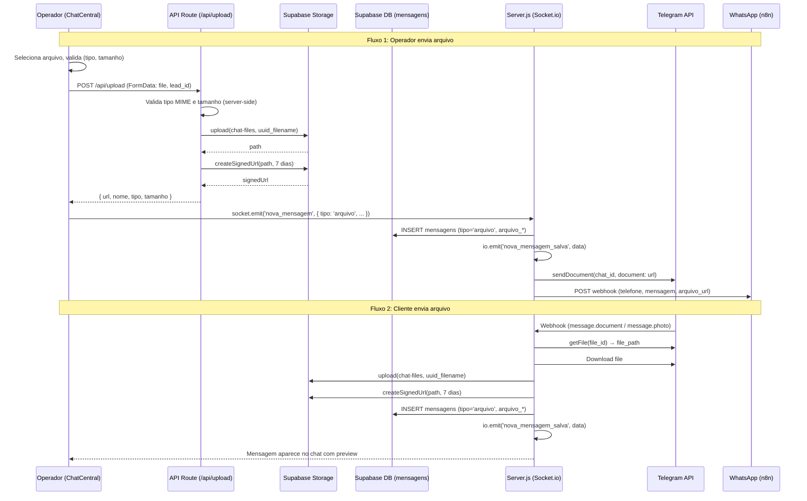

# Design Document: Chat Attachments

## Overview

Esta feature adiciona suporte a envio e recebimento de arquivos no chat do Cockpit (BRO Resolve). O fluxo cobre dois caminhos principais:

1. **Operador → Cliente**: O operador seleciona um arquivo no ChatCentral, o frontend valida e faz upload via API route para o Supabase Storage, o servidor salva a mensagem com metadados, faz broadcast via Socket.io e envia o arquivo ao canal do cliente (Telegram sendDocument / WhatsApp webhook).

2. **Cliente → Operador**: O webhook recebe mensagens com arquivos (Telegram document/photo, WhatsApp arquivo_url), o servidor baixa o arquivo, faz upload para o Supabase Storage, salva a mensagem com metadados e faz broadcast via Socket.io para o Cockpit.

Arquivos são armazenados no bucket `chat-files` do Supabase Storage com nomes sanitizados (UUID prefix). O acesso é feito via signed URLs com validade de 7 dias. A tabela `mensagens` recebe 4 novas colunas nullable para metadados de arquivo.

### Decisões de Design

- **API Route (Next.js) para upload**: O upload do operador passa por uma API route (`/api/upload`) que usa a service_role key do Supabase. Isso evita expor a service_role key no frontend e permite validação server-side.
- **Signed URLs**: Todas as URLs de arquivo são signed com 7 dias de validade. Isso garante que arquivos não ficam públicos permanentemente.
- **tipo='arquivo'**: Mensagens de arquivo usam o campo `tipo` existente com valor `'arquivo'`, mantendo compatibilidade com o fluxo atual de mensagens.
- **Validação dupla**: Validação no frontend (UX rápida) e no servidor (segurança). O servidor é a fonte de verdade.

## Architecture



## Components and Interfaces

### 1. API Route: `/api/upload` (Next.js)

Nova API route em `web/app/api/upload/route.ts`.

```typescript
// POST /api/upload
// Content-Type: multipart/form-data
// Body: file (File), lead_id (string)
// Response: { url: string, nome: string, tipo: string, tamanho: number }

interface UploadResponse {
  url: string       // signed URL (7 dias)
  nome: string      // nome original sanitizado
  tipo: string      // MIME type
  tamanho: number   // bytes
}

interface UploadError {
  error: string     // mensagem de erro em pt-BR
}
```

**Responsabilidades:**
- Receber arquivo via FormData
- Validar MIME type contra `TIPOS_PERMITIDOS`
- Validar tamanho contra `LIMITE_TAMANHO` (10 MB)
- Sanitizar nome do arquivo (UUID prefix + caracteres seguros)
- Upload para Supabase Storage bucket `chat-files`
- Gerar signed URL com 7 dias de validade
- Retornar metadados do arquivo

### 2. Server.js — Extensões ao Socket Handler `nova_mensagem`

O handler existente de `nova_mensagem` será estendido para suportar `tipo: 'arquivo'`:

```javascript
// Campos adicionais no payload quando tipo === 'arquivo':
{
  lead_id: string,
  de: string,          // operador_id
  conteudo: string,    // arquivo_nome (para exibição em texto)
  tipo: 'arquivo',
  operador_id: string,
  origem: 'humano',
  arquivo_url: string,   // signed URL
  arquivo_nome: string,  // nome original
  arquivo_tipo: string,  // MIME type
  arquivo_tamanho: number // bytes
}
```

**Outbound para Telegram:**
```javascript
// sendDocument via Telegram API
POST https://api.telegram.org/bot{token}/sendDocument
Body: { chat_id, document: arquivo_url, caption: arquivo_nome }
```

**Outbound para WhatsApp:**
```javascript
// Payload estendido para n8n webhook
POST WEBHOOK_N8N_URL
Body: { telefone, mensagem: arquivo_nome, arquivo_url }
```

### 3. Server.js — Extensões ao Webhook Handler (POST /webhook)

O webhook handler será estendido para detectar e processar arquivos recebidos:

**Telegram document:**
```javascript
// Detectar: req.body.message.document (file_id presente)
// 1. GET /getFile?file_id={file_id} → file_path
// 2. Download: https://api.telegram.org/file/bot{token}/{file_path}
// 3. Upload para Supabase Storage
// 4. Salvar mensagem com tipo='arquivo'
```

**Telegram photo:**
```javascript
// Detectar: req.body.message.photo (array presente)
// Usar último elemento (maior resolução)
// Mesmo fluxo de download/upload
```

**WhatsApp arquivo:**
```javascript
// Detectar: req.body.arquivo_url presente
// 1. Download do arquivo_url
// 2. Upload para Supabase Storage
// 3. Salvar mensagem com tipo='arquivo'
```

### 4. ChatCentral.tsx — Componente de Upload

Extensões ao componente existente:

```typescript
// Novos estados
const [isUploading, setIsUploading] = useState(false)
const [uploadError, setUploadError] = useState<string | null>(null)
const fileInputRef = useRef<HTMLInputElement>(null)

// Constantes de validação (espelhadas no servidor)
const LIMITE_TAMANHO = 10 * 1024 * 1024 // 10 MB
const TIPOS_PERMITIDOS = [
  'application/pdf',
  'image/jpeg', 'image/png', 'image/gif', 'image/webp',
  'application/msword',
  'application/vnd.openxmlformats-officedocument.wordprocessingml.document',
  'application/vnd.ms-excel',
  'application/vnd.openxmlformats-officedocument.spreadsheetml.sheet',
]
```

### 5. ChatCentral.tsx — Renderização de Mensagem de Arquivo

Novo bloco de renderização dentro do loop de mensagens:

```typescript
// Quando msg.tipo === 'arquivo':
// - Se arquivo_tipo começa com 'image/': preview inline (max 280x200px)
// - Senão: ícone de documento + nome + tamanho + botão "Baixar"
// - Mesma lógica de alinhamento (sent/received)
```

### 6. Módulo de Validação Compartilhado

Constantes e funções de validação usadas tanto no frontend quanto no servidor:

```typescript
// Constantes
const LIMITE_TAMANHO = 10 * 1024 * 1024 // 10 MB
const TIPOS_PERMITIDOS = [
  'application/pdf',
  'image/jpeg', 'image/png', 'image/gif', 'image/webp',
  'application/msword',
  'application/vnd.openxmlformats-officedocument.wordprocessingml.document',
  'application/vnd.ms-excel',
  'application/vnd.openxmlformats-officedocument.spreadsheetml.sheet',
]

// Funções
function validateFileSize(size: number): { valid: boolean; error?: string }
function validateFileType(mimeType: string): { valid: boolean; error?: string }
function sanitizeFileName(name: string): string  // remove caracteres especiais, prepend UUID
function formatFileSize(bytes: number): string   // "1.5 MB", "340 KB"
```

**Decisão**: Como o backend é CommonJS (Node.js) e o frontend é TypeScript/ESM, as constantes serão duplicadas em ambos os lados. A API route do Next.js terá sua própria cópia. Isso é aceitável dado o escopo pequeno e evita complexidade de shared packages.

## Data Models

### Migração SQL: `014_chat_attachments.sql`

```sql
-- Migração 014: Chat Attachments
-- Adiciona colunas de metadados de arquivo na tabela mensagens

ALTER TABLE mensagens ADD COLUMN IF NOT EXISTS arquivo_url TEXT;
ALTER TABLE mensagens ADD COLUMN IF NOT EXISTS arquivo_nome TEXT;
ALTER TABLE mensagens ADD COLUMN IF NOT EXISTS arquivo_tipo TEXT;
ALTER TABLE mensagens ADD COLUMN IF NOT EXISTS arquivo_tamanho BIGINT;
```

Todas as colunas são nullable — mensagens de texto existentes não são afetadas.

### Interface TypeScript atualizada (ChatCentral)

```typescript
interface Mensagem {
  id: string
  lead_id: string
  de: string
  tipo: string          // 'mensagem' | 'nota_interna' | 'sistema' | 'arquivo'
  conteudo: string
  operador_id: string | null
  created_at: string
  // Novos campos para arquivos
  arquivo_url?: string | null
  arquivo_nome?: string | null
  arquivo_tipo?: string | null
  arquivo_tamanho?: number | null
}
```

### Supabase Storage Bucket

- **Nome**: `chat-files`
- **Acesso**: Privado (apenas via service_role key)
- **Estrutura de path**: `{lead_id}/{uuid}_{sanitized_filename}`
- **Signed URL TTL**: 7 dias (604800 segundos)

### Payload Socket.io (nova_mensagem com arquivo)

```typescript
// Emitido pelo frontend ao enviar arquivo
interface FileMessagePayload {
  lead_id: string
  de: string
  conteudo: string        // arquivo_nome (fallback de exibição)
  tipo: 'arquivo'
  operador_id: string
  origem: 'humano'
  arquivo_url: string
  arquivo_nome: string
  arquivo_tipo: string
  arquivo_tamanho: number
}
```


## Correctness Properties

*A property is a characteristic or behavior that should hold true across all valid executions of a system — essentially, a formal statement about what the system should do. Properties serve as the bridge between human-readable specifications and machine-verifiable correctness guarantees.*

### Property 1: File size validation is a correct threshold function

*For any* non-negative integer representing a file size in bytes, `validateFileSize(size)` SHALL return `{ valid: true }` if and only if `size <= 10 * 1024 * 1024` (10 MB), and `{ valid: false, error: "Arquivo excede o limite de 10 MB" }` otherwise.

**Validates: Requirements 3.2, 7.1, 3.4, 7.3**

### Property 2: File type validation accepts exactly the allowed MIME types

*For any* string representing a MIME type, `validateFileType(mimeType)` SHALL return `{ valid: true }` if and only if the MIME type is in the set `TIPOS_PERMITIDOS`, and `{ valid: false, error: "Tipo de arquivo não permitido" }` otherwise.

**Validates: Requirements 3.3, 7.2, 3.5, 7.4**

### Property 3: File name sanitization produces safe names with UUID prefix

*For any* string representing a file name, `sanitizeFileName(name)` SHALL return a string that: (a) starts with a valid UUID followed by an underscore, (b) contains only alphanumeric characters, hyphens, underscores, and dots after the UUID prefix, and (c) preserves the original file extension if one exists.

**Validates: Requirements 7.5**

### Property 4: File message record construction preserves all metadata

*For any* valid file metadata (url, name, MIME type, size) and sender identifier, constructing a file message record SHALL produce a record where `tipo` equals `'arquivo'`, `arquivo_url` equals the provided URL, `arquivo_nome` equals the provided name, `arquivo_tipo` equals the provided MIME type, and `arquivo_tamanho` equals the provided size in bytes.

**Validates: Requirements 2.2, 5.4**

## Error Handling

### Upload Errors (Frontend)

| Cenário | Comportamento |
|---------|--------------|
| Arquivo > 10 MB | Exibe toast/alerta: "Arquivo excede o limite de 10 MB". Upload não inicia. |
| Tipo MIME não permitido | Exibe toast/alerta: "Tipo de arquivo não permitido". Upload não inicia. |
| Falha de rede durante upload | Exibe toast/alerta: "Falha no envio do arquivo. Tente novamente." Remove loading indicator. |
| API route retorna 400 | Exibe a mensagem de erro retornada pelo servidor. |
| API route retorna 500 | Exibe toast/alerta: "Erro interno. Tente novamente." |

### Upload Errors (Servidor — API Route)

| Cenário | Comportamento |
|---------|--------------|
| Arquivo > 10 MB | Retorna 400: `{ error: "Arquivo excede o limite de 10 MB" }` |
| Tipo MIME não permitido | Retorna 400: `{ error: "Tipo de arquivo não permitido" }` |
| Falha no upload para Supabase Storage | Retorna 500: `{ error: "Falha no upload do arquivo" }`. Log com level 'error'. |
| Falha na geração de signed URL | Retorna 500: `{ error: "Falha ao gerar URL do arquivo" }`. Log com level 'error'. |

### Outbound Errors (Servidor — Envio para Canal)

| Cenário | Comportamento |
|---------|--------------|
| Telegram sendDocument falha | Log: `{ level: 'error', msg: 'outbound_file_fail', lead_id, erro }`. Mensagem já salva no DB — operador vê no chat, mas cliente não recebe. |
| WhatsApp webhook falha | Mesmo comportamento do Telegram. |

### Inbound Errors (Servidor — Recebimento de Arquivo)

| Cenário | Comportamento |
|---------|--------------|
| Telegram getFile falha | Salva mensagem de texto: `"[Arquivo recebido — falha no processamento]"`. Log com level 'error'. |
| Download do arquivo falha | Mesmo comportamento. |
| Upload para Storage falha | Mesmo comportamento. |
| WhatsApp arquivo_url inacessível | Mesmo comportamento. |

### Princípio Geral

Falhas no processamento de arquivos **nunca bloqueiam o fluxo principal de mensagens**. Se um arquivo não pode ser processado, uma mensagem de fallback é salva e o erro é logado. O operador sempre vê que algo foi recebido.

## Testing Strategy

### Testes Unitários (Jest — backend)

- **Validação de tamanho**: Testar `validateFileSize` com valores limítrofes (0, 10MB exato, 10MB+1, valores grandes).
- **Validação de tipo**: Testar `validateFileType` com cada tipo permitido e tipos inválidos.
- **Sanitização de nome**: Testar `sanitizeFileName` com nomes normais, com caracteres especiais, unicode, espaços, múltiplos pontos.
- **Formatação de tamanho**: Testar `formatFileSize` com 0, 500 bytes, 1KB, 1.5MB, 10MB.
- **Construção de registro**: Testar que a função de construção de mensagem de arquivo popula todos os campos corretamente.

### Testes de Propriedade (Property-Based — Jest + fast-check)

Biblioteca: **fast-check** (compatível com Jest, já usado no ecossistema Node.js).

Cada teste de propriedade roda no mínimo **100 iterações**.

- **Property 1**: Gerar tamanhos aleatórios (0 a 100MB), verificar que validateFileSize retorna valid=true sse size ≤ 10MB.
  - Tag: `Feature: chat-attachments, Property 1: File size validation is a correct threshold function`
- **Property 2**: Gerar MIME types aleatórios (mix de permitidos e strings aleatórias), verificar que validateFileType retorna valid=true sse tipo está em TIPOS_PERMITIDOS.
  - Tag: `Feature: chat-attachments, Property 2: File type validation accepts exactly the allowed MIME types`
- **Property 3**: Gerar nomes de arquivo aleatórios (incluindo unicode, caracteres especiais, espaços), verificar que sanitizeFileName retorna string com UUID prefix e apenas caracteres permitidos.
  - Tag: `Feature: chat-attachments, Property 3: File name sanitization produces safe names with UUID prefix`
- **Property 4**: Gerar metadados de arquivo aleatórios (url, nome, tipo, tamanho, sender), verificar que o registro construído tem todos os campos corretos.
  - Tag: `Feature: chat-attachments, Property 4: File message record construction preserves all metadata`

### Testes de Integração

- **Upload completo**: Upload de arquivo via API route → verificar arquivo no Storage e registro no DB.
- **Outbound Telegram**: Enviar mensagem de arquivo → verificar chamada ao sendDocument com parâmetros corretos (mock).
- **Outbound WhatsApp**: Enviar mensagem de arquivo → verificar chamada ao webhook n8n com payload correto (mock).
- **Inbound Telegram document**: Webhook com document → verificar download, upload e registro no DB (mock).
- **Inbound Telegram photo**: Webhook com photo array → verificar seleção do maior tamanho, download, upload e registro (mock).
- **Inbound WhatsApp**: Webhook com arquivo_url → verificar download, upload e registro (mock).
- **Fallback de erro**: Simular falha no download → verificar mensagem de fallback salva.

### Testes de UI (Manuais / E2E futuros)

- Botão de anexo abre seletor de arquivo.
- Loading indicator aparece durante upload.
- Mensagem de arquivo renderiza com ícone, nome, tamanho e botão "Baixar".
- Imagens renderizam com preview inline (max 280x200px).
- Botão "Baixar" abre URL em nova aba.
- Alinhamento de mensagens de arquivo segue regra sent/received.
- Mensagens de erro aparecem corretamente para arquivos inválidos.
