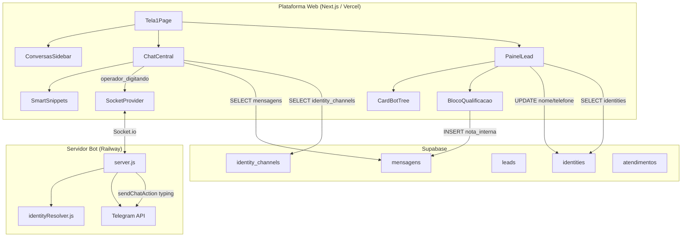
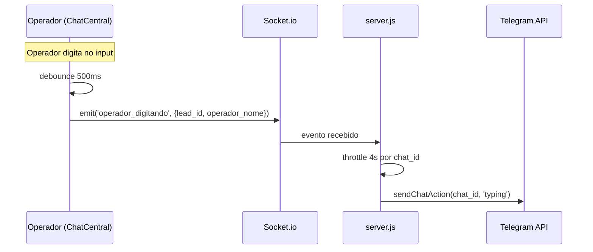
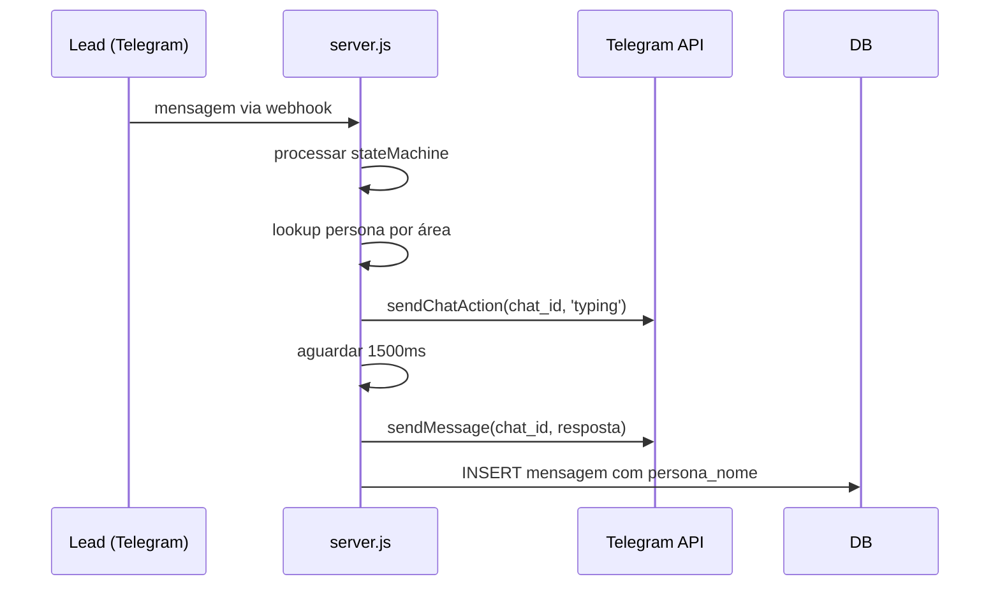
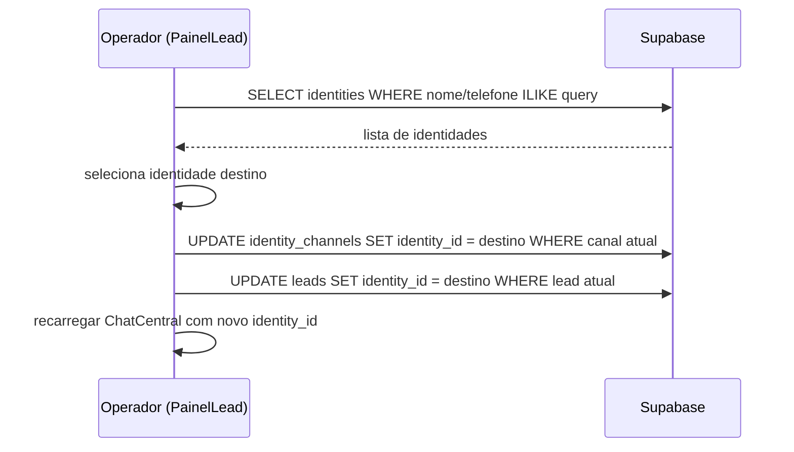

# Design — Cockpit Operativo v1.0

## Visão Geral

O Cockpit Operativo evolui a Tela 1 (tela de atendimento) do BRO Resolve em quatro frentes:

1. **Migração SQL** — Novas colunas `canal_origem` e `persona_nome` na tabela `mensagens`, índice em `identity_channels(identity_id)`.
2. **Server-side (Bot)** — Persona do bot com typing delay no Telegram; relay de typing do operador via Socket.io.
3. **PainelLead** — Refatoração em dois blocos (Card_Bot_Tree + Bloco_Qualificacao), nome/telefone editáveis na `identities`, vinculação de canais, Post-it de notas internas, botão "Chamar no WA" com mensagem pré-preenchida.
4. **ChatCentral** — Smart Snippets contextuais por status (LEAD vs CLIENTE), badges de canal no histórico unificado.

### Decisões de Design

- **Identities como fonte de verdade para nome/telefone**: Toda edição de nome/telefone atualiza `identities` primeiro, depois sincroniza `leads.nome` para manter consistência local. Isso evita divergência entre a identidade unificada e o lead.
- **Smart Snippets separados de QuickReplies**: QuickReplies (`/atalho`) são respostas genéricas do banco. Smart Snippets são botões contextuais fixos que mudam por status — implementados como componente separado `SmartSnippets.tsx`.
- **Typing status via Socket.io existente**: Reutilizamos a infraestrutura Socket.io já presente (SocketProvider, server.js) adicionando novos eventos (`operador_digitando`) sem criar conexões adicionais.
- **Migração idempotente**: Todas as operações DDL usam `IF NOT EXISTS` / `ADD COLUMN IF NOT EXISTS`.

## Arquitetura

### Diagrama de Componentes



### Fluxo de Dados — Typing Status



### Fluxo de Dados — Persona Bot



### Fluxo de Dados — Vinculação de Canais



## Componentes e Interfaces

### 1. Migração SQL (`sql/migrations/011_cockpit_operativo.sql`)

Adiciona colunas e índice necessários para suportar as novas funcionalidades.

```sql
-- Coluna canal_origem na mensagens (rastrear canal de cada mensagem)
ALTER TABLE mensagens ADD COLUMN IF NOT EXISTS canal_origem TEXT;

-- Coluna persona_nome na mensagens (nome da persona bot)
ALTER TABLE mensagens ADD COLUMN IF NOT EXISTS persona_nome TEXT;

-- Índice em identity_channels(identity_id) para buscas rápidas
CREATE INDEX IF NOT EXISTS idx_identity_channels_identity_id
  ON identity_channels(identity_id);
```

### 2. Persona Bot — `server.js`

**Mapeamento de personas** (constante no topo do arquivo):

```typescript
const BOT_PERSONAS: Record<string, string> = {
  'Trabalhista':     'Dr. Rafael',
  'Família':         'Dra. Mariana',
  'Previdenciário':  'Dr. Carlos',
  'Consumidor':      'Dra. Beatriz',
  'Cível':           'Dr. André',
  'Criminal':        'Dra. Patrícia',
}
const DEFAULT_PERSONA = 'Atendimento Santos & Bastos'
```

**Nova função `sendTelegramWithTyping`**:

```javascript
async function sendTelegramWithTyping(chat_id, text, area) {
  // 1. Enviar typing status
  await fetch(`${TELEGRAM_API}/sendChatAction`, {
    method: 'POST',
    headers: { 'Content-Type': 'application/json' },
    body: JSON.stringify({ chat_id, action: 'typing' }),
  });
  // 2. Delay humanizado
  await new Promise(r => setTimeout(r, 1500));
  // 3. Enviar mensagem
  await sendTelegram(chat_id, text);
  // 4. Retornar persona para persistência
  return BOT_PERSONAS[area] || DEFAULT_PERSONA;
}
```

**Integração no webhook**: Substituir `sendTelegram(tgMsg.chat.id, resposta.message)` por `sendTelegramWithTyping(...)` quando `is_assumido === false`.

### 3. Typing do Operador — `server.js`

**Novo handler Socket.io**:

```javascript
// Throttle map: chat_id → último timestamp de typing
const typingThrottle = new Map();

socket.on('operador_digitando', async ({ lead_id, operador_nome }) => {
  const db = getSupabase();
  const { data: lead } = await db
    .from('leads')
    .select('channel_user_id, canal_origem, is_assumido')
    .eq('id', lead_id)
    .maybeSingle();

  if (!lead?.is_assumido || lead.canal_origem !== 'telegram') return;

  const chatId = lead.channel_user_id;
  const now = Date.now();
  const last = typingThrottle.get(chatId) || 0;

  if (now - last < 4000) return; // throttle 4s
  typingThrottle.set(chatId, now);

  await fetch(`${TELEGRAM_API}/sendChatAction`, {
    method: 'POST',
    headers: { 'Content-Type': 'application/json' },
    body: JSON.stringify({ chat_id: chatId, action: 'typing' }),
  });
});
```

### 4. ChatCentral — Emissão de Typing (`ChatCentral.tsx`)

**Debounce no input**:

```typescript
const typingTimeoutRef = useRef<NodeJS.Timeout | null>(null)

const handleInputChange = (value: string) => {
  setInput(value)
  // ... lógica QuickReplies existente ...

  // Emitir typing com debounce 500ms
  if (lead && socket && value.trim()) {
    if (typingTimeoutRef.current) clearTimeout(typingTimeoutRef.current)
    typingTimeoutRef.current = setTimeout(() => {
      socket.emit('operador_digitando', {
        lead_id: lead.id,
        operador_nome: 'Operador', // TODO: nome real do operador
      })
    }, 500)
  }
}
```

### 5. SmartSnippets (`SmartSnippets.tsx`)

**Interface**:

```typescript
interface SmartSnippetsProps {
  lead: Lead
  onInject: (text: string) => void  // injeta texto no input
  onAssumir: () => void             // marca is_assumido = true
}
```

**Lógica de seleção de template**:

```typescript
function getSnippets(lead: Lead, isCliente: boolean): string[] {
  const nome = lead.nome || 'cliente'
  const area = lead.area_humano || lead.area_bot || lead.area || 'seu caso'

  if (isCliente) {
    return [
      `Oi ${nome}, estou acessando seu prontuário de ${area} para te dar um retorno.`
    ]
  }
  return [
    `Olá ${nome}, recebi seu caso de ${area}. Podemos falar agora?`
  ]
}
```

**Renderização**: Botões horizontais acima do input, com estilo `bg-accent/5 border border-accent/20 text-accent text-xs rounded-full px-3 py-1`.

### 6. Badges de Canal (`ChatCentral.tsx`)

**Resolução de canal por mensagem**:

```typescript
// Carregar mapa de channel_user_id → channel ao montar
const [channelMap, setChannelMap] = useState<Record<string, string>>({})

useEffect(() => {
  if (!lead) return
  // Buscar identity_id do lead, depois identity_channels
  async function loadChannels() {
    const { data: leadData } = await supabase
      .from('leads').select('identity_id').eq('id', lead.id).maybeSingle()
    if (!leadData?.identity_id) return
    const { data: channels } = await supabase
      .from('identity_channels')
      .select('channel, channel_user_id')
      .eq('identity_id', leadData.identity_id)
    if (channels) {
      const map: Record<string, string> = {}
      channels.forEach(c => { map[c.channel_user_id] = c.channel })
      setChannelMap(map)
    }
  }
  loadChannels()
}, [lead?.id])
```

**Renderização do badge** (apenas em mensagens recebidas):

```tsx
{!sent && channelMap[msg.de] && (
  <span className={`ml-1 text-[10px] px-1.5 py-0.5 rounded ${
    channelMap[msg.de] === 'telegram'
      ? 'bg-accent/10 text-accent'
      : 'bg-success/10 text-success'
  }`}>
    via {channelMap[msg.de] === 'telegram' ? 'Telegram' : 'WhatsApp'}
  </span>
)}
```

### 7. PainelLead Refatorado

**Estrutura de componentes**:

```
PainelLead.tsx (container 280px)
├── CardBotTree.tsx (bloco superior, somente leitura)
│   ├── Badge LEAD/CLIENTE
│   ├── ScoreCircle
│   ├── Área bot
│   ├── Prioridade
│   └── Respostas do menu (metadata)
│
├── <hr className="border-border" />
│
└── BlocoQualificacao.tsx (bloco inferior, editável)
    ├── Nome editável (click-to-edit → identities)
    ├── Telefone editável (click-to-edit → identities)
    ├── Botão "Vincular a Identidade Existente"
    ├── Dropdown área operador (area_humano)
    ├── Notas Internas (Post-it)
    ├── Botão "Chamar no WA"
    └── Botões de desfecho (CONVERTER, NÃO FECHOU)
```

**CardBotTree** — Props:

```typescript
interface CardBotTreeProps {
  lead: Lead
  isCliente: boolean
}
```

Renderiza dados imutáveis: `area_bot`, `score`, `prioridade`, `metadata` (respostas do menu). Todos os campos são `readonly` — sem inputs.

**BlocoQualificacao** — Props:

```typescript
interface BlocoQualificacaoProps {
  lead: Lead
  isCliente: boolean
  isAssumido: boolean
  operadorId: string | null
  onLeadUpdate: (lead: Lead) => void
  onLeadClosed: () => void
}
```

**Campo editável (click-to-edit)**:

```typescript
// Estado: 'display' | 'editing'
const [editingNome, setEditingNome] = useState(false)
const [nomeValue, setNomeValue] = useState(lead.nome || '')

async function saveNome() {
  if (!nomeValue.trim()) { setEditingNome(false); return } // Req 1.7
  const { data: leadData } = await supabase
    .from('leads').select('identity_id').eq('id', lead.id).maybeSingle()
  if (!leadData?.identity_id) return

  await supabase.from('identities').update({ nome: nomeValue.trim() })
    .eq('id', leadData.identity_id)
  await supabase.from('leads').update({ nome: nomeValue.trim() })
    .eq('id', lead.id)

  onLeadUpdate({ ...lead, nome: nomeValue.trim() })
  setEditingNome(false)
}
```

**Notas Internas (Post-it)**:

```typescript
// Input com estilo Post-it
<div className="bg-[#FFFBEB] border border-warning/30 rounded-md p-2">
  <textarea placeholder="Nota interna..." />
  <button>Salvar nota</button>
</div>
// Lista de notas existentes (tipo='nota_interna')
{notas.map(n => <div key={n.id} className="text-xs bg-[#FFFBEB] ...">{n.conteudo}</div>)}
```

**Botão "Chamar no WA"**:

```typescript
function buildWaLink(lead: Lead, isCliente: boolean): string | null {
  if (!lead.telefone) return null
  const phone = lead.telefone.replace(/\D/g, '')
  const nome = lead.nome || 'cliente'
  const area = lead.area_humano || lead.area_bot || lead.area || 'seu caso'

  const msg = isCliente
    ? `Oi ${nome}, estou acessando seu prontuário de ${area} para te dar um retorno.`
    : `Olá ${nome}, recebi seu caso de ${area}. Podemos falar agora?`

  return `https://wa.me/${phone}?text=${encodeURIComponent(msg)}`
}
```

**Vinculação de Identidade**:

```typescript
// Busca por nome ou telefone
const [searchQuery, setSearchQuery] = useState('')
const [searchResults, setSearchResults] = useState<Identity[]>([])

async function searchIdentities(query: string) {
  const { data } = await supabase
    .from('identities')
    .select('id, nome, telefone')
    .or(`nome.ilike.%${query}%,telefone.ilike.%${query}%`)
    .limit(10)
  setSearchResults(data || [])
}

async function linkToIdentity(targetIdentityId: string) {
  // 1. Mover canal atual para identidade destino
  await supabase.from('identity_channels')
    .update({ identity_id: targetIdentityId })
    .eq('identity_id', currentIdentityId)
    .eq('channel', currentChannel)

  // 2. Atualizar lead
  await supabase.from('leads')
    .update({ identity_id: targetIdentityId })
    .eq('id', lead.id)

  // 3. Recarregar ChatCentral
  onLeadUpdate({ ...lead, identity_id: targetIdentityId })
}
```

## Modelos de Dados

### Tabelas Existentes (relevantes)

```
identities
├── id: UUID (PK)
├── telefone: TEXT (UNIQUE, nullable)
├── nome: TEXT (nullable)
└── created_at: TIMESTAMPTZ

identity_channels
├── id: UUID (PK)
├── identity_id: UUID (FK → identities)
├── channel: TEXT ('telegram' | 'whatsapp')
├── channel_user_id: TEXT
├── created_at: TIMESTAMPTZ
└── UNIQUE(channel, channel_user_id)

leads
├── id: UUID (PK)
├── identity_id: UUID (FK → identities)
├── nome: TEXT (nullable, sincronizado com identities.nome)
├── telefone: TEXT (nullable)
├── area: TEXT, area_bot: TEXT, area_humano: TEXT
├── score: INTEGER
├── prioridade: TEXT
├── canal_origem: TEXT
├── is_assumido: BOOLEAN
├── status: TEXT
├── metadata: JSONB
└── ...

mensagens
├── id: UUID (PK)
├── lead_id: UUID (FK → leads)
├── de: TEXT (channel_user_id | 'bot' | 'sistema' | operador_id)
├── tipo: TEXT ('mensagem' | 'sistema' | 'nota_interna')
├── conteudo: TEXT
├── operador_id: UUID (nullable)
├── created_at: TIMESTAMPTZ
├── canal_origem: TEXT (nullable) ← NOVO
└── persona_nome: TEXT (nullable) ← NOVO
```

### Novas Colunas (Migração 011)

| Tabela | Coluna | Tipo | Nullable | Descrição |
|--------|--------|------|----------|-----------|
| `mensagens` | `canal_origem` | TEXT | sim | Canal de origem da mensagem (`telegram`, `whatsapp`) |
| `mensagens` | `persona_nome` | TEXT | sim | Nome da persona bot que enviou a mensagem |

### Novo Índice

| Tabela | Índice | Colunas | Motivo |
|--------|--------|---------|--------|
| `identity_channels` | `idx_identity_channels_identity_id` | `identity_id` | Otimizar busca de canais por identidade (badges, vinculação) |

### Eventos Socket.io (novos)

| Evento | Direção | Payload | Descrição |
|--------|---------|---------|-----------|
| `operador_digitando` | Client → Server | `{ lead_id: string, operador_nome: string }` | Operador está digitando no ChatCentral |

### Mapeamento Persona Bot

| Área | Persona |
|------|---------|
| Trabalhista | Dr. Rafael |
| Família | Dra. Mariana |
| Previdenciário | Dr. Carlos |
| Consumidor | Dra. Beatriz |
| Cível | Dr. André |
| Criminal | Dra. Patrícia |
| _(default)_ | Atendimento Santos & Bastos |


## Propriedades de Corretude

*Uma propriedade é uma característica ou comportamento que deve ser verdadeiro em todas as execuções válidas de um sistema — essencialmente, uma declaração formal sobre o que o sistema deve fazer. Propriedades servem como ponte entre especificações legíveis por humanos e garantias de corretude verificáveis por máquina.*

### Property 1: Consistência dual-write de nome (identities + leads)

*Para qualquer* nome válido (não-vazio, não composto apenas de espaços), ao salvar o nome de um lead, tanto `identities.nome` quanto `leads.nome` devem conter exatamente o mesmo valor após a operação.

**Validates: Requirements 1.2, 1.3**

### Property 2: Rejeição de nome vazio

*Para qualquer* string composta inteiramente de espaços em branco (incluindo string vazia), a operação de salvar nome deve ser rejeitada e o valor anterior de `identities.nome` deve permanecer inalterado.

**Validates: Requirements 1.7**

### Property 3: Integridade da vinculação de canais

*Para qualquer* par de identidades (origem, destino) e canal válido, após a operação de vinculação: (a) o registro em `identity_channels` deve apontar para `identity_id` destino, e (b) o `leads.identity_id` do lead atual deve apontar para a identidade destino.

**Validates: Requirements 2.5, 2.6**

### Property 4: Persistência de nota interna com tipo correto

*Para qualquer* texto de nota não-vazio e lead_id válido, ao salvar uma nota interna, a tabela `mensagens` deve conter um registro com `tipo='nota_interna'`, `lead_id` correspondente e `conteudo` igual ao texto fornecido.

**Validates: Requirements 3.6**

### Property 5: Ordenação de notas internas

*Para qualquer* conjunto de notas internas de um lead, a lista exibida deve estar ordenada por `created_at` descendente — ou seja, para todo par consecutivo de notas (n_i, n_{i+1}), `n_i.created_at >= n_{i+1}.created_at`.

**Validates: Requirements 3.7**

### Property 6: Seleção de template Smart Snippet por status

*Para qualquer* lead com nome e área definidos, a função `getSnippets` deve retornar: (a) o template de primeiro contato ("Olá {{nome}}, recebi seu caso de {{area}}...") quando o status está em {LEAD, TRIAGEM, NOVO}, e (b) o template de retorno ("Oi {{nome}}, estou acessando seu prontuário de {{area}}...") quando o status é CLIENTE ou o atendimento tem status "convertido". Em ambos os casos, `{{nome}}` e `{{area}}` devem ser substituídos pelos valores reais do lead.

**Validates: Requirements 4.1, 4.2**

### Property 7: Construção de URL wa.me

*Para qualquer* lead com telefone registrado, a função `buildWaLink` deve retornar uma URL no formato `https://wa.me/{telefone_limpo}?text={mensagem_codificada}` onde: (a) `telefone_limpo` contém apenas dígitos, (b) `mensagem_codificada` é o resultado de `encodeURIComponent` aplicado ao template correspondente ao status do lead, e (c) o template contém o nome e área do lead interpolados.

**Validates: Requirements 5.2, 5.3, 5.4**

### Property 8: Throttle de typing do operador

*Para qualquer* sequência de eventos `operador_digitando` para um mesmo `chat_id`, a função `sendChatAction` deve ser chamada no máximo uma vez a cada 4 segundos. Ou seja, para quaisquer duas chamadas consecutivas de `sendChatAction` para o mesmo `chat_id`, o intervalo entre elas deve ser ≥ 4000ms.

**Validates: Requirements 7.3**

### Property 9: Badge de canal condicional

*Para qualquer* mensagem no histórico unificado e mapa de canais (`channel_user_id → channel`): (a) se `msg.de` corresponde a um `channel_user_id` no mapa (mensagem do lead), o badge deve exibir o canal correto ("via Telegram" ou "via WhatsApp"), e (b) se `msg.de` é 'bot', 'sistema' ou um `operador_id`, nenhum badge deve ser exibido.

**Validates: Requirements 8.1, 8.2, 8.5**

### Property 10: Idempotência da migração SQL

*Para qualquer* número de execuções consecutivas da migração `011_cockpit_operativo.sql`, todas as execuções devem completar sem erro. A segunda execução (e subsequentes) não deve alterar o schema resultante da primeira execução.

**Validates: Requirements 9.4**

## Tratamento de Erros

### Camada de Dados (Supabase)

| Operação | Erro Possível | Tratamento |
|----------|---------------|------------|
| UPDATE identities.nome | Falha de rede / RLS | Toast de erro "Falha ao salvar nome. Tente novamente.", reverter campo para valor anterior |
| UPDATE identities.telefone | Violação UNIQUE (telefone duplicado) | Toast "Este telefone já está vinculado a outra identidade. Use 'Vincular a Identidade Existente'." |
| UPDATE identity_channels (vinculação) | FK violation / canal não encontrado | Toast "Erro ao vincular canal. Verifique e tente novamente." |
| INSERT mensagens (nota interna) | Falha de rede | Toast "Falha ao salvar nota. Tente novamente.", manter texto no campo |
| SELECT identities (busca vinculação) | Timeout / erro | Exibir "Erro na busca" no dropdown de resultados |

### Camada de Servidor (server.js)

| Operação | Erro Possível | Tratamento |
|----------|---------------|------------|
| sendChatAction (typing) | Rate limit Telegram (429) | Log warning, prosseguir com envio da mensagem sem typing |
| sendTelegram após delay | Falha de rede | Log error, não bloquear fluxo do webhook (já implementado) |
| Lookup lead para operador_digitando | Lead não encontrado | Ignorar evento silenciosamente (log debug) |

### Camada de UI

| Cenário | Tratamento |
|---------|------------|
| Lead sem identity_id | Desabilitar edição de nome/telefone, exibir dados como somente leitura |
| Lead sem telefone | Desabilitar botão "Chamar no WA" com tooltip "Telefone não disponível" |
| Busca de identidades sem resultados | Exibir "Nenhuma identidade encontrada" |
| Socket desconectado | Typing do operador falha silenciosamente (não bloqueia digitação) |
| Campo nome/telefone em edição quando lead muda | Cancelar edição, resetar para novo lead |

## Estratégia de Testes

### Abordagem Dual

Este feature combina lógica pura (funções de template, construção de URL, throttle) com integrações (Supabase, Socket.io, Telegram API). A estratégia usa:

- **Testes de propriedade (PBT)**: Para funções puras e invariantes de dados — validam comportamento universal com 100+ iterações.
- **Testes unitários**: Para exemplos específicos, edge cases e integrações mockadas.
- **Testes de integração**: Para fluxos end-to-end com Supabase real (ambiente de teste).

### Biblioteca PBT

**fast-check** (TypeScript) — já compatível com o ecossistema Next.js/Vitest do projeto.

### Testes de Propriedade (mínimo 100 iterações cada)

| # | Propriedade | Arquivo de Teste | Tag |
|---|-------------|------------------|-----|
| 1 | Consistência dual-write de nome | `tests/properties/name-update.test.ts` | Feature: cockpit-operativo, Property 1: name dual-write consistency |
| 2 | Rejeição de nome vazio | `tests/properties/name-update.test.ts` | Feature: cockpit-operativo, Property 2: empty name rejection |
| 3 | Integridade da vinculação de canais | `tests/properties/channel-linking.test.ts` | Feature: cockpit-operativo, Property 3: channel linking integrity |
| 4 | Persistência de nota interna | `tests/properties/notes.test.ts` | Feature: cockpit-operativo, Property 4: note persistence |
| 5 | Ordenação de notas internas | `tests/properties/notes.test.ts` | Feature: cockpit-operativo, Property 5: notes ordering |
| 6 | Seleção de template Smart Snippet | `tests/properties/smart-snippets.test.ts` | Feature: cockpit-operativo, Property 6: snippet template selection |
| 7 | Construção de URL wa.me | `tests/properties/wa-link.test.ts` | Feature: cockpit-operativo, Property 7: wa.me URL construction |
| 8 | Throttle de typing | `tests/properties/typing-throttle.test.ts` | Feature: cockpit-operativo, Property 8: typing throttle |
| 9 | Badge de canal condicional | `tests/properties/channel-badge.test.ts` | Feature: cockpit-operativo, Property 9: conditional channel badge |
| 10 | Idempotência da migração | `tests/properties/migration.test.ts` | Feature: cockpit-operativo, Property 10: migration idempotency |

### Testes Unitários (exemplos e edge cases)

| Cenário | Arquivo |
|---------|---------|
| Click-to-edit transforma campo em input (Req 1.1, 2.1) | `tests/unit/click-to-edit.test.tsx` |
| Nome atualizado reflete na sidebar (Req 1.4) | `tests/unit/name-propagation.test.tsx` |
| Busca de identidades sem resultados (Req 2.8) | `tests/unit/identity-search.test.tsx` |
| CardBotTree renderiza somente leitura (Req 3.3) | `tests/unit/card-bot-tree.test.tsx` |
| Smart Snippet injeta texto sem enviar (Req 4.3) | `tests/unit/smart-snippets-ui.test.tsx` |
| Botão WA desabilitado sem telefone (Req 5.5) | `tests/unit/wa-button.test.tsx` |
| Delay de 1500ms entre typing e mensagem (Req 6.3) | `tests/unit/bot-persona-delay.test.ts` |
| Debounce de 500ms no typing do operador (Req 7.1) | `tests/unit/typing-debounce.test.ts` |
| Badge omitido em mensagens do bot (Req 8.5) | `tests/unit/channel-badge-ui.test.tsx` |

### Testes de Integração

| Cenário | Arquivo |
|---------|---------|
| Migração 011 executa sem erro (Req 9.1-9.3) | `tests/integration/migration-011.test.ts` |
| sendChatAction chamado antes de sendMessage (Req 6.2) | `tests/integration/bot-typing.test.ts` |
| operador_digitando relay para Telegram (Req 7.2) | `tests/integration/operator-typing.test.ts` |
| Vinculação recarrega histórico unificado (Req 2.7) | `tests/integration/channel-link-flow.test.ts` |

### Configuração

```json
// vitest.config.ts (ou jest.config.ts)
{
  "testMatch": [
    "tests/properties/**/*.test.ts",
    "tests/unit/**/*.test.{ts,tsx}",
    "tests/integration/**/*.test.ts"
  ]
}
```

Cada teste de propriedade usa `fc.assert(fc.property(...), { numRuns: 100 })` como mínimo de iterações.
