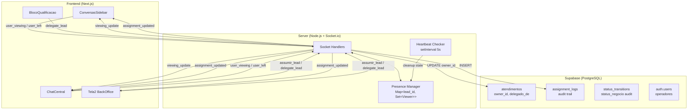

# Design — Atribuição Colaborativa sem Bloqueios

## Overview

Este design descreve a implementação do sistema de atribuição colaborativa para o CRM Santos & Bastos. O sistema permite que qualquer operador assuma, delegue ou interaja com qualquer caso a qualquer momento, sem bloqueios ou permissões especiais. Toda mudança de responsabilidade é registrada em um audit trail completo (`assignment_logs`), e a presença em tempo real via Socket.io mostra quem está visualizando cada caso.

A arquitetura se apoia em três pilares:
1. **Atribuição sem bloqueios** — `owner_id` em `atendimentos` como campo mutável por qualquer operador autenticado, com upsert para evitar erros de constraint.
2. **Presença em tempo real** — Map in-memory no server.js com heartbeat/timeout para limpeza de ghost users.
3. **Audit trail** — Tabela `assignment_logs` append-only para rastreabilidade completa.

## Architecture



### Decisões de Arquitetura

1. **`assignment_logs` como tabela separada** (não estender `status_transitions`): separação de concerns — `status_transitions` audita mudanças de `status_negocio`, enquanto `assignment_logs` audita mudanças de responsabilidade. Queries mais simples e legíveis.

2. **Presença in-memory** (não persistida no banco): presença é efêmera por natureza. Usar banco adicionaria latência desnecessária. O Map é limpo automaticamente no disconnect e via heartbeat timeout.

3. **Upsert no `assumir_lead`**: o handler atual falha com erro 23505 (UNIQUE constraint) quando o lead já tem atendimento. O novo design usa upsert para sempre atualizar o `owner_id`, garantindo que a ação nunca falha.

4. **`last_action` computado no frontend**: `MAX(ultima_msg_em, last_transition_created_at)` — evita coluna materializada e mantém consistência sem triggers.

## Components and Interfaces

### 1. Migration SQL (`016_collaborative_assignment.sql`)

```sql
-- Tabela assignment_logs (audit trail de atribuições)
CREATE TABLE IF NOT EXISTS assignment_logs (
  id UUID PRIMARY KEY DEFAULT gen_random_uuid(),
  lead_id UUID NOT NULL REFERENCES leads(id),
  from_user_id UUID REFERENCES auth.users(id),
  to_user_id UUID REFERENCES auth.users(id),
  action TEXT NOT NULL CHECK (action IN ('assign', 'reassign', 'delegate', 'unassign')),
  created_at TIMESTAMPTZ DEFAULT now()
);

-- RLS
ALTER TABLE assignment_logs ENABLE ROW LEVEL SECURITY;

CREATE POLICY "service_role_full_assignment_logs" ON assignment_logs
  FOR ALL TO service_role USING (true) WITH CHECK (true);

CREATE POLICY "authenticated_read_assignment_logs" ON assignment_logs
  FOR SELECT TO authenticated USING (true);

CREATE POLICY "authenticated_insert_assignment_logs" ON assignment_logs
  FOR INSERT TO authenticated WITH CHECK (true);

-- Índices
CREATE INDEX IF NOT EXISTS idx_assignment_logs_lead ON assignment_logs(lead_id);
CREATE INDEX IF NOT EXISTS idx_assignment_logs_created ON assignment_logs(created_at);
```

### 2. Server.js — Presence Manager

```typescript
// In-memory presence map
// Map<lead_id, Map<user_id, { user_name, socket_id, last_heartbeat }>>
const viewingMap = new Map();

// Heartbeat checker — runs every 5s, removes entries older than 15s
const HEARTBEAT_TIMEOUT = 15_000;
setInterval(() => {
  const now = Date.now();
  for (const [leadId, viewers] of viewingMap) {
    for (const [userId, info] of viewers) {
      if (now - info.last_heartbeat > HEARTBEAT_TIMEOUT) {
        viewers.delete(userId);
        io.emit('viewing_update', {
          lead_id: leadId,
          viewers: Array.from(viewers.values()).map(v => ({
            user_id: v.user_id, user_name: v.user_name
          }))
        });
      }
    }
    if (viewers.size === 0) viewingMap.delete(leadId);
  }
}, 5000);
```

### 3. Socket Events — Novos Handlers

| Evento | Direção | Payload | Descrição |
|--------|---------|---------|-----------|
| `user_viewing` | client→server | `{ lead_id, user_id, user_name }` | Operador abriu/está visualizando caso |
| `user_left` | client→server | `{ lead_id, user_id }` | Operador saiu do caso |
| `viewing_update` | server→client | `{ lead_id, viewers: [{user_id, user_name}] }` | Lista atualizada de viewers |
| `assignment_updated` | server→client | `{ lead_id, owner_id, owner_name, action }` | Responsável mudou |
| `delegate_lead` | client→server | `{ lead_id, from_user_id, to_user_id }` | Delegar caso para outro operador |

### 4. Server.js — Handler Modifications

**`assumir_lead` (modificado):**
```javascript
socket.on('assumir_lead', async ({ lead_id, operador_id }) => {
  const db = getSupabase();
  
  // Buscar owner atual para audit log
  const { data: current } = await db
    .from('atendimentos')
    .select('owner_id')
    .eq('lead_id', lead_id)
    .maybeSingle();
  
  const previousOwner = current?.owner_id || null;
  const action = previousOwner ? 'reassign' : 'assign';
  
  // Upsert — nunca falha por UNIQUE constraint
  const { error } = await db
    .from('atendimentos')
    .upsert({
      lead_id,
      owner_id: operador_id,
      delegado_de: previousOwner,
      status: 'aberto',
      assumido_em: new Date().toISOString(),
    }, { onConflict: 'lead_id' });

  if (error) {
    socket.emit('erro_assumir', { mensagem: error.message });
    return;
  }

  // Audit log
  await db.from('assignment_logs').insert({
    lead_id,
    from_user_id: previousOwner,
    to_user_id: operador_id,
    action,
  });

  // Buscar nome do novo owner para broadcast
  const { data: userData } = await db
    .from('auth.users')
    .select('raw_user_meta_data')
    .eq('id', operador_id)
    .maybeSingle();
  const ownerName = userData?.raw_user_meta_data?.name || 'Operador';

  io.emit('lead_assumido', { lead_id, operador_id });
  io.emit('assignment_updated', {
    lead_id,
    owner_id: operador_id,
    owner_name: ownerName,
    action,
  });
});
```

**`delegate_lead` (novo):**
```javascript
socket.on('delegate_lead', async ({ lead_id, from_user_id, to_user_id }) => {
  const db = getSupabase();

  await db
    .from('atendimentos')
    .update({ owner_id: to_user_id, delegado_de: from_user_id })
    .eq('lead_id', lead_id);

  await db.from('assignment_logs').insert({
    lead_id,
    from_user_id,
    to_user_id,
    action: 'delegate',
  });

  const { data: userData } = await db
    .from('auth.users')
    .select('raw_user_meta_data')
    .eq('id', to_user_id)
    .maybeSingle();
  const ownerName = userData?.raw_user_meta_data?.name || 'Operador';

  io.emit('lead_delegado', { lead_id, operador_id_destino: to_user_id });
  io.emit('assignment_updated', {
    lead_id,
    owner_id: to_user_id,
    owner_name: ownerName,
    action: 'delegate',
  });
});
```

**Presence handlers (novos):**
```javascript
socket.on('user_viewing', ({ lead_id, user_id, user_name }) => {
  if (!viewingMap.has(lead_id)) viewingMap.set(lead_id, new Map());
  viewingMap.get(lead_id).set(user_id, {
    user_id, user_name, socket_id: socket.id,
    last_heartbeat: Date.now(),
  });
  io.emit('viewing_update', {
    lead_id,
    viewers: Array.from(viewingMap.get(lead_id).values())
      .map(v => ({ user_id: v.user_id, user_name: v.user_name })),
  });
});

socket.on('user_left', ({ lead_id, user_id }) => {
  const viewers = viewingMap.get(lead_id);
  if (viewers) {
    viewers.delete(user_id);
    if (viewers.size === 0) viewingMap.delete(lead_id);
    io.emit('viewing_update', {
      lead_id,
      viewers: viewers.size > 0
        ? Array.from(viewers.values()).map(v => ({ user_id: v.user_id, user_name: v.user_name }))
        : [],
    });
  }
});

// On disconnect: remove from all viewing maps
socket.on('disconnect', () => {
  for (const [leadId, viewers] of viewingMap) {
    for (const [userId, info] of viewers) {
      if (info.socket_id === socket.id) {
        viewers.delete(userId);
        io.emit('viewing_update', {
          lead_id: leadId,
          viewers: Array.from(viewers.values())
            .map(v => ({ user_id: v.user_id, user_name: v.user_name })),
        });
      }
    }
    if (viewers.size === 0) viewingMap.delete(leadId);
  }
});
```

### 5. Frontend Components

**ConversasSidebar — Alterações:**
- Fetch `owner_id` via join com `atendimentos` e nome do owner via `auth.users`
- Exibir "Responsável: Nome" abaixo do preview da mensagem
- Computar `last_action`: `MAX(lead.ultima_msg_em, last_status_transition.created_at)`
- Exibir "Última ação: Nome · Xm atrás"
- Ouvir evento `assignment_updated` para atualizar em tempo real

**ChatCentral — Alterações:**
- Emitir `user_viewing` no mount e a cada 10s (heartbeat)
- Emitir `user_left` no unmount ou troca de lead
- Ouvir `viewing_update` e exibir indicadores de presença no header
- Filtrar o próprio usuário da lista de viewers
- Exibir aviso não-bloqueante ao assumir caso com owner existente

**BlocoQualificacao — Alterações:**
- Adicionar botão "Delegar" que abre popover com lista de operadores
- Fetch operadores de `auth.users` (via Supabase admin ou RPC)
- Emitir `delegate_lead` ao selecionar operador destino

**Tela2 BackOffice — Alterações:**
- Exibir nome do responsável em cada card de lead
- Adicionar botões Assumir/Delegar inline nos cards

## Data Models

### assignment_logs

| Coluna | Tipo | Constraint | Descrição |
|--------|------|-----------|-----------|
| id | UUID | PK, DEFAULT gen_random_uuid() | Identificador único |
| lead_id | UUID | NOT NULL, FK leads(id) | Caso relacionado |
| from_user_id | UUID | FK auth.users(id), NULLABLE | Responsável anterior (null se primeiro assign) |
| to_user_id | UUID | FK auth.users(id), NULLABLE | Novo responsável (null se unassign) |
| action | TEXT | NOT NULL, CHECK IN ('assign','reassign','delegate','unassign') | Tipo da ação |
| created_at | TIMESTAMPTZ | DEFAULT now() | Timestamp da ação |

### atendimentos (campos existentes usados)

| Coluna | Uso nesta feature |
|--------|-------------------|
| owner_id | Responsável atual do caso |
| delegado_de | Responsável anterior (preenchido em reassign/delegate) |
| lead_id | UNIQUE — usado para upsert |

### Presence (in-memory, não persistido)

```typescript
type ViewerInfo = {
  user_id: string;
  user_name: string;
  socket_id: string;
  last_heartbeat: number; // Date.now()
};

// Map<lead_id, Map<user_id, ViewerInfo>>
type ViewingMap = Map<string, Map<string, ViewerInfo>>;
```

## Correctness Properties

*A property is a characteristic or behavior that should hold true across all valid executions of a system — essentially, a formal statement about what the system should do. Properties serve as the bridge between human-readable specifications and machine-verifiable correctness guarantees.*

### Property 1: Assume action always succeeds and sets owner correctly

*For any* operator and any caso (with or without an existing owner), calling the assume action SHALL succeed without error and set `owner_id` to the operator's identifier.

**Validates: Requirements 1.2, 1.4, 1.5, 4.1, 4.5, 4.6, 6.7**

### Property 2: Assume action records audit log with correct fields

*For any* assume action on a caso, the system SHALL insert an `assignment_logs` entry containing the caso identifier, the previous owner (or null), the new owner, the action type ('assign' or 'reassign'), and a timestamp.

**Validates: Requirements 1.3, 5.1**

### Property 3: Delegate action records audit log with correct fields

*For any* delegate action from operator A to operator B on a caso, the system SHALL insert an `assignment_logs` entry containing the caso identifier, operator A as `from_user_id`, operator B as `to_user_id`, the action type 'delegate', and a timestamp.

**Validates: Requirements 5.2**

### Property 4: Reassignment preserves previous owner in delegado_de

*For any* caso that already has an owner, when a different operator assumes the caso, the system SHALL set `delegado_de` to the previous owner's identifier and `owner_id` to the new operator's identifier.

**Validates: Requirements 4.4**

### Property 5: Card displays correct owner name

*For any* caso with an `owner_id`, the card rendering function SHALL include the owner's display name in the output. When `owner_id` is null, the output SHALL contain the placeholder text "Sem responsável".

**Validates: Requirements 2.1, 2.2**

### Property 6: Last action computation selects most recent timestamp

*For any* caso with a set of message timestamps and status transition timestamps, the `last_action` computation SHALL return the maximum of all timestamps, along with the actor who performed that action.

**Validates: Requirements 2.3**

### Property 7: Presence viewer list is correctly maintained across join/leave events

*For any* sequence of `user_viewing` and `user_left` events for a caso, the resulting viewer list SHALL contain exactly the users who have joined but not yet left.

**Validates: Requirements 3.3, 3.4**

### Property 8: Presence timeout removes stale viewers

*For any* viewer in the presence map whose `last_heartbeat` is older than 15 seconds, the heartbeat checker SHALL remove that viewer from the map and emit an updated viewer list.

**Validates: Requirements 3.5**

### Property 9: Presence self-filter excludes current user

*For any* viewer list and a current user identifier, the filtered list SHALL contain all viewers except the current user. When the filtered list is empty, the presence indicator SHALL be hidden.

**Validates: Requirements 3.6, 3.7**

### Property 10: Audit log round-trip reconstructs ownership history

*For any* sequence of assume and delegate actions on a caso, reading the `assignment_logs` entries in chronological order and replaying them SHALL produce the current `owner_id` as the final state.

**Validates: Requirements 5.5, 5.6**

### Property 11: Last-write-wins on concurrent assumes

*For any* two operators attempting to assume the same caso, both actions SHALL succeed, both SHALL be recorded in `assignment_logs`, and the final `owner_id` SHALL be the operator whose action was processed last.

**Validates: Requirements 6.5**

### Property 12: Warning shows current owner name on reassignment

*For any* caso that already has an owner, when another operator attempts to assume it, the system SHALL return a warning containing the current owner's name before proceeding.

**Validates: Requirements 4.2**

## Error Handling

| Cenário | Tratamento |
|---------|-----------|
| Supabase indisponível durante assume | `socket.emit('erro_assumir', { mensagem })` — operador vê toast de erro |
| Heartbeat timeout (ghost user) | Remoção automática do viewingMap após 15s sem heartbeat |
| Socket disconnect abrupto | `disconnect` handler remove usuário de todos os viewingMaps |
| Falha ao inserir assignment_log | Log no console, não bloqueia a ação principal (assume/delegate continua) |
| `auth.users` query falha (nome do owner) | Fallback para "Operador" como nome genérico |
| Concurrent upsert race condition | PostgreSQL serializa upserts na mesma row — last-write-wins naturalmente |
| Lead sem atendimento ao delegar | Criar atendimento via upsert antes de delegar |

## Testing Strategy

### Unit Tests (example-based)
- Verificar que o card exibe "Sem responsável" quando `owner_id` é null (Req 2.2)
- Verificar que o aviso de reassignment é não-bloqueante (Req 4.3)
- Verificar que a sidebar não filtra por operador (Req 2.5)
- Verificar que nenhum indicador de bloqueio existe no UI (Req 6.4)
- Verificar que socket events são emitidos com payload correto (Req 3.1, 3.2, 4.7)

### Integration Tests
- Socket `user_viewing` → `viewing_update` round-trip (Req 3.1, 3.3)
- Socket `assumir_lead` → `assignment_updated` broadcast (Req 4.7)
- Socket disconnect → viewer removal (Req 3.5)
- Interações diversas geram entries no audit log (Req 5.3)

### Property-Based Tests (fast-check)

A biblioteca `fast-check` será usada para testes de propriedade. Cada teste roda no mínimo 100 iterações.

| Property | Tag | Iterações |
|----------|-----|-----------|
| P1: Assume always succeeds | Feature: collaborative-assignment, Property 1: Assume action always succeeds | 100 |
| P2: Assume audit log | Feature: collaborative-assignment, Property 2: Assume audit log fields | 100 |
| P3: Delegate audit log | Feature: collaborative-assignment, Property 3: Delegate audit log fields | 100 |
| P4: Reassignment delegado_de | Feature: collaborative-assignment, Property 4: Reassignment preserves previous owner | 100 |
| P5: Card owner display | Feature: collaborative-assignment, Property 5: Card displays correct owner | 100 |
| P6: Last action timestamp | Feature: collaborative-assignment, Property 6: Last action selects most recent | 100 |
| P7: Presence join/leave | Feature: collaborative-assignment, Property 7: Viewer list maintained correctly | 100 |
| P8: Presence timeout | Feature: collaborative-assignment, Property 8: Stale viewers removed | 100 |
| P9: Presence self-filter | Feature: collaborative-assignment, Property 9: Self-filter excludes current user | 100 |
| P10: Audit round-trip | Feature: collaborative-assignment, Property 10: Audit log reconstructs history | 100 |
| P11: Last-write-wins | Feature: collaborative-assignment, Property 11: Concurrent assumes last-write-wins | 100 |
| P12: Warning on reassign | Feature: collaborative-assignment, Property 12: Warning shows current owner | 100 |
