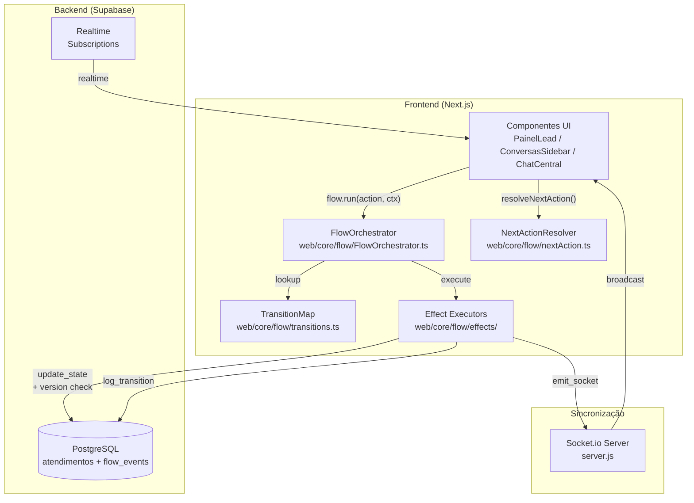
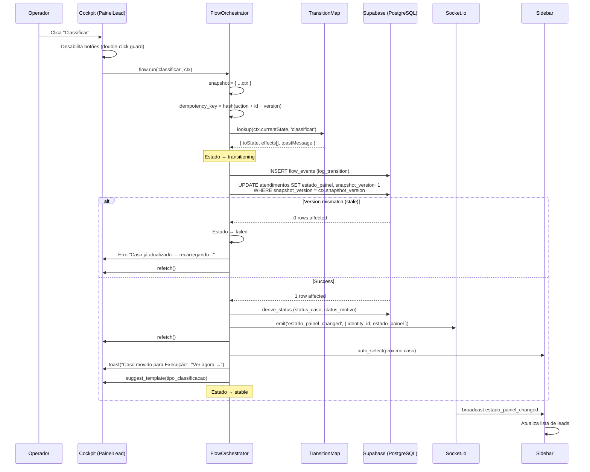
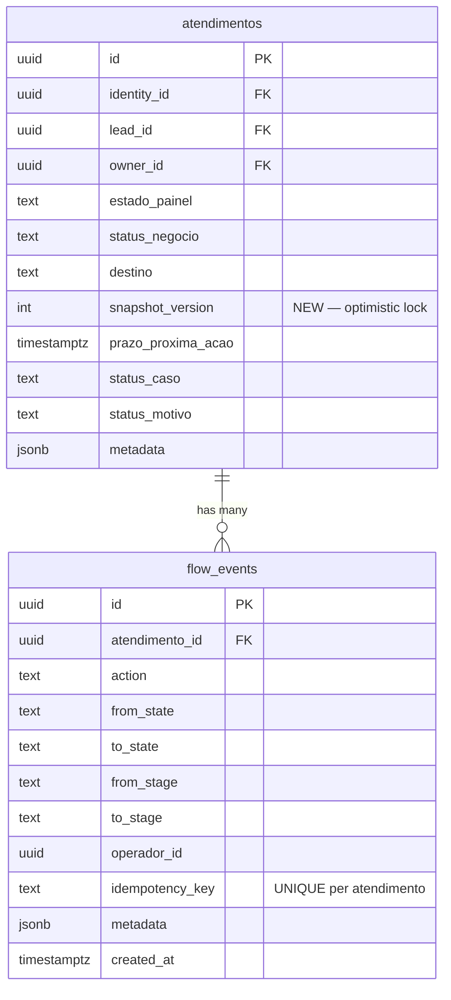
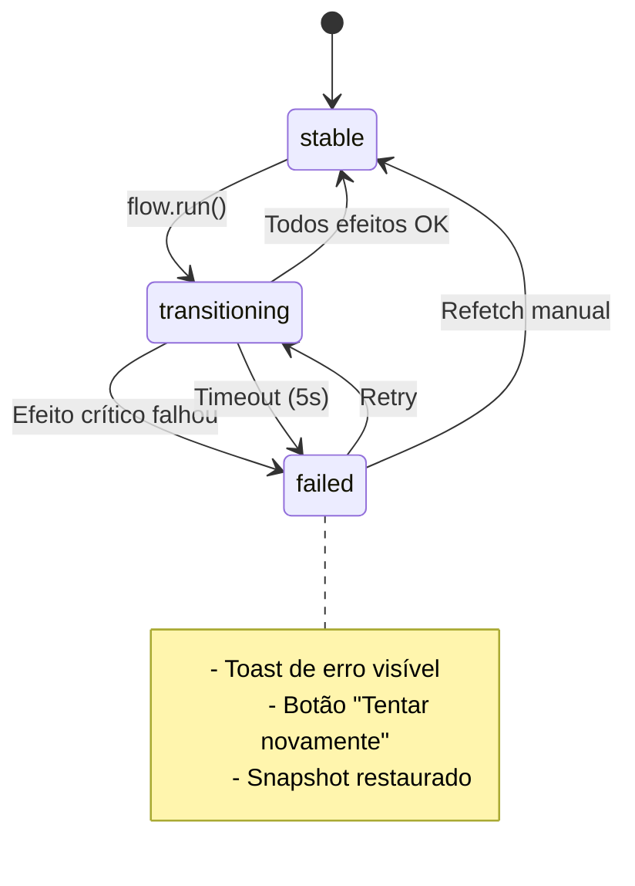

# Design — Continuous Flow UX

## Visão Geral

Este design transforma a experiência do operador de um modelo "navegação por telas" para um modelo "fluxo contínuo de operação". A arquitetura é **híbrida**: o **Flow Orchestrator roda no frontend** (client-side) para latência mínima de UX, enquanto o **backend (Supabase) valida via version check + idempotency_key**. Socket.io sincroniza operadores em tempo real.

### Princípios Arquiteturais

1. **Ponto único de controle**: Toda transição de estado passa pelo `FlowOrchestrator` — zero lógica de transição direta em handlers de componente.
2. **Snapshot imutável**: Antes de executar efeitos, o orchestrator congela o contexto. Mutações externas não afetam a execução.
3. **Efeitos declarativos**: O `Transition_Map` é a fonte única de verdade. Adicionar transições = adicionar entradas no mapa.
4. **Zero limbos**: Após qualquer transição, o operador sempre tem próximo passo visível (toast, novo caso selecionado, ou mensagem de fila vazia).
5. **Optimistic locking**: Concorrência resolvida via `snapshot_version` — primeiro operador ganha, segundo faz refetch.

### Decisão Arquitetural: Frontend-First

O orchestrator roda no frontend porque:
- **Latência**: Efeitos de UI (toast, auto-select, celebrate) executam em <100ms sem round-trip ao servidor
- **Atomicidade de UX**: A sequência snapshot → efeitos → continuidade é síncrona do ponto de vista do operador
- **Backend leve**: Supabase valida apenas `snapshot_version` e `idempotency_key` — sem lógica de orquestração no servidor

O backend garante consistência via:
- Coluna `snapshot_version` na tabela `atendimentos` (incrementada a cada update)
- Constraint `UNIQUE(atendimento_id, idempotency_key)` na tabela `flow_events`
- RLS policies existentes para autorização

---

## Arquitetura

### Diagrama de Alto Nível



### Diagrama de Sequência — Transição Completa



---

## Componentes e Interfaces

### Estrutura de Arquivos

```
web/
├── core/
│   └── flow/
│       ├── FlowOrchestrator.ts      # Classe principal — motor de transição
│       ├── transitions.ts            # Mapa declarativo de transições
│       ├── nextAction.ts             # Resolvedor de próximo passo (função pura)
│       ├── types.ts                  # Tipos compartilhados
│       └── effects/
│           ├── index.ts              # Re-export de todos os executores
│           ├── logTransition.ts      # Grava flow_event no Supabase
│           ├── updateState.ts        # Atualiza atendimento com version check
│           ├── deriveStatus.ts       # Calcula status_caso + status_motivo
│           ├── emitSocket.ts         # Emite evento via Socket.io
│           ├── refetch.ts            # Dispara refetch do contexto
│           ├── autoSelect.ts         # Seleciona próximo caso na sidebar
│           ├── toastDestino.ts       # Exibe toast com navegação
│           ├── suggestTemplate.ts    # Sugere template de mensagem
│           └── celebrate.ts          # Animação de celebração
├── components/
│   └── ui/
│       └── ActionToast.tsx           # Componente de toast reutilizável
├── hooks/
│   ├── useFlowOrchestrator.ts        # Hook que instancia o orchestrator
│   └── usePainelContext.ts           # (existente) — adiciona snapshot_version
└── app/(dashboard)/tela1/components/
    ├── PainelLead.tsx                # (existente) — refatorado para usar flow.run()
    ├── ConversasSidebar.tsx          # (existente) — adiciona auto-select
    ├── BlocoDelegacao.tsx            # Novo — delegação no bloco de contexto
    └── IndicadorProximoPasso.tsx     # Novo — indicador de próximo passo
```

### Tipos Compartilhados (`web/core/flow/types.ts`)

```typescript
// ── Estados e Ações ──

export type EstadoPainel = 'triagem' | 'em_atendimento' | 'cliente' | 'encerrado'

export type FlowAction =
  | 'classificar'
  | 'avancar_etapa'
  | 'fechar'
  | 'perder'
  | 'reativar'
  | 'delegar'
  | 'novo_atendimento'

export type FlowEffectType =
  | 'log_transition'
  | 'update_state'
  | 'derive_status'
  | 'emit_socket'
  | 'refetch'
  | 'auto_select'
  | 'toast_destino'
  | 'suggest_template'
  | 'celebrate'

export type ToastVariant = 'success' | 'info' | 'celebration'

export type TransitionStatus = 'stable' | 'transitioning' | 'failed' | 'ambiguous'

export type Confidence = 'high' | 'medium' | 'low'

export type ActionType = 'auto' | 'assisted' | 'blocked'

// ── Contexto ──

export interface FlowContext {
  atendimentoId: string
  identityId: string
  leadId: string
  currentState: EstadoPainel
  currentStage: string | null
  operadorId: string
  snapshotVersion: number
  // Dados opcionais para efeitos específicos
  metadata?: Record<string, unknown>
}

// ── Transição ──

export interface Transition {
  toState: EstadoPainel
  effects: FlowEffectType[]
  toastMessage: string
  toastAction?: string
  toastVariant: ToastVariant
}

export interface FlowTransitionResult {
  transitionId: string
  idempotencyKey: string
  snapshotVersion: number
  action: FlowAction
  fromState: EstadoPainel
  toState: EstadoPainel
  effects: FlowEffectType[]
  status: TransitionStatus
  error?: string
  startedAt: number
  completedAt?: number
  durationMs?: number
}

// ── Next Action ──

export interface NextActionContext {
  action: FlowAction | 'follow_up' | 'registrar_financeiro' | 'acompanhar' | 'revisar'
  label: string
  destination: EstadoPainel | string
  description: string
  confidence: Confidence
  type: ActionType
  reason?: string
  unblockAction?: string
}

// ── Serviços Injetados ──

export interface FlowServices {
  applyTransaction: (params: {
    ctx: FlowContext
    toState: EstadoPainel
    action: FlowAction
    idempotencyKey: string
    metadata?: Record<string, unknown>
  }) => Promise<{ newVersion: number }>
  deriveStatus: (ctx: FlowContext, toState: EstadoPainel) => Promise<void>
  emitSocket: (event: string, payload: Record<string, unknown>) => void
  showToast: (message: string, options: { actionLabel?: string; onAction?: () => void; variant: ToastVariant; duration?: number }) => void
  autoSelect: (excludeLeadId: string) => void
  refetch: () => void
  suggestTemplate: (classificationType: string) => void
  celebrate: () => void
  trackBehavior: (params: { leadId: string; userId: string; eventType: string; metadata?: Record<string, unknown> }) => void
}

export interface FlowEventInput {
  atendimentoId: string
  action: string
  fromState: string
  toState: string
  fromStage?: string | null
  toStage?: string | null
  operadorId: string
  idempotencyKey: string
  metadata?: Record<string, unknown>
}

// ── Toast Props ──

export interface ActionToastProps {
  message: string
  actionLabel?: string
  onAction?: () => void
  duration?: number
  variant: ToastVariant
  onDismiss?: () => void
}
```


### FlowOrchestrator (`web/core/flow/FlowOrchestrator.ts`)

```typescript
import { v4 as uuidv4 } from 'uuid'
import type {
  FlowAction, FlowContext, FlowServices, FlowTransitionResult,
  TransitionStatus, FlowEffectType, Transition
} from './types'
import { TRANSITION_MAP } from './transitions'

// Efeitos críticos — falha aborta a cadeia
const CRITICAL_EFFECTS: FlowEffectType[] = ['update_state', 'derive_status', 'emit_socket']

// Ordem formal de efeitos (para validação)
const EFFECT_ORDER: FlowEffectType[] = [
  'log_transition', 'update_state', 'derive_status', 'emit_socket',
  'refetch', 'auto_select', 'toast_destino', 'suggest_template', 'celebrate'
]

function generateIdempotencyKey(action: string, atendimentoId: string, version: number): string {
  // Hash determinístico: mesma entrada → mesma saída
  const raw = `${action}:${atendimentoId}:${version}`
  let hash = 0
  for (let i = 0; i < raw.length; i++) {
    const char = raw.charCodeAt(i)
    hash = ((hash << 5) - hash) + char
    hash |= 0
  }
  return `flow_${Math.abs(hash).toString(36)}_${version}`
}

export class FlowOrchestrator {
  private services: FlowServices
  private _status: TransitionStatus = 'stable'
  private _lastResult: FlowTransitionResult | null = null
  private _eventQueue: Array<() => void> = []
  private _isExecuting = false

  constructor(services: FlowServices) {
    this.services = services
  }

  get status(): TransitionStatus { return this._status }
  get lastResult(): FlowTransitionResult | null { return this._lastResult }

  async run(action: FlowAction, ctx: FlowContext): Promise<FlowTransitionResult> {
    // Guard: se já está executando, enfileirar
    if (this._isExecuting) {
      return new Promise((resolve, reject) => {
        this._eventQueue.push(() => this.run(action, ctx).then(resolve, reject))
      })
    }

    this._isExecuting = true
    const startedAt = performance.now()

    // 1. Snapshot imutável
    const snapshot: Readonly<FlowContext> = Object.freeze({ ...ctx })

    // 2. Gerar IDs
    const transitionId = uuidv4()
    const idempotencyKey = generateIdempotencyKey(action, snapshot.atendimentoId, snapshot.snapshotVersion)

    // 3. Lookup no mapa
    const stateMap = TRANSITION_MAP[snapshot.currentState]
    const transition = stateMap?.[action] as Transition | undefined

    if (!transition) {
      console.warn(`[FlowOrchestrator] Transição não encontrada: ${snapshot.currentState} + ${action}`)
      this._isExecuting = false
      this._drainQueue()
      const result: FlowTransitionResult = {
        transitionId, idempotencyKey, snapshotVersion: snapshot.snapshotVersion,
        action, fromState: snapshot.currentState, toState: snapshot.currentState,
        effects: [], status: 'stable', startedAt, completedAt: performance.now(),
        durationMs: performance.now() - startedAt,
      }
      this._lastResult = result
      return result
    }

    // 4. Iniciar transição
    this._status = 'transitioning'

    const result: FlowTransitionResult = {
      transitionId, idempotencyKey, snapshotVersion: snapshot.snapshotVersion,
      action, fromState: snapshot.currentState, toState: transition.toState,
      effects: transition.effects, status: 'transitioning', startedAt,
    }

    try {
      // 5. Executar efeitos com timeout de 5s
      await Promise.race([
        this._executeEffects(snapshot, transition, action, idempotencyKey),
        new Promise((_, reject) =>
          setTimeout(() => reject(new Error('Timeout: execução excedeu 5000ms')), 5000)
        ),
      ])

      // 6. Sucesso
      result.status = 'stable'
      result.completedAt = performance.now()
      result.durationMs = result.completedAt - startedAt
      this._status = 'stable'

      // 7. Track behavior
      this.services.trackBehavior({
        leadId: snapshot.leadId,
        userId: snapshot.operadorId,
        eventType: `flow_${action}_completed`,
        metadata: { fromState: snapshot.currentState, toState: transition.toState, durationMs: result.durationMs },
      })

      // 8. Warning se demorou > 3s
      if (result.durationMs > 3000) {
        console.warn(`[FlowOrchestrator] Transição lenta: ${action} levou ${result.durationMs}ms`)
      }

    } catch (error: any) {
      result.status = 'failed'
      result.error = error.message
      result.completedAt = performance.now()
      result.durationMs = result.completedAt - startedAt
      this._status = 'failed'

      // Toast de erro
      this.services.showToast(
        `Não foi possível ${action.replace(/_/g, ' ')} — tente novamente`,
        { variant: 'info', duration: 8000 }
      )
    } finally {
      this._lastResult = result
      this._isExecuting = false
      this._drainQueue()
    }

    return result
  }

  /** Re-executa a última transição falhada */
  async retry(): Promise<FlowTransitionResult | null> {
    if (!this._lastResult || this._lastResult.status !== 'failed') return null
    // Nota: o retry usa nova snapshot_version (refetch antes de retry)
    return null // Implementação depende do refetch do contexto atualizado
  }

  private async _executeEffects(
    snapshot: Readonly<FlowContext>,
    transition: Transition,
    action: FlowAction,
    idempotencyKey: string,
  ): Promise<void> {
    for (const effect of transition.effects) {
      const isCritical = CRITICAL_EFFECTS.includes(effect)

      try {
        await this._executeEffect(effect, snapshot, transition, action, idempotencyKey)
      } catch (error) {
        if (isCritical) {
          // Efeito crítico falhou → abortar cadeia
          throw error
        }
        // Efeito de UI falhou → log e continuar
        console.warn(`[FlowOrchestrator] Efeito não-crítico falhou: ${effect}`, error)
      }
    }
  }

  private async _executeEffect(
    effect: FlowEffectType,
    snapshot: Readonly<FlowContext>,
    transition: Transition,
    action: FlowAction,
    idempotencyKey: string,
  ): Promise<void> {
    switch (effect) {
      case 'log_transition':
        // NOTA: log_transition é executado DENTRO da mesma transação que update_state
        // via applyTransition() — ver efeito 'apply_transaction' abaixo
        break

      case 'update_state':
        // NOTA: update_state é executado DENTRO da mesma transação que log_transition
        // via applyTransition() — ver efeito 'apply_transaction' abaixo
        break

      case 'apply_transaction':
        // Transação atômica: update_state + log_transition no mesmo commit
        // Ordem real no backend:
        //   1. check idempotency_key (se existe → retorna cached)
        //   2. check snapshot_version (se stale → rejeita)
        //   3. UPDATE atendimentos SET estado_painel, snapshot_version+1
        //   4. INSERT flow_events (mesma transaction)
        //   5. COMMIT
        // Se qualquer passo falha → ROLLBACK total
        await this.services.applyTransaction({
          ctx: snapshot,
          toState: transition.toState,
          action,
          idempotencyKey,
          metadata: snapshot.metadata,
        })
        break

      case 'derive_status':
        await this.services.deriveStatus(snapshot, transition.toState)
        break

      case 'emit_socket':
        // Socket events são versionados para que clients ignorem eventos stale
        this.services.emitSocket('estado_painel_changed', {
          identity_id: snapshot.identityId,
          lead_id: snapshot.leadId,
          estado_painel: transition.toState,
          transition_id: idempotencyKey,
          snapshot_version: snapshot.snapshotVersion + 1, // versão APÓS a transição
        })
        break

      case 'refetch':
        this.services.refetch()
        break

      case 'auto_select':
        this.services.autoSelect(snapshot.leadId)
        break

      case 'toast_destino':
        this.services.showToast(transition.toastMessage, {
          actionLabel: transition.toastAction,
          variant: transition.toastVariant,
          duration: 5000,
        })
        break

      case 'suggest_template':
        if (snapshot.metadata?.classificationType) {
          this.services.suggestTemplate(snapshot.metadata.classificationType as string)
        }
        break

      case 'celebrate':
        this.services.celebrate()
        break
    }
  }

  private _drainQueue(): void {
    if (this._eventQueue.length > 0) {
      const next = this._eventQueue.shift()
      next?.()
    }
  }
}
```

### Transition Map (`web/core/flow/transitions.ts`)

```typescript
import type { EstadoPainel, FlowAction, Transition } from './types'

/**
 * TRANSITION_MAP — Fonte única de verdade para todas as transições válidas.
 *
 * Ordem formal de efeitos:
 * apply_transaction (= log + update atômico) → derive_status → emit_socket →
 * refetch → auto_select → toast_destino → suggest_template → celebrate
 *
 * NOTA: `apply_transaction` substitui `log_transition` + `update_state` separados.
 * Ambos executam na mesma transação de banco. Socket events são emitidos APÓS commit.
 *
 * Efeitos não aplicáveis são omitidos, mas a ordem relativa é mantida.
 */
export const TRANSITION_MAP: Record<EstadoPainel, Partial<Record<FlowAction, Transition>>> = {

  triagem: {
    classificar: {
      // Destino dinâmico: resolvido em runtime pelo metadata.destino
      // Default: em_atendimento (backoffice)
      toState: 'em_atendimento',
      effects: [
        'apply_transaction', 'derive_status', 'emit_socket',
        'refetch', 'auto_select', 'toast_destino', 'suggest_template',
      ],
      toastMessage: 'Caso movido para Execução',
      toastAction: 'Ver agora →',
      toastVariant: 'success',
    },
  },

  em_atendimento: {
    avancar_etapa: {
      toState: 'em_atendimento',
      effects: ['apply_transaction', 'derive_status', 'emit_socket', 'refetch'],
      toastMessage: 'Etapa avançada',
      toastVariant: 'success',
    },
    fechar: {
      toState: 'cliente',
      effects: [
        'apply_transaction', 'derive_status', 'emit_socket',
        'refetch', 'auto_select', 'toast_destino', 'celebrate',
      ],
      toastMessage: 'Caso fechado com sucesso 🎉',
      toastAction: 'Ver financeiro →',
      toastVariant: 'celebration',
    },
    perder: {
      toState: 'encerrado',
      effects: [
        'apply_transaction', 'emit_socket',
        'auto_select', 'toast_destino',
      ],
      toastMessage: 'Decisão encerrada',
      toastVariant: 'info',
    },
    delegar: {
      toState: 'em_atendimento',
      effects: ['apply_transaction', 'emit_socket', 'refetch'],
      toastMessage: 'Caso delegado',
      toastVariant: 'info',
    },
  },

  encerrado: {
    reativar: {
      toState: 'triagem',
      effects: [
        'apply_transaction', 'emit_socket',
        'refetch', 'toast_destino',
      ],
      toastMessage: 'Caso reativado',
      toastAction: 'Ver na triagem →',
      toastVariant: 'info',
    },
  },

  cliente: {
    novo_atendimento: {
      toState: 'triagem',
      effects: [
        'apply_transaction', 'emit_socket',
        'auto_select', 'toast_destino',
      ],
      toastMessage: 'Novo atendimento iniciado',
      toastAction: 'Ver na triagem →',
      toastVariant: 'info',
    },
  },
}

/**
 * Variante para classificação com destino encerrado.
 * Usado quando o operador classifica como BadCall ou encerramento direto.
 */
export const CLASSIFICAR_ENCERRADO: Transition = {
  toState: 'encerrado',
  effects: ['log_transition', 'update_state', 'emit_socket', 'auto_select', 'toast_destino'],
  toastMessage: 'Decisão encerrada',
  toastVariant: 'info',
}

/**
 * Resolve a transição correta para classificação baseado no destino.
 */
export function resolveClassificarTransition(destino: 'backoffice' | 'encerrado'): Transition {
  if (destino === 'encerrado') return CLASSIFICAR_ENCERRADO
  return TRANSITION_MAP.triagem.classificar!
}
```

### Next Action Resolver (`web/core/flow/nextAction.ts`)

```typescript
import type { EstadoPainel, NextActionContext } from './types'
import { getNextStep } from '@/utils/businessStateMachine'
import { JOURNEY_STAGES, resolveStatus } from '@/utils/journeyModel'

interface ResolverContext {
  valor_contrato?: number | null
  ultima_msg_de?: string | null
  tempo_desde_ultima_msg?: number | null
  owner_id?: string | null
  operador_id?: string | null
}

/**
 * resolveNextAction — Função pura que retorna a próxima ação recomendada.
 *
 * Regra: NUNCA retorna null para combinações válidas de (state, stage).
 * Garante que o Cockpit sempre tem uma sugestão de próximo passo.
 */
export function resolveNextAction(
  state: EstadoPainel,
  stage: string | null,
  ctx?: ResolverContext,
): NextActionContext {

  switch (state) {
    case 'triagem':
      return {
        action: 'classificar',
        label: 'Classificar este caso',
        destination: 'em_atendimento',
        description: 'Definir tipo de decisão e encaminhar',
        confidence: 'high',
        type: 'assisted',
      }

    case 'em_atendimento': {
      // Check follow-up condition first
      if (
        ctx?.ultima_msg_de === 'operador' &&
        ctx?.tempo_desde_ultima_msg != null &&
        ctx.tempo_desde_ultima_msg > 24 * 60 * 60 * 1000
      ) {
        return {
          action: 'follow_up',
          label: 'Fazer follow-up',
          destination: 'em_atendimento',
          description: 'Cliente sem resposta há mais de 24h',
          confidence: 'medium',
          type: 'assisted',
        }
      }

      // Check if owner is different (blocked)
      if (ctx?.owner_id && ctx?.operador_id && ctx.owner_id !== ctx.operador_id) {
        return {
          action: 'revisar',
          label: 'Caso de outro operador',
          destination: 'em_atendimento',
          description: 'Este caso pertence a outro operador',
          confidence: 'high',
          type: 'blocked',
          reason: 'Caso atribuído a outro operador',
          unblockAction: 'Transferir para você ou aguardar',
        }
      }

      // Derive from business state machine
      if (stage) {
        const nextStep = getNextStep(stage as any)
        if (nextStep) {
          return {
            action: 'avancar_etapa',
            label: nextStep.label,
            destination: 'em_atendimento',
            description: nextStep.descricao,
            confidence: 'high',
            type: 'assisted',
          }
        }

        // Terminal stage (distribuicao → fechar)
        const resolved = resolveStatus(stage)
        const stageInfo = JOURNEY_STAGES[resolved]
        if (stageInfo?.terminal) {
          return {
            action: 'acompanhar',
            label: 'Caso concluído',
            destination: 'cliente',
            description: 'Caso finalizado — acompanhar no financeiro',
            confidence: 'high',
            type: 'auto',
          }
        }
      }

      // Fallback: dados incompletos
      return {
        action: 'revisar',
        label: 'Revisar caso',
        destination: 'em_atendimento',
        description: 'Dados incompletos para determinar próximo passo',
        confidence: 'low',
        type: 'assisted',
      }
    }

    case 'cliente':
      if (!ctx?.valor_contrato) {
        return {
          action: 'registrar_financeiro',
          label: 'Registrar financeiro',
          destination: 'cliente',
          description: 'Registrar valor de contrato e forma de pagamento',
          confidence: 'high',
          type: 'assisted',
        }
      }
      return {
        action: 'acompanhar',
        label: 'Acompanhar caso',
        destination: 'cliente',
        description: 'Caso em andamento — monitorar progresso',
        confidence: 'high',
        type: 'auto',
      }

    case 'encerrado':
      return {
        action: 'reativar',
        label: 'Reativar caso',
        destination: 'triagem',
        description: 'Reabrir caso para nova triagem',
        confidence: 'medium',
        type: 'assisted',
      }

    default:
      return {
        action: 'revisar',
        label: 'Revisar caso',
        destination: 'triagem',
        description: 'Estado desconhecido — revisar manualmente',
        confidence: 'low',
        type: 'assisted',
      }
  }
}
```


### Hook `useFlowOrchestrator` (`web/hooks/useFlowOrchestrator.ts`)

```typescript
import { useRef, useState, useCallback } from 'react'
import { FlowOrchestrator } from '@/core/flow/FlowOrchestrator'
import type { FlowServices, FlowAction, FlowContext, TransitionStatus, FlowTransitionResult } from '@/core/flow/types'
import { createClient } from '@/utils/supabase/client'
import { useSocket } from '@/components/providers/SocketProvider'
import { trackEvent } from '@/utils/behaviorTracker'

/**
 * useFlowOrchestrator — Instancia o FlowOrchestrator com serviços reais.
 *
 * Uso:
 *   const { flow, status, run } = useFlowOrchestrator({ refetch, autoSelect, showToast, ... })
 *   await run('classificar', ctx)
 */
export function useFlowOrchestrator(deps: {
  refetch: () => void
  autoSelect: (excludeLeadId: string) => void
  showToast: FlowServices['showToast']
  suggestTemplate: (type: string) => void
  celebrate: () => void
}) {
  const socket = useSocket()
  const supabase = createClient()
  const [status, setStatus] = useState<TransitionStatus>('stable')

  const orchestratorRef = useRef<FlowOrchestrator | null>(null)

  // Lazy init
  if (!orchestratorRef.current) {
    const services: FlowServices = {
      applyTransaction: async ({ ctx, toState, action, idempotencyKey, metadata }) => {
        // Transação atômica via Supabase RPC (ou chamadas sequenciais com rollback)
        // Ordem:
        //   1. Check idempotency (se existe → retorna cached)
        //   2. Check version (se stale → rejeita)
        //   3. UPDATE atendimentos + INSERT flow_events (mesma transaction)
        
        // Primeiro: check idempotency
        const { data: existing } = await supabase
          .from('flow_events')
          .select('id')
          .eq('atendimento_id', ctx.atendimentoId)
          .eq('idempotency_key', idempotencyKey)
          .maybeSingle()
        
        if (existing) {
          // Já executada — retorna versão atual (safe retry)
          return { newVersion: ctx.snapshotVersion }
        }

        // Segundo: update_state com version check
        const { data, error } = await supabase
          .from('atendimentos')
          .update({
            estado_painel: toState,
            snapshot_version: ctx.snapshotVersion + 1,
            ...(metadata || {}),
          })
          .eq('identity_id', ctx.identityId)
          .eq('snapshot_version', ctx.snapshotVersion)
          .select('snapshot_version')
          .single()

        if (error || !data) {
          throw new Error('Caso já foi atualizado — recarregando...')
        }

        // Terceiro: log_transition (mesma "transação lógica" — se falhar, estado já mudou mas log é append-only)
        await supabase.from('flow_events').insert({
          atendimento_id: ctx.atendimentoId,
          action,
          from_state: ctx.currentState,
          to_state: toState,
          from_stage: ctx.currentStage,
          operador_id: ctx.operadorId,
          idempotency_key: idempotencyKey,
          metadata: metadata || {},
        })

        return { newVersion: data.snapshot_version }
      },

      deriveStatus: async (ctx, toState) => {
        // Importar deriveStatus de journeyModel
        const { deriveStatus } = await import('@/utils/journeyModel')
        const stage = (ctx.metadata?.toStage as string) || ctx.currentStage
        if (stage) {
          const derived = deriveStatus(stage)
          if (derived) {
            await supabase
              .from('atendimentos')
              .update({ status_caso: derived.status_caso, status_motivo: derived.status_motivo })
              .eq('identity_id', ctx.identityId)
          }
        }
      },

      emitSocket: (event, payload) => {
        socket?.emit(event, payload)
      },

      showToast: deps.showToast,
      autoSelect: deps.autoSelect,
      refetch: deps.refetch,
      suggestTemplate: deps.suggestTemplate,
      celebrate: deps.celebrate,

      trackBehavior: ({ leadId, userId, eventType, metadata }) => {
        trackEvent({ lead_id: leadId, user_id: userId, event_type: eventType, metadata })
      },
    }

    orchestratorRef.current = new FlowOrchestrator(services)
  }

  const run = useCallback(async (action: FlowAction, ctx: FlowContext): Promise<FlowTransitionResult> => {
    setStatus('transitioning')
    const result = await orchestratorRef.current!.run(action, ctx)
    setStatus(result.status)
    return result
  }, [])

  return {
    flow: orchestratorRef.current,
    status,
    run,
  }
}
```

### ActionToast (`web/components/ui/ActionToast.tsx`)

```typescript
'use client'

import { useEffect, useState, useRef } from 'react'
import { cn } from '@/lib/utils'
import type { ActionToastProps } from '@/core/flow/types'

export default function ActionToast({
  message,
  actionLabel,
  onAction,
  duration = 5000,
  variant,
  onDismiss,
}: ActionToastProps) {
  const [visible, setVisible] = useState(true)
  const [exiting, setExiting] = useState(false)
  const timerRef = useRef<NodeJS.Timeout | null>(null)

  useEffect(() => {
    timerRef.current = setTimeout(() => dismiss(), duration)
    return () => { if (timerRef.current) clearTimeout(timerRef.current) }
  }, [duration])

  function dismiss() {
    setExiting(true)
    setTimeout(() => {
      setVisible(false)
      onDismiss?.()
    }, 200)
  }

  function handleAction() {
    onAction?.()
    dismiss()
  }

  if (!visible) return null

  const variantStyles = {
    success: 'bg-white border-green-200 shadow-lg shadow-green-100/50',
    info: 'bg-white border-gray-200 shadow-lg shadow-gray-100/50',
    celebration: 'bg-green-50 border-green-300 shadow-lg shadow-green-200/50 animate-pulse-once',
  }

  return (
    <div
      role="alert"
      aria-live="assertive"
      className={cn(
        'fixed bottom-6 right-6 z-50 max-w-sm rounded-xl border p-4 transition-all duration-200',
        variantStyles[variant],
        exiting ? 'opacity-0 translate-y-2' : 'opacity-100 translate-y-0',
      )}
    >
      <div className="flex items-start gap-3">
        <div className="flex-1">
          <p className="text-sm font-medium text-gray-900">{message}</p>
        </div>
        <button
          onClick={dismiss}
          className="text-gray-400 hover:text-gray-600 text-xs"
          aria-label="Fechar"
        >
          ✕
        </button>
      </div>
      {actionLabel && onAction && (
        <button
          onClick={handleAction}
          onKeyDown={(e) => e.key === 'Enter' && handleAction()}
          className="mt-2 text-sm font-bold text-blue-600 hover:text-blue-700 transition-colors"
          tabIndex={0}
        >
          {actionLabel}
        </button>
      )}
    </div>
  )
}
```

### IndicadorProximoPasso (`web/app/(dashboard)/tela1/components/IndicadorProximoPasso.tsx`)

```typescript
'use client'

import { useMemo } from 'react'
import { resolveNextAction } from '@/core/flow/nextAction'
import type { EstadoPainel } from '@/core/flow/types'
import { cn } from '@/lib/utils'

interface Props {
  estadoPainel: EstadoPainel | null
  statusNegocio: string | null
  ctx?: {
    valor_contrato?: number | null
    ultima_msg_de?: string | null
    tempo_desde_ultima_msg?: number | null
    owner_id?: string | null
    operador_id?: string | null
  }
  onScrollToAction?: () => void
}

const CONFIDENCE_STYLES = {
  high: 'bg-blue-50 border-blue-200',
  medium: 'bg-yellow-50 border-yellow-200',
  low: 'bg-gray-50 border-gray-200',
}

const TYPE_BADGES = {
  auto: { label: 'Auto', color: 'text-green-600 bg-green-50' },
  assisted: { label: 'Ação', color: 'text-blue-600 bg-blue-50' },
  blocked: { label: 'Bloqueado', color: 'text-red-600 bg-red-50' },
}

export default function IndicadorProximoPasso({ estadoPainel, statusNegocio, ctx, onScrollToAction }: Props) {
  const nextAction = useMemo(
    () => resolveNextAction(estadoPainel ?? 'triagem', statusNegocio, ctx),
    [estadoPainel, statusNegocio, ctx],
  )

  if (!nextAction) return null

  const badge = TYPE_BADGES[nextAction.type]

  return (
    <button
      onClick={onScrollToAction}
      className={cn(
        'w-full p-3 rounded-lg border text-left transition-all hover:shadow-sm',
        CONFIDENCE_STYLES[nextAction.confidence],
      )}
    >
      <div className="flex items-center gap-2 mb-1">
        <span className={cn('text-[9px] font-bold uppercase px-1.5 py-0.5 rounded', badge.color)}>
          {badge.label}
        </span>
        <span className="text-[10px] text-gray-400 uppercase font-semibold">Próximo passo</span>
      </div>
      <p className="text-sm font-bold text-gray-900">{nextAction.label}</p>
      <p className="text-xs text-gray-500 mt-0.5">{nextAction.description}</p>
      {nextAction.type === 'blocked' && nextAction.reason && (
        <p className="text-xs text-red-600 mt-1 font-medium">⚠ {nextAction.reason}</p>
      )}
    </button>
  )
}
```

### BlocoDelegacao (`web/app/(dashboard)/tela1/components/BlocoDelegacao.tsx`)

```typescript
'use client'

import { useState, useEffect } from 'react'
import { createClient } from '@/utils/supabase/client'
import { useSocket } from '@/components/providers/SocketProvider'

interface Props {
  identityId: string | null
  ownerId: string | null
  ownerNome: string | null
  operadorId: string | null
  role: string
  onDelegated: () => void
}

export default function BlocoDelegacao({ identityId, ownerId, ownerNome, operadorId, role, onDelegated }: Props) {
  const [loading, setLoading] = useState(false)
  const supabase = createClient()
  const socket = useSocket()

  // Auto-assume: se caso não tem responsável e operador abre, assume automaticamente
  useEffect(() => {
    if (!identityId || !operadorId || ownerId) return

    async function autoAssume() {
      await supabase
        .from('atendimentos')
        .update({ owner_id: operadorId })
        .eq('identity_id', identityId)
        .is('owner_id', null)

      socket?.emit('assignment_updated', {
        identity_id: identityId,
        owner_id: operadorId,
        owner_name: 'Você',
      })
      onDelegated()
    }

    autoAssume()
  }, [identityId, operadorId, ownerId])

  const isOwner = ownerId === operadorId
  const canTransfer = role === 'owner' || isOwner

  async function handleAssumir() {
    if (!identityId || !operadorId) return
    setLoading(true)
    try {
      await supabase
        .from('atendimentos')
        .update({ owner_id: operadorId })
        .eq('identity_id', identityId)

      socket?.emit('assignment_updated', {
        identity_id: identityId,
        owner_id: operadorId,
        owner_name: 'Você',
      })
      onDelegated()
    } finally {
      setLoading(false)
    }
  }

  if (!ownerId) {
    return (
      <div className="flex items-center gap-2 py-2">
        <span className="text-[10px] text-gray-300 uppercase">Responsável</span>
        <button
          onClick={handleAssumir}
          disabled={loading}
          className="text-[10px] font-bold text-blue-600 bg-blue-50 px-2 py-1 rounded-md hover:bg-blue-100 transition-colors disabled:opacity-50"
        >
          Assumir caso
        </button>
      </div>
    )
  }

  return (
    <div className="flex items-center justify-between py-2">
      <div className="flex items-center gap-2">
        <span className="text-[10px] text-gray-300 uppercase">Responsável</span>
        <span className={`text-xs font-bold ${isOwner ? 'text-blue-600 bg-blue-50 px-1.5 py-0.5 rounded' : 'text-gray-600'}`}>
          {isOwner ? 'Você' : ownerNome || 'Operador'}
        </span>
      </div>
      {canTransfer && (
        <button
          onClick={handleAssumir}
          disabled={loading}
          className="text-[10px] font-bold text-gray-400 hover:text-blue-600 transition-colors disabled:opacity-50"
        >
          Transferir
        </button>
      )}
    </div>
  )
}
```

---

## Modelos de Dados

### Migração SQL — `flow_events` + `snapshot_version`

```sql
-- Migration 033: Continuous Flow UX — flow_events + snapshot_version
-- Suporta o FlowOrchestrator com log semântico e optimistic locking

-- 1. Adicionar snapshot_version à tabela atendimentos
ALTER TABLE atendimentos ADD COLUMN IF NOT EXISTS snapshot_version INTEGER DEFAULT 1 NOT NULL;

-- 2. Criar tabela flow_events
CREATE TABLE IF NOT EXISTS flow_events (
  id UUID PRIMARY KEY DEFAULT gen_random_uuid(),
  atendimento_id UUID NOT NULL REFERENCES atendimentos(id) ON DELETE CASCADE,
  action TEXT NOT NULL,
  from_state TEXT NOT NULL,
  to_state TEXT NOT NULL,
  from_stage TEXT,
  to_stage TEXT,
  operador_id UUID,
  idempotency_key TEXT NOT NULL,
  metadata JSONB DEFAULT '{}',
  created_at TIMESTAMPTZ NOT NULL DEFAULT now()
);

-- 3. Índices para query patterns otimizados
CREATE INDEX IF NOT EXISTS idx_flow_events_atendimento_created
  ON flow_events (atendimento_id, created_at DESC);

CREATE INDEX IF NOT EXISTS idx_flow_events_action
  ON flow_events (action);

CREATE INDEX IF NOT EXISTS idx_flow_events_to_state
  ON flow_events (to_state);

CREATE INDEX IF NOT EXISTS idx_flow_events_operador_created
  ON flow_events (operador_id, created_at DESC);

CREATE INDEX IF NOT EXISTS idx_flow_events_created
  ON flow_events (created_at DESC);

-- 4. Constraint de idempotência
ALTER TABLE flow_events ADD CONSTRAINT uq_flow_events_idempotency
  UNIQUE (atendimento_id, idempotency_key);

-- 5. RLS — operadores autenticados podem inserir e ler
ALTER TABLE flow_events ENABLE ROW LEVEL SECURITY;

CREATE POLICY flow_events_insert ON flow_events
  FOR INSERT TO authenticated
  WITH CHECK (true);

CREATE POLICY flow_events_select ON flow_events
  FOR SELECT TO authenticated
  USING (true);

-- 6. Índice para snapshot_version (optimistic locking)
CREATE INDEX IF NOT EXISTS idx_atendimentos_snapshot_version
  ON atendimentos (identity_id, snapshot_version);
```

### Diagrama ER — Novas Estruturas



---

## Correctness Properties

*Uma propriedade é uma característica ou comportamento que deve ser verdadeiro em todas as execuções válidas de um sistema — essencialmente, uma declaração formal sobre o que o sistema deve fazer. Propriedades servem como ponte entre especificações legíveis por humanos e garantias de corretude verificáveis por máquina.*

### Property 1: Snapshot Integrity — Imutabilidade do Contexto

*For any* `FlowContext` object passed to `flow.run()`, the snapshot created before effect execution SHALL remain unchanged regardless of mutations to the original context object during or after execution. Additionally, if a critical effect fails, the snapshot SHALL be available for UI state restoration.

**Validates: Requirements 1.2, 21.1, 21.6**

### Property 2: Effect Execution Order

*For any* transition in the `TRANSITION_MAP`, when executed by the `FlowOrchestrator`, the effects SHALL be executed in the exact order declared in the transition's `effects` array, and this order SHALL respect the formal standard: `log_transition → update_state → derive_status → emit_socket → refetch → auto_select → toast_destino → suggest_template → celebrate`.

**Validates: Requirements 1.3, 2.4**

### Property 3: Error Handling Atomicity

*For any* transition where a critical effect (`update_state`, `derive_status`, `emit_socket`) fails at position N in the effects array, no effects at positions > N SHALL be executed. Conversely, *for any* transition where a non-critical effect (`toast_destino`, `auto_select`, `celebrate`) fails, the remaining effects in the chain SHALL continue executing.

**Validates: Requirements 1.4, 21.1, 21.2**

### Property 4: Invalid Transition Safety

*For any* `(state, action)` pair that is NOT defined in the `TRANSITION_MAP`, calling `flow.run(action, ctx)` SHALL execute zero effects and return a result with `status: 'stable'` and `effects: []`.

**Validates: Requirements 1.5, 2.5**

### Property 5: Execution Determinism

*For any* `FlowAction` and `FlowContext`, executing `flow.run(action, ctx)` twice with identical inputs SHALL produce the same sequence of effects in the same order, and the same `idempotency_key`.

**Validates: Requirements 1.8, 23.1**

### Property 6: Transition Map Structural Completeness

*For any* entry in the `TRANSITION_MAP`, the transition object SHALL contain all required fields: `toState` (valid `EstadoPainel`), `effects` (non-empty array of `FlowEffectType`), `toastMessage` (non-empty string), and `toastVariant` (one of `'success' | 'info' | 'celebration'`).

**Validates: Requirements 2.3**

### Property 7: Transition Idempotence

*For any* `(state, action)` pair defined in the `TRANSITION_MAP`, executing the transition twice with the same context SHALL produce the same final `toState`. The second execution with the same `idempotency_key` SHALL return the cached result without re-executing effects.

**Validates: Requirements 2.6, 23.2, 23.6**

### Property 8: Next Action Resolver Completeness

*For all* valid combinations of `(state: EstadoPainel, stage: string | null)`, the `resolveNextAction` function SHALL return a non-null `NextActionContext` object — guaranteeing the Cockpit always has a next step suggestion.

**Validates: Requirements 3.8, 18.8**

### Property 9: Next Action Resolver Purity

*For any* inputs `(state, stage, ctx)`, calling `resolveNextAction` multiple times with identical arguments SHALL return structurally identical results (referential transparency). The function SHALL have zero side effects.

**Validates: Requirements 3.9**

### Property 10: Flow Events Round-Trip

*For any* sequence of transitions executed on a single `atendimento`, reading the `flow_events` for that `atendimento` in chronological order SHALL reconstruct the complete sequence of actions, including `from_state`, `to_state`, and `action` for each transition.

**Validates: Requirements 4.6**

### Property 11: Auto-Select Picks Highest Priority

*For any* non-empty list of cases in the Sidebar ordered by `deriveGlobalPriority`, the `auto_select` effect SHALL select the case with the highest priority (lowest priority level number). If the list is empty, it SHALL clear the selection without error.

**Validates: Requirements 8.1, 8.4, 8.5**

### Property 12: Display Time Maximum

*For any* pair of timestamps `(ultima_msg_em, status_changed_at)`, the effective `Display_Time` SHALL equal `max(ultima_msg_em, status_changed_at)`. This ensures cases with recent activity always appear at the top of the Sidebar.

**Validates: Requirements 10.4**

### Property 13: Continuity Invariant

*For all* transitions defined in the `TRANSITION_MAP`, the `effects` array SHALL contain at least one continuity effect (`toast_destino` or `auto_select`), guaranteeing zero limbos by design. At runtime, after any completed transition, exactly one of the following conditions SHALL be true: (a) a `Toast_Acao` with destination is visible, (b) a new case is selected in the Sidebar, or (c) the empty queue message is displayed.

**Validates: Requirements 18.1, 18.5**

### Property 14: Reject-on-Stale Concurrency

*For any* transition where `ctx.snapshotVersion` does not match the current `snapshot_version` in the database, the `update_state` effect SHALL fail, causing the orchestrator to abort the transition and trigger a refetch. No state mutation SHALL occur on the backend.

**Validates: Requirements 19.2, 19.4**

### Property 15: Idempotency Key Determinism

*For any* tuple `(action, atendimento_id, snapshot_version)`, the generated `idempotency_key` SHALL be deterministic — the same tuple always produces the same key. Different tuples (different version) SHALL produce different keys.

**Validates: Requirements 23.1, 23.7**

---

## Error Handling

### Classificação de Efeitos

| Efeito | Tipo | Falha → Comportamento |
|--------|------|----------------------|
| `log_transition` | Crítico | Aborta cadeia, restaura snapshot |
| `update_state` | Crítico | Aborta cadeia, restaura snapshot |
| `derive_status` | Crítico | Aborta cadeia, restaura snapshot |
| `emit_socket` | Crítico | Aborta cadeia, restaura snapshot |
| `refetch` | UI | Log warning, continua cadeia |
| `auto_select` | UI | Log warning, continua cadeia |
| `toast_destino` | UI | Log warning, continua cadeia |
| `suggest_template` | UI | Log warning, continua cadeia |
| `celebrate` | UI | Log warning, continua cadeia |

### Fluxo de Erro



### Política de Retry

1. **Timeout de rede**: Retry automático 1x após 2 segundos
2. **Erro 409 (conflict)**: Refetch automático + re-resolve transição
3. **Erro 5xx**: Transição para `failed` com botão retry manual
4. **Double-click**: Prevenido por desabilitar botões antes de `flow.run()`

### Códigos de Erro e Mensagens

| Cenário | Mensagem ao Operador | Ação |
|---------|---------------------|------|
| Version mismatch | "Caso já foi atualizado — recarregando..." | Refetch automático |
| Timeout (5s) | "Não foi possível completar — tente novamente" | Botão retry |
| Erro de rede | "Erro de conexão — tentando novamente..." | Retry automático 1x |
| Erro 5xx | "Erro no servidor — tente novamente" | Botão retry |
| Idempotency hit | (silencioso — retorna resultado cacheado) | Nenhuma |

### SLA de Resposta

| Faixa de Tempo | Feedback Visual |
|----------------|----------------|
| < 100ms | Nenhum (percepção instantânea) |
| 100ms – 500ms | Skeleton/shimmer nos componentes afetados |
| 500ms – 5000ms | Spinner inline com "Processando..." |
| > 5000ms | Transição para `failed` + toast de timeout |

---

## Testing Strategy

### Abordagem Dual

A estratégia de testes combina **testes de propriedade** (property-based testing) para validar invariantes universais e **testes de exemplo** (unit tests) para cenários específicos e edge cases.

### Property-Based Testing

**Biblioteca**: [fast-check](https://github.com/dubzzz/fast-check) (TypeScript, integra com Vitest)

**Configuração**: Mínimo 100 iterações por propriedade.

**Tag format**: `Feature: continuous-flow-ux, Property {number}: {property_text}`

#### Propriedades a Implementar

| # | Propriedade | Módulo Testado | Iterações |
|---|------------|----------------|-----------|
| 1 | Snapshot Integrity | `FlowOrchestrator` | 100 |
| 2 | Effect Execution Order | `FlowOrchestrator` | 100 |
| 3 | Error Handling Atomicity | `FlowOrchestrator` | 100 |
| 4 | Invalid Transition Safety | `FlowOrchestrator` | 100 |
| 5 | Execution Determinism | `FlowOrchestrator` + `generateIdempotencyKey` | 100 |
| 6 | Transition Map Structural Completeness | `TRANSITION_MAP` | 100 |
| 7 | Transition Idempotence | `FlowOrchestrator` | 100 |
| 8 | Next Action Resolver Completeness | `resolveNextAction` | 100 |
| 9 | Next Action Resolver Purity | `resolveNextAction` | 100 |
| 10 | Flow Events Round-Trip | `logEvent` + query | 100 |
| 11 | Auto-Select Picks Highest Priority | `autoSelect` | 100 |
| 12 | Display Time Maximum | `calculateDisplayTime` | 100 |
| 13 | Continuity Invariant | `TRANSITION_MAP` | 100 |
| 14 | Reject-on-Stale Concurrency | `updateState` | 100 |
| 15 | Idempotency Key Determinism | `generateIdempotencyKey` | 100 |

#### Generators Necessários

```typescript
// Generators para fast-check
import fc from 'fast-check'

// EstadoPainel válido
const arbEstadoPainel = fc.constantFrom('triagem', 'em_atendimento', 'cliente', 'encerrado')

// FlowAction válida
const arbFlowAction = fc.constantFrom(
  'classificar', 'avancar_etapa', 'fechar', 'perder', 'reativar', 'delegar', 'novo_atendimento'
)

// FlowContext arbitrário
const arbFlowContext = fc.record({
  atendimentoId: fc.uuid(),
  identityId: fc.uuid(),
  leadId: fc.uuid(),
  currentState: arbEstadoPainel,
  currentStage: fc.option(fc.constantFrom(
    'analise_viabilidade', 'retorno_cliente', 'solicitacao_documentos',
    'envio_contrato', 'esclarecimento_duvidas', 'recebimento_documentos',
    'cadastro_interno', 'confeccao_inicial', 'distribuicao'
  )),
  operadorId: fc.uuid(),
  snapshotVersion: fc.nat({ max: 1000 }),
  metadata: fc.option(fc.dictionary(fc.string(), fc.jsonValue())),
})

// Par (estado, ação) válido no mapa
const arbValidTransition = fc.constantFrom(
  { state: 'triagem', action: 'classificar' },
  { state: 'em_atendimento', action: 'avancar_etapa' },
  { state: 'em_atendimento', action: 'fechar' },
  { state: 'em_atendimento', action: 'perder' },
  { state: 'em_atendimento', action: 'delegar' },
  { state: 'encerrado', action: 'reativar' },
  { state: 'cliente', action: 'novo_atendimento' },
)

// Par (estado, ação) inválido (não no mapa)
const arbInvalidTransition = fc.constantFrom(
  { state: 'triagem', action: 'fechar' },
  { state: 'triagem', action: 'reativar' },
  { state: 'encerrado', action: 'classificar' },
  { state: 'cliente', action: 'fechar' },
  { state: 'encerrado', action: 'fechar' },
)

// Timestamps para Display Time
const arbTimestamp = fc.date({ min: new Date('2024-01-01'), max: new Date('2026-12-31') })
  .map(d => d.toISOString())
```

### Unit Tests (Exemplo-Based)

| Cenário | Tipo | Módulo |
|---------|------|--------|
| Classificação triagem → em_atendimento | Example | `FlowOrchestrator` |
| Classificação triagem → encerrado | Example | `FlowOrchestrator` |
| Fechamento com valor de contrato | Example | `FlowOrchestrator` |
| Perda com motivo | Example | `FlowOrchestrator` |
| Reativação de caso encerrado | Example | `FlowOrchestrator` |
| Timeout de 5s | Example | `FlowOrchestrator` |
| Toast celebration no fechamento | Example | `ActionToast` |
| Toast info na perda | Example | `ActionToast` |
| Next Action para triagem | Example | `resolveNextAction` |
| Next Action para follow-up (>24h) | Edge Case | `resolveNextAction` |
| Next Action para caso bloqueado | Edge Case | `resolveNextAction` |
| Next Action para dados incompletos (low confidence) | Edge Case | `resolveNextAction` |
| Auto-select com lista vazia | Edge Case | `autoSelect` |
| Double-click protection | Example | `useFlowOrchestrator` |
| Socket reconnect → refetch | Integration | `usePainelContext` |
| Version mismatch → refetch | Integration | `updateState` |

### Integration Tests

| Cenário | Componentes |
|---------|------------|
| Fluxo completo: triagem → classificar → toast → auto-select | `FlowOrchestrator` + `ConversasSidebar` + `ActionToast` |
| Concorrência: dois operadores no mesmo caso | `FlowOrchestrator` + `updateState` |
| Socket broadcast: estado_painel_changed | `emitSocket` + `ConversasSidebar` |
| Reativação: encerrado → triagem → sidebar atualiza | `FlowOrchestrator` + `ConversasSidebar` |

### Anti-Patterns a Evitar

1. **NUNCA** chamar `supabase.from('atendimentos').update(...)` diretamente em handlers de componente — sempre via `flow.run()`
2. **NUNCA** emitir socket events diretamente em componentes — sempre via efeito `emit_socket` do orchestrator
3. **NUNCA** mutar o `FlowContext` após passá-lo para `flow.run()` — o snapshot congela o estado
4. **NUNCA** adicionar lógica de transição fora do `TRANSITION_MAP` — toda transição deve ser declarativa
5. **NUNCA** ignorar o `snapshot_version` em updates — sempre usar optimistic locking
6. **NUNCA** bloquear UI durante efeitos de rede — manter scroll, busca e navegação responsivos

### Integração com Código Existente

| Componente Existente | Mudança Necessária |
|---------------------|-------------------|
| `usePainelContext.ts` | Adicionar `snapshotVersion` ao retorno; buscar `snapshot_version` do atendimento |
| `PainelLead.tsx` | Substituir `handleConfirmar`, `handleAvancarStatus`, `handleFechamento`, `handleNaoFechou`, `handleReengajar`, `handleNovoAtendimento` por chamadas a `flow.run()` |
| `ConversasSidebar.tsx` | Adicionar callback `autoSelect` que seleciona o próximo lead da lista priorizada |
| `ChatCentral.tsx` | Adicionar suporte a `suggest_template` (painel inline com template pré-preenchido) |
| `PainelHeader.tsx` | Simplificar para badge de estado apenas; delegação move para `BlocoDelegacao` |
| `StageTimeline.tsx` | Adicionar animação de entrada (fade-in + slide) quando estágio muda |
| `server.js` | Nenhuma mudança — socket events existentes são compatíveis |
| `src/stateMachine.js` | Nenhuma mudança — `getNextStep()` já é consumido pelo `NextActionResolver` |
