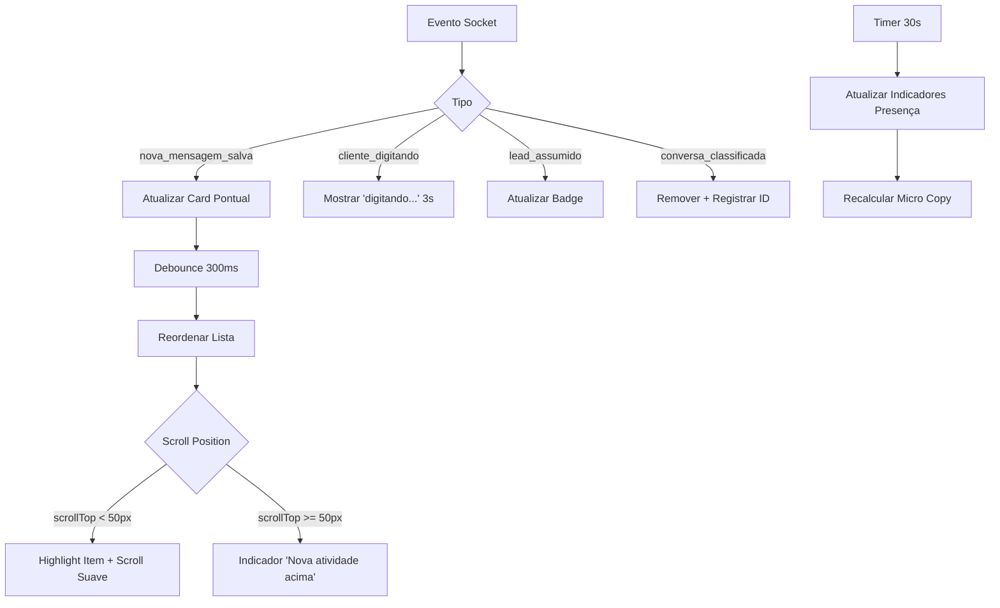
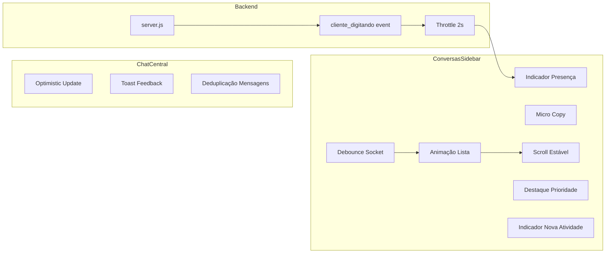

# Design Técnico — Live Relationship UX

## Overview

Este documento descreve o design técnico para as melhorias de UX na tela de Relacionamento (tela1), com foco em transmitir sensação de sistema online em tempo real. Todas as mudanças são incrementais sobre a base existente, sem alterar layout estrutural.

A feature se divide em 7 módulos funcionais:

1. **Indicador de Presença** — dot verde "online agora", "digitando..." via socket, "última atividade: X"
2. **Movimento Controlado** — animações suaves na reordenação, reposicionamento ao topo
3. **Micro Copy Contextual** — textos derivados de `getConversationStatus()` e `ultima_msg_em`
4. **Feedback Imediato** — optimistic updates, toast leve 2-3s
5. **Destaque de Prioridade** — font-weight, opacidade, badge discreto
6. **Scroll Estável** — preservação de posição, highlight de novos itens, indicador "Nova atividade acima"
7. **Sincronização Socket** — debounce, registro de removidos, atualizações pontuais

### Decisões de Design

- **Sem novos componentes React**: Todas as melhorias são elementos inline dentro dos componentes existentes.
- **Sem alteração de schema DB**: Nenhuma migração necessária. Usa campos existentes (`ultima_msg_em`, `unreadCount`, `_conversationStatus`).
- **Presença derivada de timestamp**: O indicador "online agora" é derivado de `ultima_msg_em < 2min`, sem necessidade de heartbeat ou presença real.
- **Evento `cliente_digitando`**: Novo evento de socket emitido pelo servidor quando o canal (WhatsApp/Telegram) reporta digitação. Throttle de 2s no servidor.
- **Debounce de socket**: Atualizações pontuais no estado local em vez de `loadLeads()` completo para cada evento.
- **Animações CSS-only**: Transições via `transform` e `opacity` apenas, sem keyframes complexos.
- **Micro copy sem queries extras**: Derivado exclusivamente de dados já presentes em `LeadWithMeta`.

## Architecture

### Diagrama de Fluxo Principal



### Diagrama de Componentes



## Components and Interfaces

### 1. Presence Indicator Logic (dentro de ConversasSidebar)

**Arquivo**: `web/app/(dashboard)/tela1/components/ConversasSidebar.tsx`

```typescript
// Estado de digitação por lead
const [typingLeads, setTypingLeads] = useState<Map<string, NodeJS.Timeout>>(new Map())

// Determinar indicador de presença
function getPresenceIndicator(lead: LeadWithMeta): {
  text: string
  type: 'online' | 'typing' | 'last_activity'
} | null {
  // Prioridade 1: digitando
  if (typingLeads.has(lead.id)) {
    return { text: 'digitando...', type: 'typing' }
  }
  
  // Prioridade 2: online (ultima_msg_em < 2min)
  const lastMsg = lead.ultima_msg_em
  if (lastMsg) {
    const diffMs = Date.now() - new Date(lastMsg).getTime()
    const diffMin = diffMs / 60000
    if (diffMin < 2) {
      return { text: 'online agora', type: 'online' }
    }
    
    // Prioridade 3: última atividade
    return { text: `última atividade: ${timeAgo(lastMsg)}`, type: 'last_activity' }
  }
  
  return null
}

// Socket listener para cliente_digitando
useEffect(() => {
  if (!socket) return
  
  const handleClienteDigitando = (data: { lead_id: string }) => {
    setTypingLeads(prev => {
      const next = new Map(prev)
      // Limpar timeout anterior
      const existing = next.get(data.lead_id)
      if (existing) clearTimeout(existing)
      // Novo timeout de 3s
      const timeout = setTimeout(() => {
        setTypingLeads(p => {
          const n = new Map(p)
          n.delete(data.lead_id)
          return n
        })
      }, 3000)
      next.set(data.lead_id, timeout)
      return next
    })
  }
  
  socket.on('cliente_digitando', handleClienteDigitando)
  return () => { socket.off('cliente_digitando', handleClienteDigitando) }
}, [socket])
```

### 2. Micro Copy Logic (função pura)

**Arquivo**: `web/app/(dashboard)/tela1/components/ConversasSidebar.tsx`

```typescript
/**
 * Retorna o micro copy contextual para um card de conversa.
 * Derivado exclusivamente de dados já presentes em LeadWithMeta.
 */
function getMicroCopy(lead: LeadWithMeta): {
  text: string
  style: 'warning' | 'muted' | 'accent'
} | null {
  const status = lead._conversationStatus
  if (!status) return null
  
  switch (status.status) {
    case 'active':
      // Se a última mensagem foi do cliente (inferido por ultima_msg_em recente)
      return { text: 'Cliente respondeu agora', style: 'accent' }
    
    case 'waiting':
      return { text: 'Aguardando sua resposta', style: 'warning' }
    
    case 'no_response':
      if (status.diffHours >= 48) {
        return { text: `Sem resposta há ${Math.round(status.diffDays)} dias`, style: 'muted' }
      }
      return { text: `Sem resposta há ${Math.round(status.diffHours)} horas`, style: 'muted' }
    
    default:
      return null
  }
}
```

### 3. Debounce Socket + Atualizações Pontuais (dentro de ConversasSidebar)

```typescript
// Registro de IDs removidos (evita reaparecimento)
const removedIdsRef = useRef<Set<string>>(new Set())

// Debounce por lead_id
const pendingUpdatesRef = useRef<Map<string, NodeJS.Timeout>>(new Map())

function handleSocketUpdate(leadId: string, updateFn: () => void) {
  // Ignorar leads removidos
  if (removedIdsRef.current.has(leadId)) return
  
  // Debounce 300ms por lead
  const existing = pendingUpdatesRef.current.get(leadId)
  if (existing) clearTimeout(existing)
  
  const timeout = setTimeout(() => {
    pendingUpdatesRef.current.delete(leadId)
    updateFn()
  }, 300)
  
  pendingUpdatesRef.current.set(leadId, timeout)
}

// Atualização pontual em vez de loadLeads()
function applyPontualUpdate(leadId: string, updates: Partial<LeadWithMeta>) {
  const updateList = (list: LeadWithMeta[]) =>
    list.map(l => l.id === leadId ? { ...l, ...updates } : l)
  
  setUrgentes(prev => updateList(prev))
  setEmAtendimento(prev => updateList(prev))
  setAguardando(prev => updateList(prev))
}

// Socket listener com debounce
useEffect(() => {
  if (!socket) return
  
  const handleNovaMensagem = (msg: { lead_id: string; conteudo: string; created_at: string }) => {
    handleSocketUpdate(msg.lead_id, () => {
      applyPontualUpdate(msg.lead_id, {
        ultima_msg_em: msg.created_at,
        lastMessage: msg.conteudo,
        unreadCount: (prev) => (prev ?? 0) + 1, // incrementar
      })
    })
  }
  
  const handleConversaClassificada = (data: { lead_id: string }) => {
    removedIdsRef.current.add(data.lead_id)
    // Remoção imediata, sem debounce
    setUrgentes(prev => prev.filter(l => l.id !== data.lead_id))
    setEmAtendimento(prev => prev.filter(l => l.id !== data.lead_id))
    setAguardando(prev => prev.filter(l => l.id !== data.lead_id))
  }
  
  socket.on('nova_mensagem_salva', handleNovaMensagem)
  socket.on('conversa_classificada', handleConversaClassificada)
  
  return () => {
    socket.off('nova_mensagem_salva', handleNovaMensagem)
    socket.off('conversa_classificada', handleConversaClassificada)
  }
}, [socket])
```

### 4. Scroll Estável + Indicador "Nova Atividade Acima"

```typescript
const scrollContainerRef = useRef<HTMLDivElement>(null)
const [showNewActivityIndicator, setShowNewActivityIndicator] = useState(false)
const [highlightedLeadId, setHighlightedLeadId] = useState<string | null>(null)

// Preservar scroll position antes de atualizar lista
const scrollPositionRef = useRef<number>(0)

function handleListUpdate(movedLeadId: string | null) {
  const container = scrollContainerRef.current
  if (!container || !movedLeadId) return
  
  const scrollTop = container.scrollTop
  
  if (scrollTop < 50) {
    // Operador está no topo — highlight o item que subiu
    setHighlightedLeadId(movedLeadId)
    setTimeout(() => setHighlightedLeadId(null), 1500)
  } else {
    // Operador está abaixo — mostrar indicador
    setShowNewActivityIndicator(true)
    // Restaurar scroll position
    requestAnimationFrame(() => {
      container.scrollTop = scrollTop
    })
  }
}

function scrollToTop() {
  scrollContainerRef.current?.scrollTo({ top: 0, behavior: 'smooth' })
  setShowNewActivityIndicator(false)
}
```

### 5. Animação de Lista (CSS + estado)

```typescript
// Rastrear posições anteriores para detectar mudanças
const prevOrderRef = useRef<string[]>([])
const [animatingItems, setAnimatingItems] = useState<Set<string>>(new Set())

useEffect(() => {
  const currentOrder = filteredLeads.map(l => l.id)
  const prevOrder = prevOrderRef.current
  
  if (prevOrder.length === 0) {
    // Initial render — sem animação
    prevOrderRef.current = currentOrder
    return
  }
  
  // Detectar itens que mudaram de posição
  const movedItems = new Set<string>()
  for (let i = 0; i < currentOrder.length; i++) {
    const prevIndex = prevOrder.indexOf(currentOrder[i])
    if (prevIndex !== -1 && prevIndex !== i) {
      movedItems.add(currentOrder[i])
    }
  }
  
  if (movedItems.size > 3) {
    // Muitos itens mudaram — fade geral
    // (handled by existing fadeIn state)
    setFadeIn(false)
    setTimeout(() => setFadeIn(true), 150)
  } else if (movedItems.size > 0) {
    // Poucos itens — animar individualmente
    setAnimatingItems(movedItems)
    setTimeout(() => setAnimatingItems(new Set()), 300)
  }
  
  prevOrderRef.current = currentOrder
}, [filteredLeads])
```

### 6. Toast Feedback (inline no ChatCentral)

```typescript
// Estado de toast no ChatCentral
const [toast, setToast] = useState<{
  message: string
  type: 'success' | 'error'
} | null>(null)

function showToast(message: string, type: 'success' | 'error' = 'success') {
  setToast({ message, type })
  if (type === 'success') {
    setTimeout(() => setToast(null), 2500)
  }
}

// Optimistic update ao enviar mensagem
const handleSend = () => {
  if (!input.trim() || !lead || !socket || !operadorId) return
  
  // Optimistic: adicionar mensagem localmente com ID temporário
  const tempId = `temp-${Date.now()}`
  const optimisticMsg: Mensagem = {
    id: tempId,
    lead_id: lead.id,
    de: operadorId,
    tipo: isNotaInterna ? 'nota_interna' : 'mensagem',
    conteudo: input.trim(),
    operador_id: operadorId,
    created_at: new Date().toISOString(),
  }
  setMensagens(prev => [...prev, optimisticMsg])
  
  // Emit via socket
  socket.emit('nova_mensagem', { /* ... existing payload ... */ })
  
  setInput('')
  showToast('Mensagem enviada', 'success')
}

// Deduplicação: quando confirmação chega via socket
const handleNovaMensagem = (msg: Mensagem) => {
  if (msg.lead_id === lead.id) {
    setMensagens(prev => {
      // Remover optimistic se existir, adicionar real
      if (prev.some(m => m.id === msg.id)) return prev
      // Remover temp messages do mesmo operador com conteúdo igual
      const withoutTemp = prev.filter(m => 
        !m.id.startsWith('temp-') || m.conteudo !== msg.conteudo
      )
      return [...withoutTemp, msg]
    })
  }
}

// JSX do toast (inline, sem componente novo)
// {toast && (
//   <div className={`fixed bottom-4 right-4 z-50 px-4 py-2.5 rounded-lg shadow-md text-xs font-medium
//     transition-all duration-200 ${toast.type === 'success' 
//       ? 'bg-bg-surface text-text-primary border border-border' 
//       : 'bg-error/10 text-error border border-error/20'}`}>
//     <span>{toast.message}</span>
//     {toast.type === 'error' && (
//       <button onClick={() => setToast(null)} className="ml-3 text-text-muted hover:text-text-primary">✕</button>
//     )}
//   </div>
// )}
```

### 7. Destaque de Prioridade (dentro de renderLeadItem)

```typescript
function renderLeadItem(lead: LeadWithMeta) {
  const hasUnread = (lead.unreadCount ?? 0) > 0
  const isWaiting = lead._conversationStatus?.status === 'waiting'
  const isActive = lead._conversationStatus?.status === 'active'
  
  // Opacidade: total para waiting/unread, reduzida para outros
  const opacityClass = (hasUnread || isWaiting) ? 'opacity-100' : 'opacity-70'
  
  // Font weight: semibold para unread
  const nameWeightClass = hasUnread ? 'font-semibold' : 'font-medium'
  
  // Highlight temporário
  const isHighlighted = lead.id === highlightedLeadId
  const highlightClass = isHighlighted ? 'bg-accent/5 transition-colors duration-1500' : ''
  
  // Animação individual
  const isAnimating = animatingItems.has(lead.id)
  const animClass = isAnimating ? 'transition-all duration-300 ease-out' : ''
  
  return (
    <div key={lead.id}
      className={`px-3 py-3 cursor-pointer border-b border-border transition-colors 
        ${opacityClass} ${highlightClass} ${animClass}
        ${isSelected ? 'bg-bg-surface-hover' : 'hover:bg-bg-surface-hover'} 
        ${borderLeftClass}`}
    >
      {/* ... existing avatar ... */}
      <div className="flex-1 min-w-0">
        <div className="flex items-center justify-between">
          <span className={`text-sm ${nameWeightClass} text-text-primary truncate`}>
            {displayName}
          </span>
          <div className="flex items-center gap-1.5 shrink-0 ml-2">
            {/* Badge de não-lidos */}
            {hasUnread && (
              <span className="text-[10px] px-1.5 py-0.5 rounded-full font-medium bg-accent/10 text-accent">
                {lead.unreadCount}
              </span>
            )}
            {/* Status tag existente */}
            {lead._conversationStatus && lead._conversationStatus.status !== 'active' && (
              <span className={`text-[10px] px-1.5 py-0.5 rounded-full font-medium ...`}>
                {CONVERSATION_STATUS_STYLES[lead._conversationStatus.status].label}
              </span>
            )}
            <span className="text-[11px] text-text-muted">
              {timeAgo(lead.ultima_msg_em || lead.created_at)}
            </span>
          </div>
        </div>
        
        {/* Micro copy OU preview */}
        {(() => {
          const microCopy = getMicroCopy(lead)
          if (microCopy) {
            const colorClass = microCopy.style === 'warning' ? 'text-warning' 
              : microCopy.style === 'accent' ? 'text-accent' 
              : 'text-text-muted'
            return <p className={`text-xs ${colorClass} truncate mt-0.5`}>{microCopy.text}</p>
          }
          return <p className="text-xs text-text-muted truncate mt-0.5">{preview || '\u00A0'}</p>
        })()}
        
        {/* Indicador de presença */}
        {(() => {
          const presence = getPresenceIndicator(lead)
          if (!presence) return null
          return (
            <div className="flex items-center gap-1 mt-0.5">
              {presence.type === 'online' && (
                <span className="w-2 h-2 rounded-full bg-success inline-block" />
              )}
              <span className="text-[10px] text-text-muted/60">{presence.text}</span>
            </div>
          )
        })()}
      </div>
    </div>
  )
}
```

### 8. Evento `cliente_digitando` no Servidor

**Arquivo**: `server.js`

```javascript
// Throttle map para cliente_digitando
const clienteDigitandoThrottle = new Map() // lead_id → timestamp

// Quando o webhook do canal reporta digitação
function handleClienteDigitando(leadId) {
  const now = Date.now()
  const lastEmit = clienteDigitandoThrottle.get(leadId) || 0
  
  // Throttle: máximo 1 emit a cada 2s por lead
  if (now - lastEmit < 2000) return
  
  clienteDigitandoThrottle.set(leadId, now)
  io.emit('cliente_digitando', { lead_id: leadId })
}

// Limpar throttle map periodicamente (a cada 60s)
setInterval(() => {
  const cutoff = Date.now() - 10000
  for (const [key, ts] of clienteDigitandoThrottle) {
    if (ts < cutoff) clienteDigitandoThrottle.delete(key)
  }
}, 60000)
```

### 9. Timer de Atualização de Presença (30s)

```typescript
// Dentro de ConversasSidebar — substituir o timer de 60s existente
useEffect(() => {
  const timer = setInterval(() => setNow(Date.now()), 30000) // 30s em vez de 60s
  return () => clearInterval(timer)
}, [])
```

## Correctness Properties

### Property 1: Indicador de presença retorna estado correto por threshold de tempo

*For any* timestamp `ultimaMsgEm` e tempo de referência `now`, `getPresenceIndicator()` SHALL retornar:
- `'online'` com texto "online agora" quando a diferença é menor que 2 minutos
- `'last_activity'` com texto "última atividade: X" quando a diferença é 2 minutos ou mais
- `'typing'` com texto "digitando..." quando o lead está no mapa de digitação (independente do timestamp)

**Validates: Requirements 1.1, 1.2, 1.4**

### Property 2: Micro copy retorna texto correto por status de conversa

*For any* `LeadWithMeta` com `_conversationStatus` válido, `getMicroCopy()` SHALL retornar:
- "Cliente respondeu agora" quando status é `active`
- "Aguardando sua resposta" quando status é `waiting`
- "Sem resposta há X horas" quando status é `no_response` e `diffHours < 48`
- "Sem resposta há X dias" quando status é `no_response` e `diffHours >= 48`

**Validates: Requirements 3.1, 3.2, 3.3, 3.4**

### Property 3: Debounce agrupa eventos do mesmo lead em janela de 300ms

*For any* sequência de N eventos de socket para o mesmo `lead_id` dentro de 300ms, o sistema SHALL aplicar apenas 1 atualização ao estado local. Para eventos de leads diferentes dentro da mesma janela, cada lead SHALL receber sua própria atualização.

**Validates: Requirements 7.1**

### Property 4: IDs removidos não reaparecem na lista

*For any* `lead_id` adicionado ao `removedIdsRef`, atualizações subsequentes de socket para esse `lead_id` SHALL ser ignoradas e o Card_Conversa SHALL não reaparecer na lista.

**Validates: Requirements 7.2**

### Property 5: Deduplicação de mensagens optimistic preserva exatamente uma instância

*For any* mensagem enviada com optimistic update (ID temporário `temp-*`) seguida de confirmação do servidor (ID real), a lista de mensagens SHALL conter exatamente uma instância da mensagem (a versão do servidor), sem duplicatas.

**Validates: Requirements 4.7**

### Property 6: Destaque de prioridade é cumulativo e correto

*For any* `LeadWithMeta`, o destaque visual SHALL seguir:
- `unreadCount > 0` → font-weight semibold + badge com contagem
- Status `waiting` → opacidade 1.0
- `unreadCount > 0` AND status `waiting` → ambos os destaques aplicados
- `unreadCount = 0` AND status `active` → estilo padrão (font-weight medium, opacidade 0.7)

**Validates: Requirements 5.1, 5.2, 5.3, 5.5, 5.6**

## Error Handling

### Falha de conexão Socket.io
- Se o socket desconectar, os indicadores de presença continuam funcionando baseados em `ultima_msg_em` (dados locais)
- O indicador "digitando..." não aparece durante desconexão (sem eventos)
- O `SocketProvider` já tem `reconnection: true` com `reconnectionAttempts: Infinity`
- Após reconexão, o timer de 30s recalcula todos os indicadores

### Evento para lead inexistente
- Se `cliente_digitando` chega para um `lead_id` que não está na lista local, o evento é ignorado silenciosamente
- O timeout de 3s limpa automaticamente entradas órfãs do mapa de digitação

### Overflow de eventos de socket
- O debounce de 300ms por lead previne cascata de re-renders
- Se mais de 3 itens mudam simultaneamente, o fade geral de 150ms é aplicado em vez de animações individuais
- O registro de IDs removidos (`removedIdsRef`) previne processamento de eventos para leads já removidos

### Optimistic update com falha
- Se o servidor não confirma a mensagem dentro de 5s, o toast de erro é exibido
- A mensagem optimistic (com ID `temp-*`) permanece na lista até a próxima atualização
- O operador pode reenviar a mensagem manualmente

### Null/undefined em ultima_msg_em
- `getPresenceIndicator()` retorna `null` se `ultima_msg_em` é null (sem indicador de presença)
- `getMicroCopy()` usa o fallback de `_conversationStatus` que já trata null via `getConversationStatus()`
