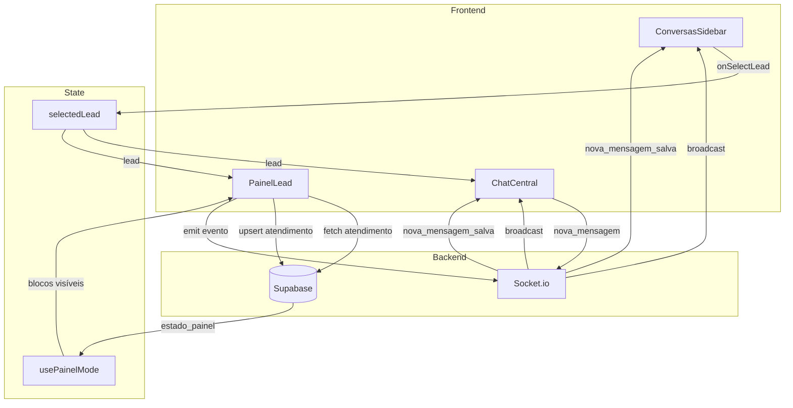
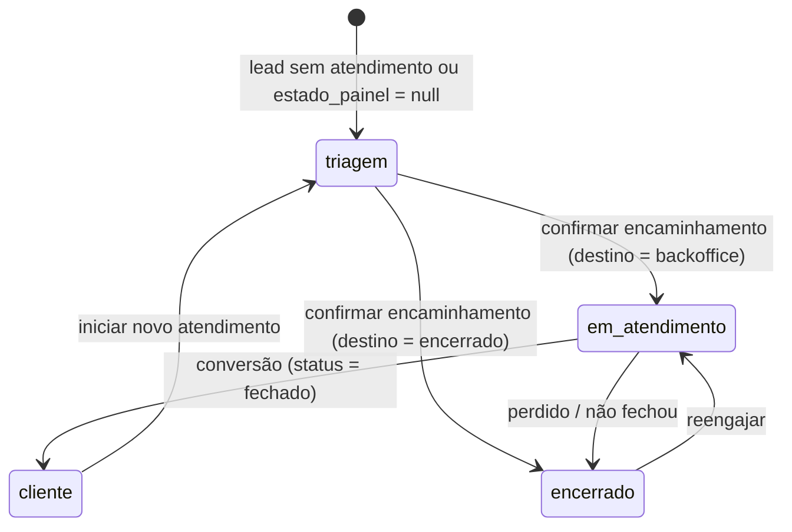

# Design — Painel Operacional UX

## Visão Geral

Este design detalha a arquitetura e os componentes da interface do Painel Operacional, seguindo o princípio: **"a triagem entende — o tratamento decide — o backoffice executa"**. O sistema é composto por três colunas fixas (Sidebar | Chat | Painel) onde o Painel Lead muda de modo conforme o `estado_painel` do atendimento, exibindo apenas os blocos relevantes para cada fase.

O redesign refatora o `PainelLead` atual (monolítico, ~500 linhas) em componentes menores e orientados por estado, introduz uma máquina de estados finita para governar transições de modo, e padroniza o fluxo de dados via hooks customizados.

### Decisões de Design

1. **State Machine no cliente**: O `estado_painel` vem do banco, mas a renderização condicional é governada por um hook `usePainelMode` que mapeia estado → blocos visíveis. Isso evita `if/else` espalhados.
2. **Composição sobre herança**: Cada modo do painel é um componente wrapper que compõe blocos reutilizáveis (Identidade, Dossiê, etc.).
3. **Otimistic UI para notas**: O Dossiê salva automaticamente no blur e mostra feedback "Salvo" sem esperar resposta do servidor.
4. **Socket-first para tempo real**: Todas as mudanças de estado propagam via Socket.io antes de refetch, garantindo < 1s de latência.
5. **resolveTreatment como fonte única**: A função `resolveTreatment(tipo, detalhe)` é a única que decide destino. Nenhum componente hardcoda lógica de encaminhamento.

## Arquitetura

### Árvore de Componentes

```
Tela1Page
├── ConversasSidebar          (320px, esquerda)
│   ├── SearchBar
│   ├── FilterTabs             (Todos | Aguardando | Sem retorno)
│   ├── LeadCard[]             (item da lista)
│   │   ├── AvatarWithStatus
│   │   ├── LeadPreview
│   │   └── AlertBadges        (🔴 não lido, ⚠️ sem responsável, ⏱ sem resposta)
│   └── NewContactModal
│
├── ChatCentral                (flex-1, centro)
│   ├── ChatHeader
│   │   └── PresenceIndicator
│   ├── MessageList
│   │   ├── MessageBubble[]
│   │   ├── SystemMessage[]
│   │   └── InternalNote[]
│   └── InputBar
│       ├── NoteToggle
│       ├── SmartSnippets
│       ├── FileUpload
│       └── SendButton
│
└── PainelLead                 (360px, direita)
    ├── PainelHeader           (estado + responsável + delegar)
    ├── usePainelMode(estado_painel) → renderiza modo:
    │
    ├── [triagem]
    │   ├── BlocoIdentidade    (nome, tel, email, score, vincular)
    │   ├── BlocoIntencao      (URA, canal, área — somente leitura)
    │   ├── BlocoClassJuridica (3 dropdowns cascata)
    │   ├── BlocoDossie        (textarea + notas anteriores)
    │   ├── BlocoTratamento    (2 dropdowns + resultado)
    │   └── BotaoConfirmacao
    │
    ├── [em_atendimento]
    │   ├── BlocoIdentidade
    │   ├── BlocoDossie
    │   ├── BlocoStatusAtual   (status_negocio formatado + próxima ação)
    │   └── BotoesAcao         (Confirmar reunião, Enviar proposta, Perdido)
    │
    ├── [cliente]
    │   ├── BlocoIdentidade
    │   ├── BlocoDossie
    │   ├── BlocoContrato      (valor, status pagamento)
    │   └── BotaoNovoAtendimento
    │
    └── [encerrado]
        ├── BlocoIdentidade
        ├── BlocoDossie
        ├── BlocoMotivoEncerramento
        └── BotaoReengajar
```

### Fluxo de Dados



### Máquina de Estados do Painel



**Transições e gatilhos:**

| De | Para | Gatilho | Ação no banco |
|---|---|---|---|
| `triagem` | `em_atendimento` | Confirmar com destino=backoffice | `atendimentos.estado_painel = 'em_atendimento'` |
| `triagem` | `encerrado` | Confirmar com destino=encerrado | `atendimentos.estado_painel = 'encerrado'` |
| `em_atendimento` | `cliente` | Conversão | `atendimentos.estado_painel = 'cliente'` |
| `em_atendimento` | `encerrado` | Perdido | `atendimentos.estado_painel = 'encerrado'` |
| `encerrado` | `em_atendimento` | Reengajar | `atendimentos.estado_painel = 'em_atendimento'` |
| `cliente` | `triagem` | Novo atendimento | Cria novo registro de atendimento |

## Componentes e Interfaces

### PainelHeader

Exibe estado atual com cor e nome do responsável.

```typescript
interface PainelHeaderProps {
  estadoPainel: EstadoPainel
  ownerNome: string | null
  isOwner: boolean
  onDelegate: (operadorId: string) => void
}
```

**Comportamento:**
- Cor de fundo mapeada por `COR_CLASSES` de `painelStatus.ts`
- Label do estado via `getEstadoLabel()`
- Botão "Delegar" visível apenas se `isOwner === true`
- Ao clicar "Delegar", carrega lista de operadores via `supabase.from('operadores').select('id, nome')`

### BlocoIdentidade

Exibe e permite edição inline de nome, telefone, email. Mostra score com indicador visual.

```typescript
interface BlocoIdentidadeProps {
  lead: Lead
  isOwner: boolean
  onLeadUpdate: (lead: Lead) => void
}
```

**Comportamento:**
- Campos editáveis inline (click → input, blur → save)
- Score visual: 🔥 QUENTE (≥7, vermelho), ⚠️ MORNO (≥4, amarelo), ❄️ FRIO (<4, cinza)
- Propagação de nome para todos os leads da mesma `identity_id`
- Botão "Vincular identidade" com busca por nome/telefone

### BlocoIntencao

Exibe intenção capturada pelo bot (somente leitura).

```typescript
interface BlocoIntencaoProps {
  lead: Lead
}
```

**Comportamento:**
- Usa `getIntencaoAtual(lead)` para texto da intenção
- Exibe canal de origem e área detectada pelo bot
- Sem interação — apenas contexto

### BlocoClassJuridica

3 dropdowns cascata para classificação jurídica. Visível apenas no modo `triagem`.

```typescript
interface BlocoClassJuridicaProps {
  segmentNodes: SegmentNode[]
  areaId: string | null
  categoriaId: string | null
  subcategoriaId: string | null
  isOwner: boolean
  isRequired: boolean  // true quando destino = backoffice
  onChange: (area: string | null, cat: string | null, sub: string | null) => void
}
```

**Comportamento:**
- Nível 1 → filtra nível 2 → filtra nível 3 via `filterChildren()`
- Ao mudar nível 1, limpa níveis 2 e 3
- Ao mudar nível 2, limpa nível 3
- Exibe aviso "⚠ Obrigatória para backoffice" quando `isRequired && !subcategoriaId`

### BlocoDossie

Textarea para registro do caso + notas anteriores. Visível em todos os modos.

```typescript
interface BlocoDossieProps {
  leadId: string
  operadorId: string | null
  isOwner: boolean
}
```

**Comportamento:**
- Auto-save no blur (insere `mensagens` com `tipo = 'nota_interna'`)
- Indicador "Salvo" por 1.5s após salvar
- Lista de notas anteriores ordenadas por `created_at DESC`
- Placeholder: "O que você entendeu do caso..."

### BlocoTratamento

2 dropdowns para classificação operacional + card de resultado. Visível apenas no modo `triagem`.

```typescript
interface BlocoTratamentoProps {
  tratamentoTipo: string
  tratamentoDetalhe: string
  treatment: TreatmentResult | null
  isOwner: boolean
  onTipoChange: (tipo: string) => void
  onDetalheChange: (detalhe: string) => void
}
```

**Comportamento:**
- Tipos carregados de `TREATMENT_TIPOS`
- Detalhes filtrados por `TREATMENT_DETALHES[tipo]`
- Ao selecionar tipo + detalhe, executa `resolveTreatment()` e exibe resultado
- Card azul para destino=backoffice, cinza para destino=encerrado

### BotaoConfirmacao

Botão principal de encaminhamento. Visível apenas no modo `triagem`.

```typescript
interface BotaoConfirmacaoProps {
  treatment: TreatmentResult | null
  classificacaoCompleta: boolean
  loading: boolean
  onConfirmar: () => void
  onNaoFechou: () => void
}
```

**Comportamento:**
- Desabilitado quando: sem tratamento, ou backoffice sem classificação jurídica completa
- Texto "Processando..." durante loading
- Exibe razão do bloqueio quando desabilitado
- Botão "Não fechou" visível apenas quando destino=backoffice

### BlocoStatusAtual

Exibe status do negócio e próxima ação. Visível no modo `em_atendimento`.

```typescript
interface BlocoStatusAtualProps {
  statusNegocio: string
  prazoProximaAcao: string | null
}
```

**Comportamento:**
- Formata `status_negocio` em linguagem humana (ex: `aguardando_agendamento` → "Aguardando agendamento")
- Exibe prazo com urgência via `getPrazoLabel()`

### BotoesAcao

Botões contextuais para o modo `em_atendimento`.

```typescript
interface BotoesAcaoProps {
  statusNegocio: string
  operadorId: string
  leadId: string
  onActionComplete: () => void
}
```

**Comportamento:**
- "Confirmar reunião" → modal com data/local → `timeline_events` + `status_transitions`
- "Enviar proposta" → modal com valor → atualiza `status_negocio`
- "Perdido" → modal com motivo → encerra atendimento

### LeadCard (Sidebar)

Card individual na lista de conversas.

```typescript
interface LeadCardProps {
  lead: LeadWithMeta
  isSelected: boolean
  searchQuery: string
  operadorId: string | null
  onSelect: (lead: Lead) => void
}
```

**Comportamento:**
- Badge 🔴 para mensagens não lidas
- Badge ⚠️ para lead sem responsável
- Badge ⏱ para lead sem resposta > 15min
- Borda lateral colorida por score (azul ≥7, amarelo ≥4, cinza <4)
- Dot de status no avatar (azul=active, amarelo=waiting, cinza=no_response)
- Opacidade 60% para leads > 24h sem atividade
- Fundo azul sutil + negrito extra para leads < 5min ou não lidos

### AlertBadges

Componente de indicadores visuais para o LeadCard.

```typescript
interface AlertBadgesProps {
  hasUnread: boolean
  hasNoOwner: boolean
  isOverdue: boolean  // > 15min sem resposta
}
```

## Modelos de Dados

### Interfaces TypeScript

```typescript
// Estado do painel — governa o modo de renderização
type EstadoPainel = 'triagem' | 'em_atendimento' | 'cliente' | 'encerrado'

// Lead (já existente em page.tsx)
interface Lead {
  id: string
  nome: string | null
  telefone: string | null
  email: string | null
  area: string | null
  area_bot: string | null
  area_humano: string | null
  score: number
  prioridade: string
  canal_origem: string | null
  created_at: string
  resumo: string | null
  corrigido: boolean
  is_reaquecido?: boolean
  is_assumido?: boolean
  identity_id?: string | null
  ultima_msg_em?: string | null
  channel_user_id?: string | null
}

// Atendimento — registro principal de acompanhamento
interface Atendimento {
  id: string
  lead_id: string
  identity_id: string | null
  owner_id: string | null
  status: string | null                          // classificado, convertido, nao_fechou
  status_negocio: string | null                   // aguardando_agendamento, negociacao, fechado, etc.
  destino: string | null                          // backoffice | encerrado
  estado_painel: EstadoPainel | null              // governa o modo do painel
  classificacao_tratamento_tipo: string | null     // Informação, Solicitação, Retorno, BadCall
  classificacao_tratamento_detalhe: string | null
  motivo_id: string | null                        // segmento_id (nível 1)
  categoria_id: string | null                     // assunto_id (nível 2)
  subcategoria_id: string | null                  // especificacao_id (nível 3)
  observacao: string | null
  prazo_proxima_acao: string | null
  motivo_perda: string | null
  valor_estimado: number | null
  valor_contrato: number | null
  status_pagamento: string | null
  encerrado_em: string | null
  created_at: string
}

// Mensagem
interface Mensagem {
  id: string
  lead_id: string
  de: string                    // operador_id, 'bot', ou channel_user_id
  tipo: string                  // mensagem, nota_interna, sistema, arquivo, audio
  conteudo: string
  operador_id: string | null
  created_at: string
  arquivo_url?: string | null
  arquivo_nome?: string | null
  arquivo_tipo?: string | null
  arquivo_tamanho?: number | null
}

// Nó da árvore de segmentos (classificação jurídica)
interface SegmentNode {
  id: string
  parent_id: string | null
  nivel: 1 | 2 | 3
  nome: string
  persona: string | null
  ativo: boolean
  created_at: string
}

// Resultado do tratamento
interface TreatmentResult {
  destino: 'backoffice' | 'encerrado'
  status_negocio: string
}

// Transição de status (auditoria)
interface StatusTransition {
  id: string
  atendimento_id: string
  status_anterior: string | null
  status_novo: string
  operador_id: string
  created_at: string
}

// Evento de timeline
interface TimelineEvent {
  id: string
  lead_id: string
  tipo: string                  // reuniao_agendada, proposta_enviada, contrato_gerado, etc.
  descricao: string
  operador_id: string
  metadata: Record<string, any>
  created_at: string
}

// Mapa de blocos visíveis por modo
interface PainelModeConfig {
  header: boolean
  identidade: boolean
  intencao: boolean
  classJuridica: boolean
  dossie: boolean
  tratamento: boolean
  resultado: boolean
  botaoConfirmacao: boolean
  statusAtual: boolean
  botoesAcao: boolean
  contrato: boolean
  motivoEncerramento: boolean
  botaoReengajar: boolean
  botaoNovoAtendimento: boolean
}

// Configuração por modo
const PAINEL_MODES: Record<EstadoPainel, PainelModeConfig> = {
  triagem: {
    header: true, identidade: true, intencao: true,
    classJuridica: true, dossie: true, tratamento: true,
    resultado: true, botaoConfirmacao: true,
    statusAtual: false, botoesAcao: false, contrato: false,
    motivoEncerramento: false, botaoReengajar: false, botaoNovoAtendimento: false,
  },
  em_atendimento: {
    header: true, identidade: true, intencao: false,
    classJuridica: false, dossie: true, tratamento: false,
    resultado: false, botaoConfirmacao: false,
    statusAtual: true, botoesAcao: true, contrato: false,
    motivoEncerramento: false, botaoReengajar: false, botaoNovoAtendimento: false,
  },
  cliente: {
    header: true, identidade: true, intencao: false,
    classJuridica: false, dossie: true, tratamento: false,
    resultado: false, botaoConfirmacao: false,
    statusAtual: false, botoesAcao: false, contrato: true,
    motivoEncerramento: false, botaoReengajar: false, botaoNovoAtendimento: true,
  },
  encerrado: {
    header: true, identidade: true, intencao: false,
    classJuridica: false, dossie: true, tratamento: false,
    resultado: false, botaoConfirmacao: false,
    statusAtual: false, botoesAcao: false, contrato: false,
    motivoEncerramento: true, botaoReengajar: true, botaoNovoAtendimento: false,
  },
}
```

### Eventos de Socket

| Evento | Direção | Payload | Descrição |
|---|---|---|---|
| `nova_mensagem` | Client → Server | `{ lead_id, de, conteudo, tipo, operador_id, origem }` | Envio de mensagem |
| `nova_mensagem_salva` | Server → Client | `Mensagem` | Mensagem persistida |
| `assumir_lead` | Client → Server | `{ lead_id, operador_id }` | Assumir lead |
| `lead_assumido` | Server → Client | `{ lead_id, operador_id }` | Lead assumido |
| `conversa_classificada` | Client → Server | `{ lead_id, status_negocio, destino }` | Classificação confirmada |
| `delegate_lead` | Client → Server | `{ lead_id, from_user_id, to_user_id }` | Delegar lead |
| `assignment_updated` | Server → Client | `{ lead_id, owner_id, owner_name }` | Responsável atualizado |
| `user_viewing` | Client → Server | `{ lead_id, user_id, user_name }` | Heartbeat de presença |
| `viewing_update` | Server → Client | `{ lead_id, viewers[] }` | Lista de visualizadores |
| `user_left` | Client → Server | `{ lead_id, user_id }` | Saiu da visualização |
| `lead_encerrado` | Client → Server | `{ lead_id, tipo }` | Lead encerrado |
| `estado_painel_changed` | Server → Client | `{ lead_id, estado_painel }` | Mudança de modo do painel |

### Queries Supabase

**Carregar atendimento do lead:**
```sql
SELECT owner_id, estado_painel, status_negocio, destino,
       classificacao_tratamento_tipo, prazo_proxima_acao, motivo_perda
FROM atendimentos
WHERE lead_id = $1
LIMIT 1
```

**Carregar histórico por identity:**
```sql
SELECT id, status_negocio, destino, classificacao_tratamento_tipo, created_at
FROM atendimentos
WHERE identity_id = $1 AND status_negocio IS NOT NULL
ORDER BY created_at DESC
LIMIT 5
```

**Upsert de classificação (triagem → confirmação):**
```sql
INSERT INTO atendimentos (lead_id, owner_id, status, status_negocio, destino,
  estado_painel, classificacao_tratamento_tipo, classificacao_tratamento_detalhe,
  motivo_id, categoria_id, subcategoria_id, observacao, prazo_proxima_acao)
VALUES ($1, $2, 'classificado', $3, $4, $5, $6, $7, $8, $9, $10, $11, $12)
ON CONFLICT (lead_id) DO UPDATE SET ...
```

**Carregar mensagens cross-canal:**
```sql
-- 1. Buscar identity_id do lead
SELECT identity_id FROM leads WHERE id = $1

-- 2. Buscar todos os leads da identity
SELECT id FROM leads WHERE identity_id = $2

-- 3. Buscar mensagens de todos os leads
SELECT * FROM mensagens
WHERE lead_id = ANY($3)
ORDER BY created_at ASC
```

## Propriedades de Corretude

*Uma propriedade é uma característica ou comportamento que deve ser verdadeiro em todas as execuções válidas de um sistema — essencialmente, uma declaração formal sobre o que o sistema deve fazer. Propriedades servem como ponte entre especificações legíveis por humanos e garantias de corretude verificáveis por máquina.*

### Propriedade 1: Mapeamento de modo do painel

*Para qualquer* valor válido de `estado_painel` (triagem, em_atendimento, cliente, encerrado), o mapa `PAINEL_MODES[estado]` deve retornar a configuração correta de blocos visíveis, onde: triagem inclui classJuridica e tratamento; em_atendimento inclui statusAtual e botoesAcao mas exclui classJuridica e tratamento; cliente inclui contrato; encerrado inclui motivoEncerramento e botaoReengajar. Adicionalmente, `dossie` deve ser `true` para todos os modos.

**Valida: Requisitos 2.1, 2.2, 2.3, 2.4, 6.7, 7.2, 8.7**

### Propriedade 2: Mapeamento de estado para cor

*Para qualquer* valor válido de `status_negocio`, a função `getCorPainel()` deve retornar a cor correta: `cinza` para null/triagem, `azul` para status de aguardo (aguardando_agendamento, aguardando_proposta, etc.), `amarelo` para negociacao, `verde` para fechado, `cinza_claro` para perdido/resolvido.

**Valida: Requisitos 3.1, 16.2**

### Propriedade 3: Classificação visual do score

*Para qualquer* score inteiro de 0 a 10, `getScoreVisual(score)` deve retornar: ícone 🔥 com label "QUENTE" e cor vermelha para score ≥ 7; ícone ⚠️ com label "MORNO" e cor amarela para score ≥ 4 e < 7; ícone ❄️ com label "FRIO" e cor cinza para score < 4. Adicionalmente, a borda lateral do card na Sidebar deve ser azul para ≥ 7, amarela para ≥ 4, cinza para < 4.

**Valida: Requisitos 4.2, 14.2**

### Propriedade 4: Filtro cascata da árvore de segmentos

*Para qualquer* árvore de segmentos válida e qualquer `parentId` e `nivel`, `filterChildren(nodes, parentId, nivel)` deve retornar apenas nós onde `ativo === true`, `nivel` corresponde ao parâmetro, e `parent_id === parentId` (ou `parent_id === null` para nível 1). Ao selecionar um nó de nível N, os níveis N+1 e N+2 devem ser limpos.

**Valida: Requisitos 6.2, 6.3, 6.4**

### Propriedade 5: Validação do botão de confirmação

*Para qualquer* combinação de `TreatmentResult` e estado de classificação jurídica (areaId, categoriaId, subcategoriaId), o botão "Confirmar encaminhamento" deve estar habilitado se e somente se: (a) existe um treatment válido, E (b) se `treatment.destino === 'backoffice'`, então os 3 níveis da classificação jurídica devem estar preenchidos, OU (c) se o tipo de tratamento for `BadCall` ou o destino for `encerrado`, a classificação jurídica não é exigida. Quando desabilitado, uma mensagem de razão deve ser exibida.

**Valida: Requisitos 6.5, 6.6, 9.1, 9.2, 9.8, 17.2**

### Propriedade 6: Resolução de tratamento

*Para qualquer* par válido de `(tipo, detalhe)` presente em `TREATMENT_MAP`, `resolveTreatment(tipo, detalhe)` deve retornar um `TreatmentResult` com `destino` sendo `'backoffice'` ou `'encerrado'` e `status_negocio` sendo uma string não vazia. Para pares inválidos (não presentes no mapa), deve lançar um erro.

**Valida: Requisitos 8.3, 8.4**

### Propriedade 7: Ordenação de conversas na Sidebar

*Para qualquer* conjunto de leads com diferentes estados de `unreadCount` e `ultima_msg_em`, a função `sortConversations()` deve retornar os leads ordenados com: (1) leads com mensagens não lidas (`unreadCount > 0`) antes dos demais, e (2) dentro de cada grupo, leads com atividade mais antiga primeiro (maior tempo de inatividade = maior prioridade).

**Valida: Requisito 13.7**

### Propriedade 8: Status de conversa para cor do dot

*Para qualquer* lead com `ultima_msg_em` e `created_at`, `getConversationStatus()` deve retornar um status (`active`, `waiting`, `no_response`, `inativo`) que mapeia para a cor correta do dot: azul para `active`, amarelo para `waiting`, cinza para `no_response`.

**Valida: Requisito 14.1**

### Propriedade 9: Camada visual de urgência baseada em tempo

*Para qualquer* lead, a camada visual de urgência deve ser determinada pelo tempo desde a última atividade: leads com < 5 minutos ou mensagens não lidas recebem fundo azul sutil e nome em negrito extra; leads com > 24 horas recebem opacidade 60%; leads entre 30min e 24h recebem cor de tempo amarela.

**Valida: Requisitos 14.3, 14.4**

### Propriedade 10: Alinhamento de mensagens por remetente

*Para qualquer* mensagem no chat, se `msg.de === operadorId` ou `msg.de === 'bot'`, a mensagem deve ser alinhada à direita com fundo azul; caso contrário, deve ser alinhada à esquerda com fundo branco.

**Valida: Requisito 15.2**

### Propriedade 11: Validação de arquivo

*Para qualquer* arquivo com tamanho e tipo MIME, `validateFileSize()` deve rejeitar arquivos > 10MB e `validateFileType()` deve rejeitar tipos não permitidos. Ambas as funções devem aceitar arquivos válidos (≤ 10MB e tipo permitido).

**Valida: Requisito 15.6**

### Propriedade 12: Ordenação de notas do dossiê

*Para qualquer* conjunto de notas internas com timestamps distintos, a lista exibida no Dossiê deve estar ordenada por `created_at` em ordem decrescente (mais recente primeiro).

**Valida: Requisito 7.5**

## Tratamento de Erros

| Cenário | Comportamento | Feedback |
|---|---|---|
| Falha ao salvar classificação | Rollback local, não emite socket | Toast vermelho persistente: "Erro ao salvar classificação. Tente novamente." com botão ✕ |
| Falha ao salvar nota do dossiê | Mantém texto no textarea | Toast vermelho: "Erro ao salvar nota" |
| Falha ao enviar mensagem | Não adiciona à lista | Alert com mensagem de erro do socket |
| Falha ao upload de arquivo | Não envia mensagem de arquivo | Mensagem de erro por 3s abaixo do input |
| Arquivo > 10MB | Rejeita antes do upload | Mensagem: "Arquivo excede o limite de 10 MB" |
| Tipo de arquivo não permitido | Rejeita antes do upload | Mensagem: "Tipo de arquivo não permitido" |
| Tratamento não mapeado | `resolveTreatment` lança erro | Não exibe card de resultado, botão permanece desabilitado |
| Socket desconectado | Operações locais continuam | Indicador de conexão no header (futuro) |
| Lead sem identity_id | Fallback para lead_id direto | Funciona normalmente, sem consolidação cross-canal |
| Operador sem permissão (não é owner) | Campos desabilitados | `disabled:opacity-50` nos inputs |
| Delegação falha | Não atualiza owner | Toast de erro |

## Estratégia de Testes

### Testes Unitários (example-based)

- Renderização de cada modo do painel (triagem, em_atendimento, cliente, encerrado)
- Interações de UI: click-to-edit, blur-to-save, modal open/close
- Feedback visual: toasts, loading states, disabled states
- Integração de socket: emit/on para cada evento
- Cross-canal: carregamento de mensagens por identity_id

### Testes de Propriedade (property-based)

Biblioteca: **fast-check** (TypeScript/JavaScript)
Configuração: mínimo 100 iterações por propriedade.

Cada propriedade do documento de design será implementada como um teste de propriedade individual:

- **Propriedade 1**: Gerar `EstadoPainel` aleatório → verificar `PAINEL_MODES` retorna config correta
  - Tag: `Feature: operational-panel-ux, Property 1: Mode config mapping`
- **Propriedade 2**: Gerar `status_negocio` aleatório → verificar `getCorPainel` retorna cor correta
  - Tag: `Feature: operational-panel-ux, Property 2: Estado to color mapping`
- **Propriedade 3**: Gerar score 0-10 → verificar `getScoreVisual` retorna visual correto
  - Tag: `Feature: operational-panel-ux, Property 3: Score visual classification`
- **Propriedade 4**: Gerar árvore de segmentos aleatória → verificar `filterChildren` filtra corretamente
  - Tag: `Feature: operational-panel-ux, Property 4: Cascade filter`
- **Propriedade 5**: Gerar combinações de treatment + classificação → verificar habilitação do botão
  - Tag: `Feature: operational-panel-ux, Property 5: Confirmation button validation`
- **Propriedade 6**: Gerar pares tipo+detalhe → verificar `resolveTreatment` retorna resultado correto
  - Tag: `Feature: operational-panel-ux, Property 6: Treatment resolution`
- **Propriedade 7**: Gerar lista de leads com unread/timestamps → verificar ordenação
  - Tag: `Feature: operational-panel-ux, Property 7: Conversation sorting`
- **Propriedade 8**: Gerar timestamps → verificar `getConversationStatus` retorna status correto
  - Tag: `Feature: operational-panel-ux, Property 8: Conversation status to dot color`
- **Propriedade 9**: Gerar leads com timestamps variados → verificar camada visual de urgência
  - Tag: `Feature: operational-panel-ux, Property 9: Time-based urgency styling`
- **Propriedade 10**: Gerar mensagens com remetentes variados → verificar alinhamento
  - Tag: `Feature: operational-panel-ux, Property 10: Message alignment by sender`
- **Propriedade 11**: Gerar arquivos com tamanhos e tipos variados → verificar validação
  - Tag: `Feature: operational-panel-ux, Property 11: File validation`
- **Propriedade 12**: Gerar notas com timestamps → verificar ordenação DESC
  - Tag: `Feature: operational-panel-ux, Property 12: Notes ordering`

### Testes de Integração

- Fluxo completo de triagem: selecionar lead → classificar → confirmar → verificar banco + socket
- Fluxo de delegação: delegar → verificar assignment_updated → verificar sidebar atualizada
- Fluxo de reengajamento: encerrado → reengajar → verificar estado_painel = em_atendimento
- Cross-canal: criar identity com 2 leads → verificar mensagens consolidadas
- Presença: 2 operadores no mesmo lead → verificar indicador de presença

