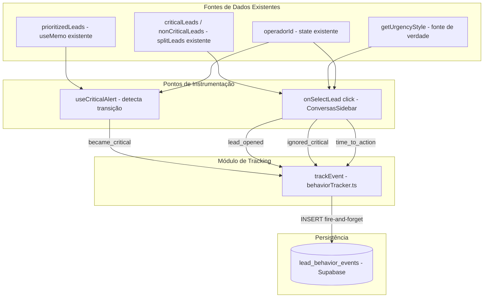

# Design — Operator Behavior Tracking

## Visão Geral

O Operator Behavior Tracking é uma camada de instrumentação invisível que registra 4 eventos de comportamento do operador em relação a leads críticos. A implementação é **puramente aditiva e fire-and-forget** — zero alterações em lógica existente, zero bloqueio de UI, zero feedback visual ao operador.

### Eventos Rastreados

| Evento | Quando | Onde é Disparado |
|--------|--------|-----------------|
| `became_critical` | Lead transiciona para estado crítico | `useCriticalAlert` (hook existente, modificado para aceitar `userId`) |
| `lead_opened` | Operador clica em qualquer lead | `ConversasSidebar` (callback `onSelectLead`) |
| `ignored_critical` | Operador abre lead não-crítico com críticos na fila | `ConversasSidebar` (callback `onSelectLead`) |
| `time_to_action` | Operador abre lead crítico | `ConversasSidebar` (callback `onSelectLead`) |

### Decisões de Design

| Decisão | Escolha | Justificativa |
|---------|---------|---------------|
| Padrão de escrita | Fire-and-forget (sem `await`) | Instrumentação NUNCA deve bloquear a UI |
| Tratamento de erros | `.catch(() => {})` silencioso | Falha de tracking não pode afetar operação |
| Módulo centralizado | `web/utils/behaviorTracker.ts` | Ponto único de escrita, fácil de desabilitar/modificar |
| Detecção de criticidade | Reutiliza `getUrgencyStyle()` e `splitLeads()` | Fonte única de verdade, sem duplicação |
| Passagem de `userId` | Parâmetro adicionado ao `useCriticalAlert` | Mínima alteração na interface do hook |
| Cálculo de `time_to_action` | `Date.now() - Date.parse(ultima_msg_em)` | Usa timestamp da última mensagem do cliente como proxy do momento crítico |
| Tabela dedicada | `lead_behavior_events` com JSONB metadata | Flexível para novos campos sem migração |

## Arquitetura

### Fluxo de Dados



### Princípio de Não-Interferência

A instrumentação opera como uma **projeção write-only** sobre dados existentes:

- **Leitura**: Consome dados já calculados (`criticalLeads`, `nonCriticalLeads`, `operadorId`)
- **Escrita**: INSERT assíncrono no Supabase, sem `await` no call site
- **Efeito na UI**: Nenhum — sem estado React novo, sem re-renders, sem feedback visual
- **Efeito em falha**: Nenhum — `.catch(() => {})` garante silêncio total

## Componentes e Interfaces

### 1. Migração SQL — `027_behavior_events.sql`

```sql
-- sql/migrations/027_behavior_events.sql
CREATE TABLE IF NOT EXISTS lead_behavior_events (
  id UUID PRIMARY KEY DEFAULT gen_random_uuid(),
  lead_id UUID,
  user_id UUID,
  event_type TEXT NOT NULL,
  metadata JSONB DEFAULT '{}',
  created_at TIMESTAMPTZ DEFAULT now()
);

CREATE INDEX IF NOT EXISTS idx_behavior_events_type_created
  ON lead_behavior_events (event_type, created_at);
```

**Decisão**: Sem `REFERENCES` para `leads(id)` ou `auth.users(id)` — a tabela é append-only para analytics, e foreign keys adicionariam overhead desnecessário em inserts fire-and-forget.

### 2. `behaviorTracker.ts` — Módulo Utilitário

```typescript
// web/utils/behaviorTracker.ts
import { createClient } from '@/utils/supabase/client'

interface TrackEventParams {
  lead_id: string
  user_id: string
  event_type: 'became_critical' | 'lead_opened' | 'ignored_critical' | 'time_to_action'
  metadata?: Record<string, unknown>
}

export function trackEvent({ lead_id, user_id, event_type, metadata = {} }: TrackEventParams): void {
  const supabase = createClient()
  supabase
    .from('lead_behavior_events')
    .insert({ lead_id, user_id, event_type, metadata })
    .then(() => {})
    .catch(() => {})
}
```

**Interface**:
- **Entrada**: `TrackEventParams` — `lead_id`, `user_id`, `event_type`, `metadata` opcional
- **Saída**: `void` — fire-and-forget, sem Promise retornada
- **Efeito colateral**: INSERT assíncrono no Supabase
- **Tratamento de erro**: `.catch(() => {})` silencioso

**Decisão**: `createClient()` é chamado dentro da função (não no módulo) para garantir que o cliente é criado no contexto correto do browser. A função retorna `void` (não `Promise<void>`) para que o call site não possa usar `await`.

### 3. Modificação do `useCriticalAlert` — Adição de `userId`

```typescript
// Assinatura ANTES:
export function useCriticalAlert(leads: LeadForAlert[]): void

// Assinatura DEPOIS:
export function useCriticalAlert(leads: LeadForAlert[], userId?: string | null): void
```

**Lógica adicionada** (dentro do `useEffect` existente, após detecção de `newCriticalIds`):

```typescript
// Após: if (newCriticalIds.size > 0 && !document.hidden && audioRef.current) { ... }
// Adicionar: disparo de became_critical para cada novo ID
if (newCriticalIds.size > 0 && userId) {
  for (const leadId of newCriticalIds) {
    const lead = leads.find(l => l.id === leadId)
    if (!lead) continue

    const elapsedMs = lead.ultima_msg_em
      ? Date.now() - new Date(lead.ultima_msg_em).getTime()
      : 0
    const elapsedMinutes = Math.floor(elapsedMs / 60000)

    trackEvent({
      lead_id: leadId,
      user_id: userId,
      event_type: 'became_critical',
      metadata: {
        elapsed_minutes: elapsedMinutes,
        stage: (lead as any).classificacao ? 'classificacao' : 'atendimento',
      },
    })
  }
}
```

**Decisão**: O parâmetro `userId` é opcional (`string | null | undefined`) para manter backward compatibility. Se não fornecido, o hook funciona exatamente como antes — apenas sem disparar eventos.

### 4. Modificação do `ConversasSidebar` — Instrumentação no `onSelectLead`

A instrumentação é adicionada dentro do handler `onClick` do botão de lead, **após** a chamada existente a `onSelectLead(lead)`:

```typescript
onClick={() => {
  onSelectLead(lead)

  // --- Instrumentação (fire-and-forget) ---
  if (operadorId) {
    const urgency = getUrgencyStyle(lead.ultima_msg_em || null, lead.ultima_msg_de || null)
    const wasCritical = urgency.level === 'critical'
    const allLeads = [...criticalLeads, ...nonCriticalLeads]
    const positionInQueue = allLeads.findIndex(l => l.id === lead.id)

    // Evento 1: lead_opened (sempre)
    trackEvent({
      lead_id: lead.id,
      user_id: operadorId,
      event_type: 'lead_opened',
      metadata: {
        was_critical: wasCritical,
        time_since_critical: wasCritical && lead.ultima_msg_em
          ? Math.floor((Date.now() - new Date(lead.ultima_msg_em).getTime()) / 1000)
          : 0,
        position_in_queue: positionInQueue,
      },
    })

    // Evento 2: ignored_critical (se lead não-crítico E existem críticos)
    if (!wasCritical && criticalLeads.length > 0) {
      trackEvent({
        lead_id: lead.id,
        user_id: operadorId,
        event_type: 'ignored_critical',
        metadata: {
          critical_count: criticalLeads.length,
          opened_lead_id: lead.id,
          critical_lead_ids: criticalLeads.map(l => l.id),
        },
      })
    }

    // Evento 3: time_to_action (se lead é crítico)
    if (wasCritical && lead.ultima_msg_em) {
      trackEvent({
        lead_id: lead.id,
        user_id: operadorId,
        event_type: 'time_to_action',
        metadata: {
          seconds: Math.floor((Date.now() - new Date(lead.ultima_msg_em).getTime()) / 1000),
          was_critical: true,
        },
      })
    }
  }

  // --- Fim da instrumentação ---
  if (socket && operadorId && !lead.is_reaquecido) {
    socket.emit('assumir_lead', { lead_id: lead.id, operador_id: operadorId })
  }
}
```

**Decisão**: Toda a instrumentação fica dentro de um guard `if (operadorId)` para evitar eventos sem identificação do operador. Os 3 eventos (`lead_opened`, `ignored_critical`, `time_to_action`) são disparados condicionalmente no mesmo handler.

### 5. Chamada do `useCriticalAlert` com `operadorId`

```typescript
// ANTES:
useCriticalAlert(prioritizedLeads)

// DEPOIS:
useCriticalAlert(prioritizedLeads, operadorId)
```

Alteração de uma única linha no `ConversasSidebar`.

## Modelos de Dados

### Tabela `lead_behavior_events` (NOVA)

| Coluna | Tipo | Default | Descrição |
|--------|------|---------|-----------|
| `id` | UUID | `gen_random_uuid()` | Chave primária |
| `lead_id` | UUID | — | ID do lead relacionado ao evento |
| `user_id` | UUID | — | ID do operador que gerou o evento |
| `event_type` | TEXT NOT NULL | — | Tipo: `became_critical`, `lead_opened`, `ignored_critical`, `time_to_action` |
| `metadata` | JSONB | `'{}'` | Dados adicionais específicos por tipo de evento |
| `created_at` | TIMESTAMPTZ | `now()` | Timestamp do evento |

### Estrutura de Metadata por Evento

**`became_critical`**:
```json
{
  "elapsed_minutes": 35,
  "stage": "atendimento"
}
```

**`lead_opened`**:
```json
{
  "was_critical": true,
  "time_since_critical": 1847,
  "position_in_queue": 0
}
```

**`ignored_critical`**:
```json
{
  "critical_count": 3,
  "opened_lead_id": "uuid-do-lead-aberto",
  "critical_lead_ids": ["uuid-1", "uuid-2", "uuid-3"]
}
```

**`time_to_action`**:
```json
{
  "seconds": 1847,
  "was_critical": true
}
```

### Índices

| Índice | Colunas | Justificativa |
|--------|---------|---------------|
| `idx_behavior_events_type_created` | `(event_type, created_at)` | Consultas de métricas diárias filtram por tipo e data |

### Consulta de Métrica Diária

```sql
SELECT
  COUNT(*) FILTER (
    WHERE event_type = 'lead_opened'
    AND metadata->>'was_critical' = 'true'
  ) AS correct,
  COUNT(*) FILTER (
    WHERE event_type = 'ignored_critical'
  ) AS ignored,
  ROUND(
    COUNT(*) FILTER (WHERE event_type = 'lead_opened' AND metadata->>'was_critical' = 'true')::numeric
    / NULLIF(
        COUNT(*) FILTER (WHERE event_type = 'lead_opened' AND metadata->>'was_critical' = 'true')
        + COUNT(*) FILTER (WHERE event_type = 'ignored_critical'),
        0
      ),
    2
  ) AS prioritization_rate
FROM lead_behavior_events
WHERE created_at >= NOW() - INTERVAL '1 day';
```

### Tipos TypeScript

```typescript
// Interface do trackEvent (em behaviorTracker.ts)
interface TrackEventParams {
  lead_id: string
  user_id: string
  event_type: 'became_critical' | 'lead_opened' | 'ignored_critical' | 'time_to_action'
  metadata?: Record<string, unknown>
}

// Tipos existentes reutilizados (sem alteração)
// - LeadForAlert (de criticalPressure.ts)
// - LeadWithMeta (de ConversasSidebar.tsx)
// - UrgencyStyle (de urgencyColors.ts)
```

### Funções Puras Extraíveis para Teste

Para viabilizar property-based testing, a lógica de decisão de eventos é extraída em funções puras no `behaviorTracker.ts`:

```typescript
// Determina quais eventos disparar quando um lead é selecionado
export function resolveLeadSelectEvents(params: {
  lead: { id: string; ultima_msg_em?: string | null; ultima_msg_de?: string | null }
  userId: string
  wasCritical: boolean
  criticalLeadIds: string[]
  positionInQueue: number
  now?: number // para testes determinísticos
}): TrackEventParams[]

// Determina quais eventos disparar quando leads transicionam para crítico
export function resolveBecameCriticalEvents(params: {
  newCriticalIds: string[]
  leads: Array<{ id: string; ultima_msg_em?: string | null; classificacao?: string | null }>
  userId: string
  now?: number
}): TrackEventParams[]

// Calcula a taxa de priorização a partir de contagens
export function calculatePrioritizationRate(correct: number, ignored: number): number | null
```

**Decisão**: Extrair a lógica de decisão em funções puras permite testar com property-based testing sem precisar mockar React hooks ou o Supabase. O parâmetro `now` opcional permite testes determinísticos sem depender de `Date.now()`.


## Propriedades de Corretude

*Uma propriedade é uma característica ou comportamento que deve ser verdadeiro em todas as execuções válidas de um sistema — essencialmente, uma declaração formal sobre o que o sistema deve fazer. Propriedades servem como ponte entre especificações legíveis por humanos e garantias de corretude verificáveis por máquina.*

### Property 1: Um evento `became_critical` por lead que transiciona

*Para qualquer* conjunto de IDs de leads que acabaram de transicionar para estado crítico (`newCriticalIds`) e qualquer `userId` válido, `resolveBecameCriticalEvents` DEVE retornar exatamente um evento com `event_type === 'became_critical'` para cada ID em `newCriticalIds`, e o `lead_id` de cada evento DEVE corresponder ao ID do lead que transicionou.

**Validates: Requirements 3.1, 3.5**

### Property 2: Metadata correta no evento `became_critical`

*Para qualquer* lead com `ultima_msg_em` arbitrário e campo `classificacao` presente ou ausente, o evento `became_critical` gerado por `resolveBecameCriticalEvents` DEVE conter `elapsed_minutes` igual a `Math.floor((now - Date.parse(ultima_msg_em)) / 60000)` e `stage` igual a `'classificacao'` quando o lead tem `classificacao`, ou `'atendimento'` caso contrário.

**Validates: Requirements 3.2**

### Property 3: Evento `lead_opened` com metadata correta para qualquer lead selecionado

*Para qualquer* lead selecionado (crítico ou não), qualquer lista de leads críticos, e qualquer posição na fila, `resolveLeadSelectEvents` DEVE incluir exatamente um evento `lead_opened` com metadata contendo: `was_critical` correspondendo ao estado de urgência do lead, `time_since_critical` em segundos (ou 0 se não-crítico), e `position_in_queue` correspondendo à posição do lead na lista combinada.

**Validates: Requirements 4.1, 4.2, 4.4**

### Property 4: Evento `ignored_critical` disparado condicionalmente com metadata correta

*Para qualquer* lead não-crítico selecionado e qualquer lista não-vazia de leads críticos, `resolveLeadSelectEvents` DEVE incluir um evento `ignored_critical` com metadata contendo `critical_count` igual ao tamanho da lista de críticos, `opened_lead_id` igual ao ID do lead selecionado, e `critical_lead_ids` contendo exatamente os IDs dos leads críticos. Quando a lista de críticos estiver vazia OU o lead selecionado for crítico, o evento `ignored_critical` NÃO DEVE ser incluído.

**Validates: Requirements 5.1, 5.2, 5.3**

### Property 5: Evento `time_to_action` disparado condicionalmente com metadata correta

*Para qualquer* lead crítico selecionado com `ultima_msg_em` válido, `resolveLeadSelectEvents` DEVE incluir um evento `time_to_action` com metadata contendo `seconds` igual a `Math.floor((now - Date.parse(ultima_msg_em)) / 1000)` e `was_critical === true`. Quando o lead selecionado for não-crítico, o evento `time_to_action` NÃO DEVE ser incluído.

**Validates: Requirements 6.1, 6.2, 6.3, 6.4**

### Property 6: Fórmula de taxa de priorização

*Para quaisquer* contagens `correct >= 0` e `ignored >= 0`, `calculatePrioritizationRate` DEVE retornar `correct / (correct + ignored)` quando `correct + ignored > 0`, e `null` quando ambos forem zero (divisão por zero).

**Validates: Requirements 8.2**

## Tratamento de Erros

### Erros de Escrita no Supabase

| Cenário | Tratamento | Justificativa |
|---------|-----------|---------------|
| Insert falha (rede, permissão, etc.) | `.catch(() => {})` silencioso | Tracking nunca deve afetar operação |
| Supabase indisponível | `.catch(() => {})` silencioso | Degradação graciosa — UI continua normal |
| Dados inválidos (UUID malformado) | `.catch(() => {})` silencioso | Evento perdido é aceitável |

### Erros de Dados de Entrada

| Cenário | Tratamento | Justificativa |
|---------|-----------|---------------|
| `operadorId` é `null` | Guard `if (operadorId)` — nenhum evento disparado | Sem identificação, evento não tem valor |
| `ultima_msg_em` é `null` | `elapsed_minutes = 0`, `seconds = 0` | Valor default seguro |
| Lead não encontrado na lista | `continue` no loop | Skip silencioso |
| `criticalLeads` vazio | `ignored_critical` não disparado | Comportamento correto por design |

### Princípio: Falha Silenciosa Total

A instrumentação segue o princípio de **falha silenciosa total**:
1. Nenhum `console.error` ou `console.warn` — silêncio absoluto
2. Nenhum estado React afetado por falha de tracking
3. Nenhum re-render causado por tracking
4. Se `trackEvent` falhar, o operador não percebe nada

## Estratégia de Testes

### Abordagem Dual

A estratégia combina **testes de propriedade** (property-based testing) para a lógica pura de decisão de eventos e **testes de exemplo** para integração e edge cases.

### Testes de Propriedade (PBT)

**Biblioteca**: `fast-check` (já em `devDependencies`)
**Runner**: `vitest` (já em `devDependencies`)
**Iterações mínimas**: 100 por propriedade

| Propriedade | Função Testada | Gerador |
|-------------|---------------|---------|
| Property 1: Um became_critical por transição | `resolveBecameCriticalEvents()` | Arrays de IDs aleatórios + leads com timestamps aleatórios |
| Property 2: Metadata correta no became_critical | `resolveBecameCriticalEvents()` | Leads com `ultima_msg_em` e `classificacao` aleatórios |
| Property 3: lead_opened com metadata correta | `resolveLeadSelectEvents()` | Leads com urgência aleatória, listas de tamanho variável |
| Property 4: ignored_critical condicional | `resolveLeadSelectEvents()` | Combinações de lead crítico/não-crítico + listas críticas vazias/não-vazias |
| Property 5: time_to_action condicional | `resolveLeadSelectEvents()` | Leads críticos/não-críticos com timestamps aleatórios |
| Property 6: Fórmula de priorização | `calculatePrioritizationRate()` | Pares de inteiros não-negativos |

**Configuração de cada teste PBT**:
```typescript
// Tag format:
// Feature: operator-behavior-tracking, Property N: <property_text>
```

### Funções Puras Extraíveis para Teste

A lógica de decisão de eventos é extraída em funções puras no `behaviorTracker.ts`:

- `resolveLeadSelectEvents(params)` → retorna array de `TrackEventParams` para o click handler
- `resolveBecameCriticalEvents(params)` → retorna array de `TrackEventParams` para transições
- `calculatePrioritizationRate(correct, ignored)` → retorna `number | null`

Essas funções são **puras** (sem efeitos colaterais, sem dependência de `Date.now()` graças ao parâmetro `now`), permitindo PBT direto sem mocks.

### Testes de Exemplo (Unit Tests)

| Cenário | Tipo | O que verifica |
|---------|------|---------------|
| `trackEvent` chama Supabase insert com params corretos | EXAMPLE | Integração com Supabase |
| `trackEvent` retorna void (não Promise) | EXAMPLE | Interface fire-and-forget |
| `trackEvent` com Supabase rejeitando não propaga erro | EDGE_CASE | `.catch(() => {})` funciona |
| `useCriticalAlert` com `userId` dispara `trackEvent` | EXAMPLE | Integração hook → tracker |
| `useCriticalAlert` sem `userId` não dispara eventos | EDGE_CASE | Guard funciona |
| Click em lead com `operadorId = null` não dispara eventos | EDGE_CASE | Guard funciona |
| Migração SQL cria tabela com colunas corretas | SMOKE | Schema correto |
| Migração SQL cria índice composto | SMOKE | Índice existe |

### Testes de Integração

| Cenário | O que verifica |
|---------|---------------|
| Socket handlers existentes continuam funcionando | Não-regressão |
| Filtros por pills continuam funcionando | Não-regressão |
| `useCriticalAlert` continua reproduzindo som | Não-regressão |
| Consulta de métrica diária retorna resultados corretos | Query SQL funciona |
