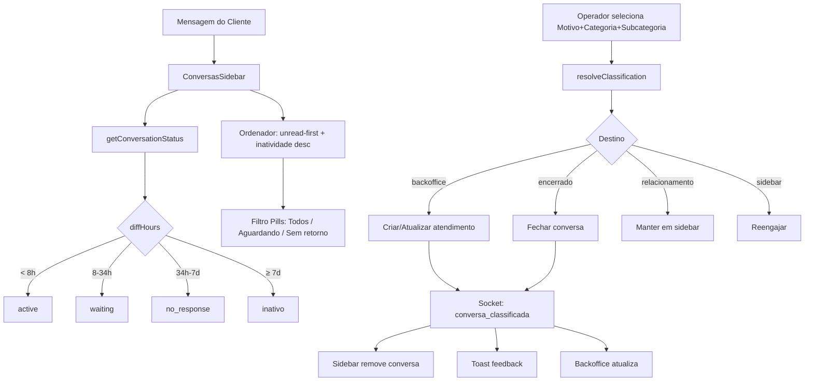
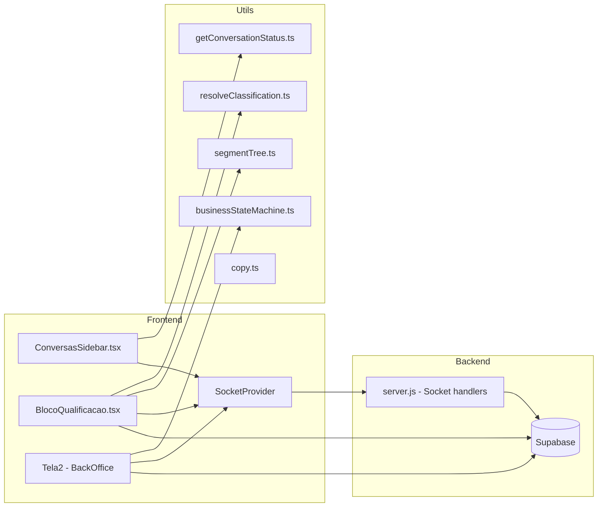
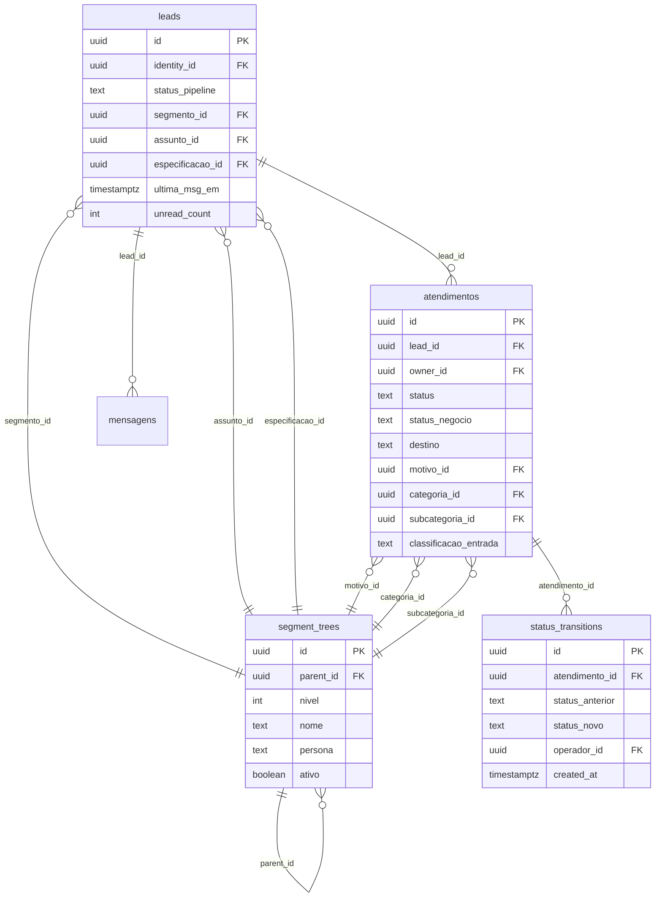
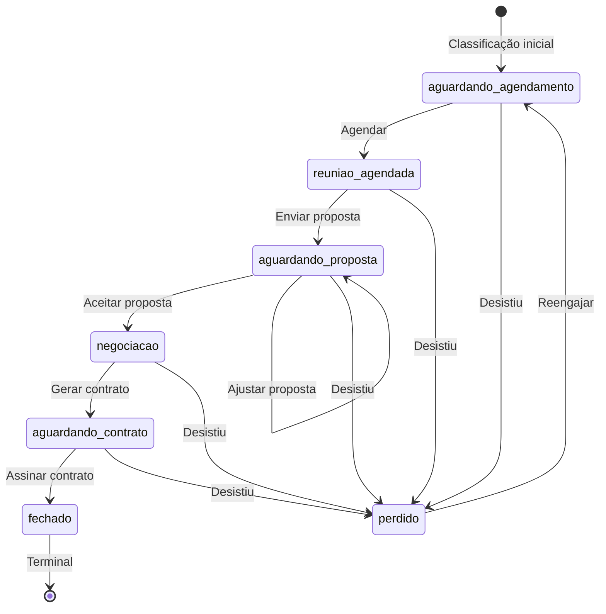
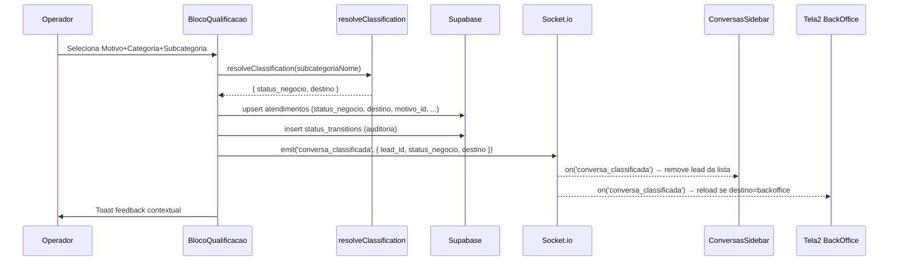

# Design Técnico — Ordenação Inteligente de Conversas

## Overview

Este documento descreve o design técnico para a funcionalidade de ordenação inteligente de conversas, motor de classificação, máquina de estados de negócio, módulo de recuperação (Outros & Abandonados) e sistema de classificação hierárquica (Arvore_Classificacao).

A feature se divide em 7 módulos funcionais que se conectam end-to-end:

1. **Classificador Temporal** (`getConversationStatus`) — substitui `classificarInatividade()` com horas corridas
2. **Ordenador + Filtros** — nova lógica de sort (unread-first) e 3 pills com contadores
3. **Motor de Classificação** (`resolveClassification`) — mapeia subcategoria → status_negocio + destino
4. **Máquina de Estados de Negócio** — valida transições de status_negocio com auditoria
5. **Integração Sidebar ↔ Backoffice** — socket events para remoção/roteamento
6. **Toast System** — feedback visual contextual
7. **Módulo Outros & Abandonados** — recuperação de leads perdidos

### Decisões de Design

- **Horas corridas vs. horas úteis**: Simplifica a lógica eliminando `calcularHorasUteis()`. Thresholds: <8h=active, ≥8h=waiting, ≥34h=no_response, ≥7d=inativo.
- **resolveClassification() temporária**: Função de mapeamento por string matching (sem colunas DB novas na segment_trees). Será substituída por colunas `status_negocio` e `destino` na segment_trees futuramente.
- **Sem novos componentes React**: Toast é implementado como estado + div condicional dentro dos componentes existentes.
- **Socket events para remoção**: Usa o padrão existente de `io.emit()` para sincronizar sidebar sem reload.

## Architecture

### Diagrama de Fluxo Principal



### Diagrama de Componentes



## Components and Interfaces

### 1. getConversationStatus (novo — substitui classificarInatividade)

**Arquivo**: `web/utils/conversationStatus.ts`

```typescript
export type ConversationStatus = 'active' | 'waiting' | 'no_response' | 'inativo'

export interface ConversationStatusResult {
  status: ConversationStatus
  diffHours: number
  diffDays: number
}

/**
 * Classifica o status temporal de uma conversa usando horas corridas.
 * Substitui classificarInatividade() que usava horas úteis.
 * 
 * Thresholds:
 *   < 8h   → active
 *   8-34h  → waiting
 *   34h-7d → no_response
 *   ≥ 7d   → inativo
 */
export function getConversationStatus(
  ultimaMsgEm: string | null,
  createdAt?: string | null,
  now?: Date
): ConversationStatusResult {
  const currentTime = now || new Date()
  const reference = ultimaMsgEm || createdAt || null

  if (!reference) {
    return { status: 'no_response', diffHours: Infinity, diffDays: Infinity }
  }

  const diffMs = currentTime.getTime() - new Date(reference).getTime()
  const diffHours = diffMs / (1000 * 60 * 60)
  const diffDays = diffMs / (1000 * 60 * 60 * 24)

  if (diffDays >= 7) return { status: 'inativo', diffHours, diffDays }
  if (diffHours >= 34) return { status: 'no_response', diffHours, diffDays }
  if (diffHours >= 8) return { status: 'waiting', diffHours, diffDays }
  return { status: 'active', diffHours, diffDays }
}
```

**Mapeamento de status para UI** (adicionado ao mesmo arquivo):

```typescript
export const CONVERSATION_STATUS_STYLES: Record<ConversationStatus, {
  label: string; bg: string; text: string
}> = {
  active:      { label: 'Ativo',        bg: 'bg-[#EEF6FF]', text: 'text-[#3B82F6]' },
  waiting:     { label: 'Aguardando',   bg: 'bg-[#FFFBEB]', text: 'text-[#D97706]' },
  no_response: { label: 'Sem resposta', bg: 'bg-[#F3F4F6]', text: 'text-[#6B7280]' },
  inativo:     { label: 'Inativo',      bg: 'bg-[#FEE2E2]', text: 'text-[#DC2626]' },
}
```

### 2. resolveClassification (temporária — mapeamento por string matching)

**Arquivo**: `web/utils/resolveClassification.ts`

```typescript
export type StatusNegocio =
  | 'aguardando_agendamento'
  | 'reuniao_agendada'
  | 'aguardando_proposta'
  | 'negociacao'
  | 'aguardando_contrato'
  | 'fechado'
  | 'perdido'

export type Destino = 'backoffice' | 'encerrado' | 'sidebar' | 'relacionamento'

export interface ClassificationResult {
  status_negocio: StatusNegocio
  destino: Destino
}

/**
 * TEMPORÁRIA: Resolve status_negocio e destino a partir do nome da subcategoria.
 * Usa string matching (keywords) até que colunas status_negocio/destino
 * sejam adicionadas à tabela segment_trees.
 * 
 * Regras de mapeamento:
 *   agendar/reuniao     → aguardando_agendamento / backoffice
 *   proposta             → aguardando_proposta / backoffice
 *   contrato             → aguardando_contrato / backoffice
 *   negociacao/analise   → negociacao / backoffice
 *   duvida/informacao    → relacionamento / relacionamento (fica na sidebar)
 *   desistiu/sem_interesse/perdido → perdido / encerrado
 *   fallback             → aguardando_agendamento / backoffice
 */
export function resolveClassification(subcategoriaNome: string): ClassificationResult {
  const nome = subcategoriaNome.toLowerCase()
    .normalize('NFD')
    .replace(/[\u0300-\u036f]/g, '')

  // Encerramento
  if (/desist|sem.?interesse|perdido|cancelou|nao.?quer/.test(nome)) {
    return { status_negocio: 'perdido', destino: 'encerrado' }
  }

  // Relacionamento (fica na sidebar)
  if (/duvida|informacao|orientacao|consulta.?rapida/.test(nome)) {
    return { status_negocio: 'aguardando_agendamento', destino: 'relacionamento' }
  }

  // Backoffice — contrato
  if (/contrato|assinatura/.test(nome)) {
    return { status_negocio: 'aguardando_contrato', destino: 'backoffice' }
  }

  // Backoffice — proposta
  if (/proposta|orcamento|honorario/.test(nome)) {
    return { status_negocio: 'aguardando_proposta', destino: 'backoffice' }
  }

  // Backoffice — negociação
  if (/negociacao|analise|avaliacao/.test(nome)) {
    return { status_negocio: 'negociacao', destino: 'backoffice' }
  }

  // Backoffice — agendamento (inclui reunião)
  if (/agendar|reuniao|visita|atendimento|pronto/.test(nome)) {
    return { status_negocio: 'aguardando_agendamento', destino: 'backoffice' }
  }

  // Fallback → backoffice com agendamento
  return { status_negocio: 'aguardando_agendamento', destino: 'backoffice' }
}
```

### 3. businessStateMachine (máquina de estados de negócio)

**Arquivo**: `web/utils/businessStateMachine.ts`

```typescript
import type { StatusNegocio } from './resolveClassification'

/** Mapa de transições válidas: estado_atual → [estados_destino] */
const VALID_TRANSITIONS: Record<StatusNegocio, StatusNegocio[]> = {
  aguardando_agendamento: ['reuniao_agendada', 'perdido'],
  reuniao_agendada:       ['aguardando_proposta', 'perdido'],
  aguardando_proposta:    ['negociacao', 'aguardando_proposta', 'perdido'],
  negociacao:             ['aguardando_contrato', 'perdido'],
  aguardando_contrato:    ['fechado', 'perdido'],
  fechado:                [],
  perdido:                ['aguardando_agendamento'], // via reengajar
}

export interface TransitionResult {
  allowed: boolean
  error?: string
}

export interface AuditEntry {
  conversa_id: string
  status_anterior: StatusNegocio
  status_novo: StatusNegocio
  operador_id: string
  timestamp: string
}

/**
 * Valida se a transição de status_negocio é permitida.
 */
export function validateBusinessTransition(
  from: StatusNegocio,
  to: StatusNegocio
): TransitionResult {
  const allowed = VALID_TRANSITIONS[from]
  if (!allowed) {
    return { allowed: false, error: `Estado "${from}" não reconhecido.` }
  }
  if (!allowed.includes(to)) {
    return {
      allowed: false,
      error: `Transição "${from}" → "${to}" não permitida. Transições válidas: ${allowed.join(', ') || 'nenhuma (estado terminal)'}.`
    }
  }
  return { allowed: true }
}

/**
 * Cria entrada de auditoria para uma transição.
 */
export function createAuditEntry(
  conversaId: string,
  from: StatusNegocio,
  to: StatusNegocio,
  operadorId: string
): AuditEntry {
  return {
    conversa_id: conversaId,
    status_anterior: from,
    status_novo: to,
    operador_id: operadorId,
    timestamp: new Date().toISOString(),
  }
}

export { VALID_TRANSITIONS }
```

### 4. Sorting Logic (dentro de ConversasSidebar)

```typescript
/**
 * Ordena conversas: unread-first, depois por maior inatividade.
 * Aplicado via useMemo dentro de ConversasSidebar.
 */
function sortConversations(leads: LeadWithMeta[]): LeadWithMeta[] {
  return [...leads].sort((a, b) => {
    // 1. Unread first
    const aUnread = (a.unreadCount ?? 0) > 0 ? 1 : 0
    const bUnread = (b.unreadCount ?? 0) > 0 ? 1 : 0
    if (aUnread !== bUnread) return bUnread - aUnread

    // 2. Maior inatividade primeiro (mais tempo sem resposta = prioridade)
    const aTime = new Date(a.ultima_msg_em || a.created_at).getTime()
    const bTime = new Date(b.ultima_msg_em || b.created_at).getTime()
    if (aTime !== bTime) return aTime - bTime // menor timestamp = mais antigo = primeiro

    // 3. Tiebreaker: mais recente primeiro
    return bTime - aTime
  })
}
```

### 5. Toast System (inline, sem componente novo)

```typescript
// Estado dentro de BlocoQualificacao ou ConversasSidebar
const [toast, setToast] = useState<{
  message: string
  type: 'success' | 'error'
  persistent: boolean
} | null>(null)

// Mapeamento destino → mensagem
const TOAST_MESSAGES: Record<string, string> = {
  backoffice:     'Encaminhado para operação',
  encerrado:      'Lead encerrado',
  sidebar:        'Lead movido para sidebar',
  relacionamento: 'Encaminhado para relacionamento',
}

function showToast(destino: string, error?: boolean) {
  const message = error
    ? 'Erro ao salvar classificação. Tente novamente.'
    : TOAST_MESSAGES[destino] || 'Classificação salva'
  
  setToast({ message, type: error ? 'error' : 'success', persistent: !!error })
  
  if (!error) {
    setTimeout(() => setToast(null), 3000)
  }
}

// JSX inline (sem componente novo)
// {toast && (
//   <div className={`fixed bottom-4 right-4 z-50 px-4 py-3 rounded-lg shadow-lg text-sm font-medium
//     transition-opacity duration-150
//     ${toast.type === 'success' ? 'bg-success text-white' : 'bg-error text-white'}`}>
//     {toast.message}
//     {toast.persistent && <button onClick={() => setToast(null)} className="ml-3">✕</button>}
//   </div>
// )}
```

### 6. Modificações em ConversasSidebar

Mudanças principais:
- Substituir `classificarInatividade` por `getConversationStatus`
- 3 pills em vez de 4: "Todos", "Aguardando", "Sem retorno"
- Contadores em cada pill
- Indicador ● de não-lidos no pill "Todos"
- Sort: unread-first → maior inatividade
- `useMemo` para classificação, sort e filtro
- Excluir conversas com status `inativo`, `abandonado_ura`, `outro_input`
- Listener de socket `conversa_classificada` para remoção sem reload
- Fade transition 150ms ao trocar filtro

```typescript
// Novo tipo de pill
type FilterPill = 'todos' | 'aguardando' | 'sem_retorno'

// useMemo para classificação + sort + filtro
const classifiedLeads = useMemo(() => {
  return getAllLeadsFlat().map(lead => ({
    ...lead,
    _conversationStatus: getConversationStatus(
      lead.ultima_msg_em || null,
      lead.created_at
    ),
  }))
}, [urgentes, emAtendimento, aguardando])

const visibleLeads = useMemo(() => {
  // Excluir inativo, abandonado_ura, outro_input
  return classifiedLeads.filter(l =>
    l._conversationStatus.status !== 'inativo'
  )
}, [classifiedLeads])

const sortedLeads = useMemo(() => {
  return sortConversations(visibleLeads)
}, [visibleLeads])

const filteredLeads = useMemo(() => {
  if (activePill === 'todos') return sortedLeads
  if (activePill === 'aguardando') return sortedLeads.filter(l => l._conversationStatus.status === 'waiting')
  if (activePill === 'sem_retorno') return sortedLeads.filter(l => l._conversationStatus.status === 'no_response')
  return sortedLeads
}, [sortedLeads, activePill])

// Contadores (computados do mesmo array, sem iteração extra)
const counters = useMemo(() => {
  let waiting = 0, noResponse = 0, hasUnread = false
  for (const l of visibleLeads) {
    if (l._conversationStatus.status === 'waiting') waiting++
    if (l._conversationStatus.status === 'no_response') noResponse++
    if ((l.unreadCount ?? 0) > 0) hasUnread = true
  }
  return { total: visibleLeads.length, waiting, noResponse, hasUnread }
}, [visibleLeads])
```

### 7. Modificações em BlocoQualificacao

Após o operador selecionar Segmento + Assunto + Especificação (que mapeiam para Motivo + Categoria + Subcategoria):

```typescript
async function handleClassificar() {
  if (!selectedEspecificacao || !operadorId) return
  setLoading(true)

  try {
    // 1. Resolver nome da subcategoria
    const subcategoriaNode = segmentNodes.find(n => n.id === selectedEspecificacao)
    if (!subcategoriaNode) throw new Error('Subcategoria não encontrada')

    // 2. Resolver classificação
    const { status_negocio, destino } = resolveClassification(subcategoriaNode.nome)

    // 3. Validar transição (se já tem status_negocio)
    // ... validateBusinessTransition se necessário

    // 4. Persistir no atendimento
    const { error: atError } = await supabase
      .from('atendimentos')
      .upsert({
        lead_id: lead.id,
        owner_id: operadorId,
        status_negocio,
        destino,
        classificacao_entrada: subcategoriaNode.nome,
        motivo_id: selectedSegmento,
        categoria_id: selectedAssunto,
        subcategoria_id: selectedEspecificacao,
      }, { onConflict: 'lead_id' })

    if (atError) throw atError

    // 5. Registrar auditoria
    await supabase.from('status_transitions').insert({
      atendimento_id: lead.id, // será resolvido para o UUID do atendimento
      status_anterior: null,
      status_novo: status_negocio,
      operador_id: operadorId,
    })

    // 6. Emit socket event para remoção da sidebar
    if (socket) {
      socket.emit('conversa_classificada', {
        lead_id: lead.id,
        status_negocio,
        destino,
      })
    }

    // 7. Toast feedback
    showToast(destino)

    // 8. Limpar seleção
    onLeadClosed()
  } catch (err: any) {
    showToast('', true)
    console.error('[handleClassificar]', err.message)
  } finally {
    setLoading(false)
  }
}
```

### 8. Modificações em Tela2 (BackOffice)

- Agrupar por `status_negocio` em vez de `atendimento.status`
- Novos cards de status: aguardando_agendamento, reuniao_agendada, aguardando_proposta, negociacao, aguardando_contrato, fechado, perdido
- 4 ações por card: Avançar, Fechar, Desistiu, Reengajar
- Validação via `validateBusinessTransition()` antes de cada ação

```typescript
const BACKOFFICE_GROUPS = [
  { key: 'aguardando_agendamento', label: 'Aguardando Agendamento', color: 'text-accent' },
  { key: 'reuniao_agendada',      label: 'Reunião Agendada',       color: 'text-info' },
  { key: 'aguardando_proposta',   label: 'Aguardando Proposta',    color: 'text-warning' },
  { key: 'negociacao',            label: 'Negociação',             color: 'text-accent' },
  { key: 'aguardando_contrato',   label: 'Aguardando Contrato',   color: 'text-warning' },
  { key: 'fechado',               label: 'Fechado',                color: 'text-success' },
  { key: 'perdido',               label: 'Perdido',                color: 'text-text-muted' },
]
```

## Data Models

### Migração SQL: `015_smart_conversation_sorting.sql`

```sql
-- ============================================================
-- Migração 015: Smart Conversation Sorting
-- Novas colunas em atendimentos, tabela de auditoria
-- ============================================================

-- ── 1. Novas colunas em atendimentos ────────────────────────
ALTER TABLE atendimentos ADD COLUMN IF NOT EXISTS status_negocio TEXT;
ALTER TABLE atendimentos ADD COLUMN IF NOT EXISTS destino TEXT;
ALTER TABLE atendimentos ADD COLUMN IF NOT EXISTS motivo_id UUID REFERENCES segment_trees(id);
ALTER TABLE atendimentos ADD COLUMN IF NOT EXISTS categoria_id UUID REFERENCES segment_trees(id);
ALTER TABLE atendimentos ADD COLUMN IF NOT EXISTS subcategoria_id UUID REFERENCES segment_trees(id);

-- Índice para queries do backoffice por status_negocio
CREATE INDEX IF NOT EXISTS idx_atendimentos_status_negocio
  ON atendimentos(status_negocio);

-- ── 2. Tabela de auditoria de transições ────────────────────
CREATE TABLE IF NOT EXISTS status_transitions (
  id UUID PRIMARY KEY DEFAULT gen_random_uuid(),
  atendimento_id UUID NOT NULL REFERENCES atendimentos(id),
  status_anterior TEXT,
  status_novo TEXT NOT NULL,
  operador_id UUID NOT NULL REFERENCES auth.users(id),
  created_at TIMESTAMPTZ DEFAULT now()
);

ALTER TABLE status_transitions ENABLE ROW LEVEL SECURITY;

DROP POLICY IF EXISTS "service_role_full_status_transitions" ON status_transitions;
CREATE POLICY "service_role_full_status_transitions" ON status_transitions
  FOR ALL TO service_role USING (true) WITH CHECK (true);

DROP POLICY IF EXISTS "authenticated_read_status_transitions" ON status_transitions;
CREATE POLICY "authenticated_read_status_transitions" ON status_transitions
  FOR SELECT TO authenticated USING (true);

DROP POLICY IF EXISTS "authenticated_insert_status_transitions" ON status_transitions;
CREATE POLICY "authenticated_insert_status_transitions" ON status_transitions
  FOR INSERT TO authenticated WITH CHECK (true);

CREATE INDEX IF NOT EXISTS idx_status_transitions_atendimento
  ON status_transitions(atendimento_id);

CREATE INDEX IF NOT EXISTS idx_status_transitions_created
  ON status_transitions(created_at);

-- ── 3. Campo unread_count em leads (para ordenação) ─────────
ALTER TABLE leads ADD COLUMN IF NOT EXISTS unread_count INTEGER DEFAULT 0;
```

### Diagrama de Dados



### Máquina de Estados de Negócio



### Socket Events (novos)

| Evento | Emissor | Payload | Consumidor |
|--------|---------|---------|------------|
| `conversa_classificada` | BlocoQualificacao | `{ lead_id, status_negocio, destino }` | ConversasSidebar, Tela2 |
| `status_negocio_changed` | Tela2 | `{ lead_id, status_anterior, status_novo, operador_id }` | Tela2 (broadcast) |
| `conversa_resgatada` | Módulo Outros | `{ lead_id, tipo_resgate }` | ConversasSidebar |

### Fluxo de Dados: Classificação End-to-End



## Correctness Properties

*A property is a characteristic or behavior that should hold true across all valid executions of a system — essentially, a formal statement about what the system should do. Properties serve as the bridge between human-readable specifications and machine-verifiable correctness guarantees.*

### Property 1: Classificador temporal retorna status correto por threshold

*For any* timestamp `ultimaMsgEm` and reference time `now`, `getConversationStatus(ultimaMsgEm, null, now)` SHALL return:
- `active` when diffHours < 8
- `waiting` when 8 ≤ diffHours < 34
- `no_response` when 34 ≤ diffHours < 168 (7 days)
- `inativo` when diffHours ≥ 168

**Validates: Requirements 1.1, 1.2, 1.3, 1.4, 13.1**

### Property 2: Ordenação unread-first com inatividade decrescente

*For any* lista de conversas com valores arbitrários de `unreadCount` e `ultima_msg_em`, após aplicar `sortConversations()`, todas as conversas com `unreadCount > 0` SHALL aparecer antes de todas as conversas com `unreadCount = 0`, e dentro de cada grupo, as conversas SHALL estar ordenadas por maior tempo de inatividade primeiro.

**Validates: Requirements 2.1, 2.2, 2.4**

### Property 3: Filtros retornam apenas conversas do status correspondente

*For any* lista de conversas com status variados, aplicar o filtro "Aguardando" SHALL retornar apenas conversas com `status === 'waiting'`, e aplicar o filtro "Sem retorno" SHALL retornar apenas conversas com `status === 'no_response'`, e aplicar o filtro "Todos" SHALL retornar todas as conversas visíveis.

**Validates: Requirements 3.2, 3.3, 3.4**

### Property 4: Contadores refletem a contagem exata por status

*For any* lista de conversas, o contador "Todos" SHALL ser igual ao comprimento total da lista visível, o contador "Aguardando" SHALL ser igual ao número de conversas com `status === 'waiting'`, e o contador "Sem retorno" SHALL ser igual ao número de conversas com `status === 'no_response'`.

**Validates: Requirements 4.1, 4.2, 4.3**

### Property 5: Indicador de não-lidos reflete presença de unread

*For any* lista de conversas, o Indicador_Nao_Lidos SHALL ser visível se e somente se existe pelo menos uma conversa com `unreadCount > 0`.

**Validates: Requirements 5.1, 5.2**

### Property 6: Round-trip de classificação preserva Status_Negocio e Destino

*For any* caminho válido na Arvore_Classificacao (Motivo + Categoria + Subcategoria), persistir uma Classificacao e depois ler o registro da Conversa SHALL retornar o mesmo Status_Negocio, Destino, Motivo, Categoria e Subcategoria definidos no nó-folha da árvore.

**Validates: Requirements 9.7, 17.24, 16.19**

### Property 7: Remoção da sidebar após classificação

*For any* conversa presente na sidebar, após salvar uma Classificacao válida, a conversa SHALL ser removida da lista exibida e os contadores SHALL ser recalculados para refletir a remoção.

**Validates: Requirements 10.1, 10.4**

### Property 8: Roteamento backoffice condicional ao destino

*For any* classificação, um item no Backoffice SHALL ser criado se e somente se o destino é `backoffice`. Classificações com destino `encerrado`, `sidebar` ou `relacionamento` SHALL NOT criar itens no Backoffice.

**Validates: Requirements 11.1, 11.4**

### Property 9: Idempotência de criação de item no Backoffice

*For any* conversa classificada duas vezes com destino `backoffice`, SHALL existir apenas um item no Backoffice para essa conversa (update, não duplicata).

**Validates: Requirements 11.3**

### Property 10: Separação entre Status_Negocio e Status_Conversa

*For any* classificação salva, o Status_Negocio SHALL ser definido com um valor válido do enum e o Status_Conversa (derivado de `ultima_msg_em`) SHALL permanecer inalterado.

**Validates: Requirements 12.2, 12.3**

### Property 11: Auditoria de transições de status

*For any* transição válida de Status_Negocio, SHALL existir um registro de auditoria contendo o identificador da conversa, o status anterior, o status novo, o timestamp e o identificador do operador.

**Validates: Requirements 12.6, 14.5, 14.7**

### Property 12: Conversas inativas excluídas da sidebar

*For any* conversa com `diffDays >= 7`, ela SHALL ser classificada como `inativo` e SHALL NOT aparecer na lista da sidebar.

**Validates: Requirements 13.1, 13.3**

### Property 13: Máquina de estados aceita apenas transições válidas

*For any* par (estado_atual, estado_destino), `validateBusinessTransition()` SHALL retornar `allowed: true` se e somente se a transição está no mapa de transições válidas. `fechado` SHALL ser terminal sem transições de saída. `perdido` SHALL permitir apenas `reengajar` → `aguardando_agendamento`.

**Validates: Requirements 14.1, 14.2, 14.3, 14.4**

### Property 14: Cascade delete na Arvore_Classificacao

*For any* remoção de um nó Motivo, todos os nós Categoria e Subcategoria descendentes SHALL ser removidos. Para remoção de Categoria, todos os nós Subcategoria filhos SHALL ser removidos.

**Validates: Requirements 17.6, 17.7**

### Property 15: Estrutura da Arvore_Classificacao com 3 níveis e mapeamento completo

*For any* árvore válida, ela SHALL ter exatamente 3 níveis (Motivo → Categoria → Subcategoria), e cada nó-folha (Subcategoria) SHALL mapear para exatamente um Status_Negocio e exatamente um Destino.

**Validates: Requirements 17.1, 17.2**

### Property 16: Itens do módulo de recuperação contêm campos obrigatórios

*For any* item no Modulo_Outros_Abandonados, se classificado como `abandonado_ura` SHALL conter nome (se disponível), telefone, última mensagem e estágio de abandono. Se classificado como `outro_input` SHALL conter nome (se disponível), telefone e última mensagem.

**Validates: Requirements 16.4, 16.5**

### Property 17: Exclusão de abandonado_ura e outro_input da sidebar

*For any* lista da sidebar, conversas com Status_Conversa `abandonado_ura` ou `outro_input` SHALL NOT ser exibidas.

**Validates: Requirements 16.6, 16.7**

## Error Handling

### Falha na persistência de classificação
- Se o `upsert` em `atendimentos` falhar, a conversa permanece na sidebar
- Toast de erro persistente é exibido até o operador dispensar
- Log de erro no console com detalhes da falha
- Nenhum socket event é emitido (sidebar não remove a conversa)

### Falha na criação de item no Backoffice
- Se a criação/update do atendimento com destino backoffice falhar:
  - Log de erro é registrado
  - Toast de erro é exibido ao operador
  - A classificação é revertida (status_negocio não é persistido)

### Transição de estado inválida
- `validateBusinessTransition()` retorna `{ allowed: false, error: '...' }`
- O erro é exibido ao operador via toast
- Nenhuma mudança é persistida no banco

### Subcategoria sem mapeamento válido
- `resolveClassification()` tem fallback para `aguardando_agendamento / backoffice`
- Quando colunas forem adicionadas à segment_trees, subcategorias sem mapeamento serão bloqueadas na validação

### Falha de conexão Socket.io
- Se o socket estiver desconectado no momento da classificação:
  - A persistência no banco ocorre normalmente
  - A remoção da sidebar acontece no próximo reload ou reconexão
  - O SocketProvider já tem `reconnection: true` com `reconnectionAttempts: Infinity`

### Null/undefined em ultima_msg_em
- `getConversationStatus(null)` retorna `no_response` com `diffHours: Infinity`
- Se `createdAt` também for null, retorna `no_response`

### Race condition: dois operadores classificam a mesma conversa
- O `upsert` com `onConflict: 'lead_id'` garante que apenas um registro existe
- O segundo operador verá a conversa já removida da sidebar via socket event
- A auditoria registra ambas as tentativas

## Testing Strategy

### Abordagem Dual: Unit Tests + Property Tests

Esta feature é adequada para property-based testing porque contém:
- Funções puras com comportamento determinístico (`getConversationStatus`, `resolveClassification`, `validateBusinessTransition`)
- Propriedades universais que devem valer para todos os inputs (thresholds, ordenação, filtros)
- Espaço de input grande (timestamps, listas de conversas, combinações de status)

### Property-Based Testing

**Biblioteca**: [fast-check](https://github.com/dubzzz/fast-check) (já compatível com o ecossistema TypeScript/Jest do projeto)

**Configuração**: Mínimo 100 iterações por teste de propriedade.

**Tag format**: `Feature: smart-conversation-sorting, Property {N}: {description}`

**Propriedades a implementar**:

1. **Property 1** — Classificador temporal: gerar timestamps aleatórios, verificar que o status retornado corresponde ao threshold correto.
2. **Property 2** — Ordenação: gerar listas aleatórias de conversas, verificar invariante unread-first + inatividade decrescente.
3. **Property 3** — Filtros: gerar listas com status variados, verificar que cada filtro retorna apenas o subset correto.
4. **Property 4** — Contadores: gerar listas, verificar que contadores = contagem real por status.
5. **Property 5** — Indicador não-lidos: gerar listas, verificar visibilidade = existência de unread.
6. **Property 6** — Round-trip classificação: gerar árvores e caminhos válidos, persistir e ler, verificar igualdade.
7. **Property 13** — Máquina de estados: gerar pares (estado, destino) aleatórios, verificar que apenas transições válidas são aceitas.
8. **Property 14** — Cascade delete: gerar árvores, remover nós, verificar que descendentes são removidos.
9. **Property 15** — Estrutura da árvore: gerar árvores, verificar 3 níveis e mapeamento completo em folhas.

### Unit Tests (exemplos específicos e edge cases)

1. `getConversationStatus(null)` → `no_response`
2. `getConversationStatus` com timestamp exatamente em cada boundary (8h, 34h, 7d)
3. `resolveClassification('Humilhação')` → fallback correto
4. `resolveClassification('desistiu')` → `perdido / encerrado`
5. `validateBusinessTransition('fechado', 'aguardando_agendamento')` → rejected
6. `validateBusinessTransition('perdido', 'aguardando_agendamento')` → allowed (reengajar)
7. Toast messages para cada destino
8. Falha de persistência mantém conversa na sidebar

### Integration Tests

1. Fluxo completo: classificar conversa → verificar remoção da sidebar → verificar aparição no backoffice
2. Socket event `conversa_classificada` propaga corretamente entre componentes
3. Transição de status no backoffice com auditoria
4. Módulo Outros & Abandonados: resgate de conversa → reclassificação → roteamento correto
