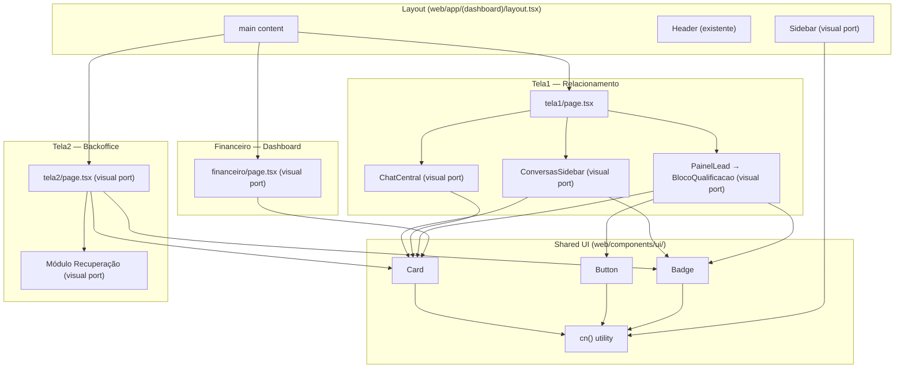
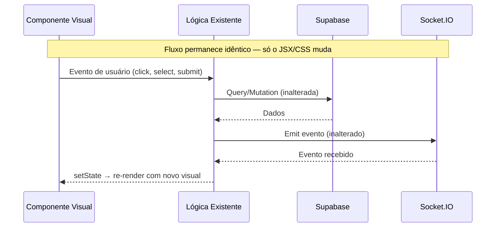

# Design — Template Visual Port

## Visão Geral

Este design especifica como portar o visual dos 3 templates (RelationshipView, BackofficeView, DashboardView) + Sidebar + primitivos UI para o projeto Next.js existente, mantendo 100% da lógica de negócio intacta.

A estratégia é "visual swap": substituir apenas classes CSS/Tailwind e estrutura JSX de layout, sem tocar em hooks, state, effects, queries Supabase, socket listeners ou funções de negócio.

### Princípios

1. **Visual = Template**: Clonar fielmente as classes CSS, espaçamentos, tipografia e cores dos templates
2. **Lógica = Existente**: Nenhuma função, hook, query ou event listener é alterado
3. **Shared-first**: Criar componentes primitivos compartilhados (Card, Button, Badge, cn) antes de portar telas
4. **Sequência bottom-up**: Primitivos → Sidebar → Tela1 (lista → chat → painel) → Tela2 → Financeiro → Recovery

## Arquitetura

### Diagrama de Componentes



### Fluxo de Dados (inalterado)



## Componentes e Interfaces

### 1. Componentes Compartilhados (novos)

#### `web/lib/utils.ts` — Utilitário cn()

```typescript
import { type ClassValue, clsx } from "clsx";
import { twMerge } from "tailwind-merge";

export function cn(...inputs: ClassValue[]) {
  return twMerge(clsx(inputs));
}
```

Dependências novas: `clsx`, `tailwind-merge`.

#### `web/components/ui/Card.tsx`

```tsx
import { cn } from "@/lib/utils";

export function Card({ children, className, ...props }: React.HTMLAttributes<HTMLDivElement>) {
  return (
    <div className={cn("bg-white rounded-xl shadow-sm border border-gray-100 overflow-hidden", className)} {...props}>
      {children}
    </div>
  );
}
```

#### `web/components/ui/Button.tsx`

```tsx
import { cn } from "@/lib/utils";

type Variant = "primary" | "secondary" | "neutral";

const variants: Record<Variant, string> = {
  primary: "bg-blue-600 text-white hover:bg-blue-700",
  secondary: "bg-white text-blue-600 border border-blue-200 hover:bg-blue-50",
  neutral: "bg-gray-100 text-gray-600 hover:bg-gray-200",
};

export function Button({
  children, variant = "primary", className, ...props
}: React.ButtonHTMLAttributes<HTMLButtonElement> & { variant?: Variant }) {
  return (
    <button
      className={cn("px-4 py-2 rounded-lg font-medium transition-all active:scale-95 disabled:opacity-50 text-sm", variants[variant], className)}
      {...props}
    >
      {children}
    </button>
  );
}
```

#### `web/components/ui/Badge.tsx`

```tsx
import { cn } from "@/lib/utils";

export function Badge({ children, className, ...props }: React.HTMLAttributes<HTMLSpanElement>) {
  return (
    <span className={cn("px-2 py-0.5 rounded-full text-[10px] font-semibold uppercase tracking-wider", className)} {...props}>
      {children}
    </span>
  );
}
```

### 2. Alterações Globais de Estilo

#### `web/app/globals.css` — Adições

```css
@import url('https://fonts.googleapis.com/css2?family=Inter:wght@400;500;600;700;800;900&display=swap');

/* Scrollbar hide */
.scrollbar-hide::-webkit-scrollbar { display: none; }
.scrollbar-hide { -ms-overflow-style: none; scrollbar-width: none; }
```

A fonte Inter já está referenciada como `--font-body`, mas precisa do peso 900 (font-black). A importação do Google Fonts garante todos os pesos.

#### `web/tailwind.config.ts` — Extensões

Adicionar ao `theme.extend`:
- `fontWeight`: garantir que `black: '900'` está disponível (já é padrão do Tailwind)
- Nenhuma alteração de cores necessária — os templates usam cores Tailwind padrão (`blue-600`, `gray-50`, etc.) que já existem

### 3. Sidebar — Visual Port

**Arquivo**: `web/components/Sidebar.tsx`

**O que muda (visual)**:
- Largura: `w-sidebar` (240px) → `w-20 lg:w-64` com transição
- Logo: adicionar ícone Zap (lucide-react) em `bg-blue-600 rounded-lg`, texto `font-black text-xl tracking-tighter`
- Itens: adicionar ícones Lucide (MessageSquare, LayoutGrid, DollarSign), `p-3 rounded-xl`
- Estado ativo: `bg-blue-50 text-blue-600`, ícone `scale-110`
- Estado inativo: `text-gray-400 hover:bg-gray-50 hover:text-gray-600`
- Footer: botões Settings e LogOut com `border-t border-gray-50`
- Texto oculto em mobile: `hidden lg:block`

**O que NÃO muda (lógica)**:
- `links[]` array com rotas e `ownerOnly`
- `usePathname()` para detecção de rota ativa
- `role` prop e filtragem por permissão
- `<Link>` do Next.js para navegação

**Dependência nova**: `lucide-react`

### 4. ConversasSidebar — Visual Port

**Arquivo**: `web/app/(dashboard)/tela1/components/ConversasSidebar.tsx`

**O que muda (visual)**:
- Container: `w-[280px]` → `w-80` (320px), fundo `bg-[#F1F3F6]`, borda `border-r border-[#E6E8EC]/20`
- Título: adicionar "Conversas" em `text-xl font-bold tracking-tight`
- Filtros: pills (`rounded-full`) → tabs underline (`border-b-2`), texto `text-[11px]`, ativo `text-blue-600 font-semibold border-blue-400`, inativo `text-[#9CA3AF] border-transparent`
- Busca: `rounded-full` → `rounded-xl`, fundo `bg-[#F7F8FA]`, `shadow-sm`, placeholder "Buscar cliente..."
- Item de conversa: avatar `w-10 h-10` → `w-12 h-12` com imagem ou inicial, dot de status (`bg-blue-500`/`bg-yellow-500`/`bg-gray-400`), nome `font-bold text-sm`, timeAgo `text-[9px] font-bold text-gray-300 uppercase`, preview `text-xs text-gray-400`
- Selecionado: `bg-white shadow-sm rounded-xl` com `border-l-4` colorido por score
- Fade transition: manter `opacity` existente, ajustar `duration-200`

**O que NÃO muda (lógica)**:
- `loadLeads()` com queries Supabase (leads, clients, atendimentos, mensagens)
- Socket listeners (lead_assumido, nova_mensagem_salva, lead_encerrado, etc.)
- `conversa_classificada` handler que remove lead das listas
- `handleSearch()` com debounce de 300ms
- `getAllLeadsFlat()` com dedup por identity_id
- `useMemo` chains (classifiedLeads → visibleLeads → sortedLeads → filteredLeads)
- `getConversationStatus()` e `sortConversations()`
- `handleSaveNewContact()` com criação de identity + lead
- `counters` useMemo

### 5. ChatCentral — Visual Port

**Arquivo**: `web/app/(dashboard)/tela1/components/ChatCentral.tsx`

**O que muda (visual)**:
- Área de mensagens: fundo `bg-[#F6F8FC]`
- Header: avatar `w-10 h-10 rounded-full border border-gray-100 shadow-sm`, nome `font-bold text-sm tracking-tight`, indicador "Online" `text-[10px] font-bold uppercase tracking-widest` com dot `animate-pulse bg-blue-500`
- Mensagens enviadas: `bg-chat-sent rounded-[12px_0_12px_12px]` → `bg-[#2563EB] text-white rounded-2xl rounded-tr-none shadow-[0_2px_8px_rgba(0,0,0,0.04)]`
- Mensagens recebidas: `bg-chat-received rounded-[0_12px_12px_12px]` → `bg-white text-gray-900 rounded-2xl rounded-tl-none border border-white`
- Timestamp: `font-mono text-xs` → `text-[9px] font-bold uppercase tracking-tighter opacity-60`
- Input area: container `bg-[#F8FAFC] rounded-2xl border border-gray-100/50 shadow-inner`, botão Paperclip, textarea `text-[13px] font-medium`, botão envio `bg-blue-600 rounded-xl shadow-md shadow-blue-100`

**O que NÃO muda (lógica)**:
- `loadMessages()` com identity_id merge
- Socket listeners (nova_mensagem_salva, erro_assumir, pipeline_error)
- `handleSend()` com emit nova_mensagem
- `handleInputChange()` com detecção de `/` para QuickReplies
- `handleFileSelect()` com validação e upload
- `handleKeyDown()` (Enter para enviar, Escape para fechar)
- `isNotaInterna` toggle
- SmartSnippets, QuickReplies, PopupEnfileirar, PopupAguardando
- Channel map e badges via/WhatsApp/Telegram
- Typing detection com debounce

### 6. BlocoQualificacao (Painel_Cliente) — Visual Port

**Arquivo**: `web/app/(dashboard)/tela1/components/BlocoQualificacao.tsx`

**O que muda (visual)**:
- Container: fundo `bg-[#FBFBFC]`, borda `border-l border-[#E6E8EC]/20`
- Avatar: `w-24 h-24 rounded-full border-[3px] border-white` com ring por leadStatus (`ring-blue-100` hot, `ring-[#FEF3C7]` warm, `ring-gray-100` cold)
- Campos editáveis: estilo `border-b border-gray-100 focus-within:border-blue-600`, labels `text-[10px] font-bold text-gray-300 uppercase tracking-widest`, valores `text-sm font-bold text-gray-900`
- Dropdowns: `rounded-xl shadow-sm font-bold bg-white border border-[#E6E8EC]/20 p-3`
- Dropdown "Próximo Passo": `bg-blue-50/30 border-blue-100 text-blue-700 rounded-2xl p-4 font-black`
- Label "PRÓXIMO PASSO": `text-[10px] font-black text-blue-600 italic underline underline-offset-4`
- Bloco "Vai acontecer": `bg-gray-900 rounded-2xl` com `animate-in fade-in slide-in-from-top-2`, título `text-[10px] font-black text-blue-400 uppercase tracking-widest`, conteúdo `text-xs font-bold text-white`
- Botão confirmar: `fixed bottom-0 w-80 py-4 rounded-2xl text-[11px] font-black uppercase tracking-[0.2em]`, ativo `bg-[#2563EB] text-white shadow-xl shadow-blue-100`, desabilitado `bg-[#E5E7EB] text-gray-400`
- Indicador dirty: `text-[10px] font-black text-[#92400E] bg-[#FEF3C7] rounded-md uppercase tracking-widest animate-pulse`
- Dossiê: `rounded-xl shadow-sm min-h-[100px] text-[11px] font-medium placeholder:text-gray-200`

**O que NÃO muda (lógica)**:
- `resolveClassification()` para gerar preview
- Cascading dropdowns com `filterChildren(segmentNodes, parentId, level)`
- `handleClassificar()` com upsert atendimentos + audit + socket emit
- `handleConversao()`, `handleNaoFechou()`
- `saveNome()`, `saveTelefone()`, `saveEmail()` com identity propagation
- `linkToIdentity()` para vinculação
- `handleSaveNota()` com auto-save on blur
- Botoeira de jornada (agendar, solicitar, proposta, contrato)
- Toast system
- Todos os modals (EnfileirarPopup, MotivoPopup, ConversaoPopup, etc.)

### 7. Tela2 BackOffice — Visual Port

**Arquivo**: `web/app/(dashboard)/tela2/page.tsx`

**O que muda (visual)**:
- Título: `text-lg font-display font-bold` → `text-3xl font-black tracking-tight` + subtítulo `text-sm font-medium text-gray-500` + indicador "Atualizado agora" com dot verde animado
- Summary cards: grid `grid-cols-4` → `grid-cols-1 md:grid-cols-2 lg:grid-cols-4 gap-5`, usar componente Card com `border-none shadow-sm hover:shadow-md`, ícone em fundo colorido `rounded-lg`, valor `text-4xl font-black`, label `text-[10px] font-black uppercase tracking-widest`
- Seções de leads: headers `text-xs font-black uppercase tracking-[0.2em]` com subtítulo italic e contagem
- Lead cards: usar Card com `border-none hover:ring-2 hover:ring-blue-100`, avatar `w-12 h-12 rounded-2xl bg-gray-50`, nome `text-base font-bold`, micro copy urgência `text-[11px] font-black uppercase`, valor estimado, Badge de stage, botão ChevronRight
- Botões de ação: substituir 3 botões inline (Avançar/Fechar/Desistiu) por botão contextual ChevronRight que executa `handleAvancar()` para leads em negociação
- Estado vazio: ícone CheckCircle em `bg-green-50 rounded-full`, "Operação sob controle" em `font-bold`

**O que NÃO muda (lógica)**:
- `loadData()` com queries Supabase (atendimentos + leads)
- `handleTransition()`, `handleAvancar()`, `handleFechar()`, `handleDesistiu()`, `handleReengajar()`
- `validateBusinessTransition()` e `getNextStatus()`
- Socket listeners (conversa_classificada, status_negocio_changed)
- `handleRescue()` com router.push e socket emit
- `BACKOFFICE_GROUPS` array
- Toast system
- Recovery module (abandonados + outros)

### 8. Financeiro/Dashboard — Visual Port

**Arquivo**: `web/app/(dashboard)/financeiro/page.tsx`

**O que muda (visual)**:
- Título: `text-lg font-display font-bold` → `text-3xl font-black tracking-tight` + subtítulo
- KPI cards: usar Card com `border-none shadow-sm`, ícone em fundo colorido `p-3 rounded-xl`, label `text-[10px] font-black text-gray-400 uppercase tracking-widest`, valor `text-3xl font-black`
- Seção "Controle de Relacionamento": indicadores com dots coloridos + barra de engajamento `h-2 bg-gray-100 rounded-full` dividida blue-500/orange-400
- Seção "Performance Backoffice": itens em `p-3 bg-gray-50 rounded-xl` + botão relatório `text-[10px] font-black text-blue-600 bg-blue-50 rounded-xl uppercase tracking-widest`
- Seção "Últimas Conversões": lista com ícone TrendingUp, nome, data, valor, ChevronRight
- Tabela operadores: manter mas aplicar estilo Card

**O que NÃO muda (lógica)**:
- `loadData()` com queries Supabase (pot_tratamento, atendimentos, leads, bot_feedback)
- Cálculos (receita estimada/confirmada, ticket médio, gap bot)
- `fmt()` formatter
- MetricCard e MetricIcon components (serão refatorados visualmente mas mantêm a mesma lógica)

### 9. Módulo de Recuperação — Visual Port

**Arquivo**: Dentro de `web/app/(dashboard)/tela2/page.tsx` (seção existente)

**O que muda (visual)**:
- Aplicar padrão visual do BackofficeView: Card com `border-none shadow-sm`, avatar `rounded-2xl`, micro copy de urgência
- Headers de seção: `text-xs font-black uppercase tracking-[0.2em]`
- Micro copy contextual: "Abandonou na etapa X" para abandonados, "Sem resposta há X dias" para perdidos
- Botão: "Abrir no Cockpit" → "Reativar" com mesmo estilo

**O que NÃO muda (lógica)**:
- Queries Supabase para abandonos e others
- `handleRescue()` com socket emit conversa_resgatada
- Router navigation

## Modelos de Dados

Nenhum modelo de dados é alterado. Todas as interfaces TypeScript existentes permanecem idênticas:

- `Lead` (tela1/page.tsx)
- `LeadWithMeta` (ConversasSidebar.tsx)
- `LeadComAtendimento` (tela2/page.tsx)
- `FinanceiroData` (financeiro/page.tsx)
- `Mensagem` (ChatCentral.tsx)
- `SegmentNode` (segmentTree.ts)
- `StatusNegocio`, `Destino`, `ClassificationResult` (resolveClassification.ts)
- `ConversationStatus`, `ConversationStatusResult` (conversationStatus.ts)
- `TransitionResult`, `AuditEntry` (businessStateMachine.ts)

## Dependências Novas

| Pacote | Versão | Motivo |
|--------|--------|--------|
| `lucide-react` | ^0.400 | Ícones da Sidebar e telas (Zap, MessageSquare, LayoutGrid, etc.) |
| `clsx` | ^2.1 | Composição condicional de classes CSS |
| `tailwind-merge` | ^2.3 | Merge inteligente de classes Tailwind (evita conflitos) |
| `date-fns` | ^3.6 | `formatDistanceToNow` para micro copy de urgência no backoffice |

Nenhuma dependência existente é removida.

## Correctness Properties

*Uma propriedade é uma característica ou comportamento que deve ser verdadeiro em todas as execuções válidas de um sistema — essencialmente, uma declaração formal sobre o que o sistema deve fazer. Propriedades servem como ponte entre especificações legíveis por humanos e garantias de correção verificáveis por máquina.*

### Property 1: cn() merges base classes with custom classes

*For any* set of Tailwind class strings passed to `cn()`, the output SHALL contain all non-conflicting classes, and when a conflict exists (e.g., `bg-white` vs `bg-red-500`), the last class wins (tailwind-merge behavior).

**Validates: Requirements 1.6**

### Property 2: Lead list item renders all required visual elements

*For any* valid lead object (with nome or telefone, created_at, and optional ultima_msg_em), the rendered conversation list item SHALL contain: an avatar element (48px), a status dot, the display name, a timeAgo string, and a message preview (or non-breaking space if no lastMessage).

**Validates: Requirements 3.4**

### Property 3: Message styling is direction-dependent

*For any* message object, if the sender is the current user or bot, the message container SHALL have classes `bg-[#2563EB] text-white rounded-2xl rounded-tr-none`; otherwise it SHALL have classes `bg-white text-gray-900 rounded-2xl rounded-tl-none`.

**Validates: Requirements 4.3, 4.4**

### Property 4: Preview block reflects resolveClassification output

*For any* valid subcategoria name from segment_trees, the "Vai acontecer" preview block SHALL display the exact `status_negocio` and `destino` values returned by `resolveClassification(subcategoriaNome)`.

**Validates: Requirements 5.6**

### Property 5: Backoffice leads are grouped by status_negocio

*For any* set of LeadComAtendimento objects, each lead SHALL appear in the section whose `key` matches the lead's `atendimento_status` (which maps to `status_negocio`), and no lead SHALL appear in more than one section.

**Validates: Requirements 6.3, 6.4**

### Property 6: Engagement bar proportions are valid

*For any* non-negative integer values of `qualificacao` and `backoffice`, the two segments of the engagement bar SHALL have widths that sum to 100% of the bar, with each segment's width proportional to its value relative to the total. When both values are 0, the bar SHALL show 0% for both.

**Validates: Requirements 7.3**

## Error Handling

A portagem visual não introduz novos fluxos de erro. Todos os handlers de erro existentes permanecem:

| Componente | Erro | Tratamento Existente (mantido) |
|---|---|---|
| ConversasSidebar | Falha em loadLeads() | Console.error, lista vazia |
| ChatCentral | Falha em upload | `uploadError` state com auto-dismiss 3s |
| ChatCentral | Erro de socket | Alert com mensagem |
| BlocoQualificacao | Falha em handleClassificar() | Toast de erro persistente |
| BlocoQualificacao | Falha em conversão | Alert com mensagem |
| Tela2 | Transição inválida | Toast de erro com mensagem de validação |
| Financeiro | Sem dados | Estado vazio com mensagem informativa |

**Novo tratamento visual**: Os toasts e estados de erro existentes serão estilizados com as classes do design system (Card, rounded-2xl, shadow-sm), mas a lógica de exibição/dismissal permanece idêntica.

## Testing Strategy

### Abordagem

Esta feature é primariamente uma portagem visual (CSS/JSX), o que limita a aplicabilidade de property-based testing. A maioria dos critérios de aceitação são verificações de classes CSS estáticas (SMOKE) ou renderização de UI (EXAMPLE). Porém, existem 6 propriedades testáveis que envolvem lógica de composição, agrupamento e cálculo.

### Testes de Propriedade (Property-Based)

Biblioteca: `fast-check` (JavaScript/TypeScript)
Mínimo: 100 iterações por propriedade

Cada propriedade do design será implementada como um teste PBT:

1. **cn() class merging** — Gerar strings de classes Tailwind aleatórias, verificar merge correto
2. **Lead list item elements** — Gerar leads aleatórios, verificar presença de todos os elementos visuais
3. **Message direction styling** — Gerar mensagens com sender aleatório, verificar classes corretas
4. **Preview ↔ resolveClassification** — Gerar nomes de subcategoria, verificar que preview reflete output
5. **Backoffice grouping** — Gerar conjuntos de leads com status aleatórios, verificar agrupamento correto
6. **Engagement bar math** — Gerar pares de inteiros, verificar que proporções somam 100%

Tag format: `Feature: template-visual-port, Property {N}: {title}`

### Testes Unitários (Example-Based)

- Sidebar: renderiza com role='owner' mostra todos os links; role='operador' oculta ownerOnly
- Sidebar: item ativo tem classes `bg-blue-50 text-blue-600`
- ConversasSidebar: filtro "Aguardando" mostra apenas leads com status waiting
- ChatCentral: estado vazio mostra mensagem "Selecione uma conversa"
- BlocoQualificacao: indicador dirty aparece quando campo é editado
- Tela2: estado vazio mostra "Operação sob controle"
- Financeiro: estado sem dados mostra mensagem informativa

### Testes de Snapshot

- Card, Button, Badge renderizam com classes base corretas
- Sidebar renderiza corretamente em ambos estados (collapsed/expanded)

### Testes de Regressão Visual

- Comparar screenshots antes/depois para garantir que a lógica funcional não foi afetada
- Verificar que todas as interações (click, select, submit) continuam funcionando

### Testes de Integração

- Fluxo completo: selecionar lead → ver chat → classificar → verificar que lead sai da sidebar
- Fluxo backoffice: avançar status → verificar que lead muda de grupo
- Fluxo financeiro: verificar que dados Supabase são exibidos corretamente

### Critério de Aceitação para Merge

1. Todos os testes existentes passam sem modificação
2. Nenhuma assinatura de função foi alterada
3. Nenhum event listener de socket foi alterado
4. Nenhuma query Supabase foi alterada
5. Visual match com templates (revisão manual)
